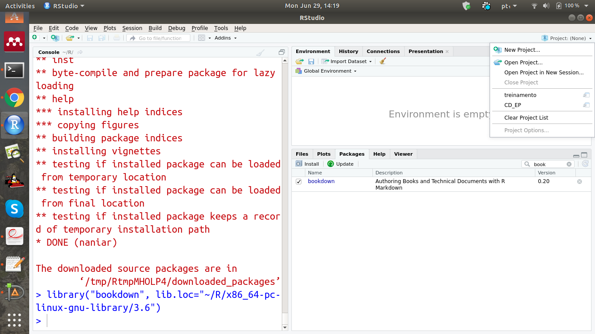
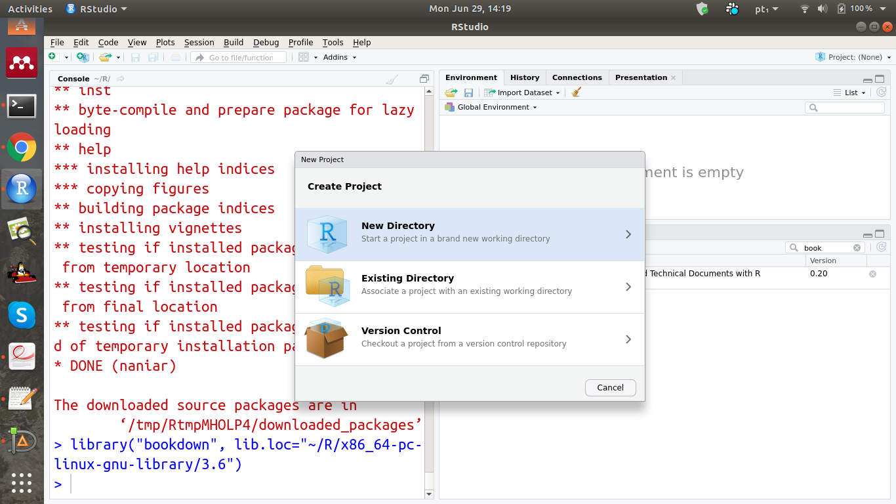
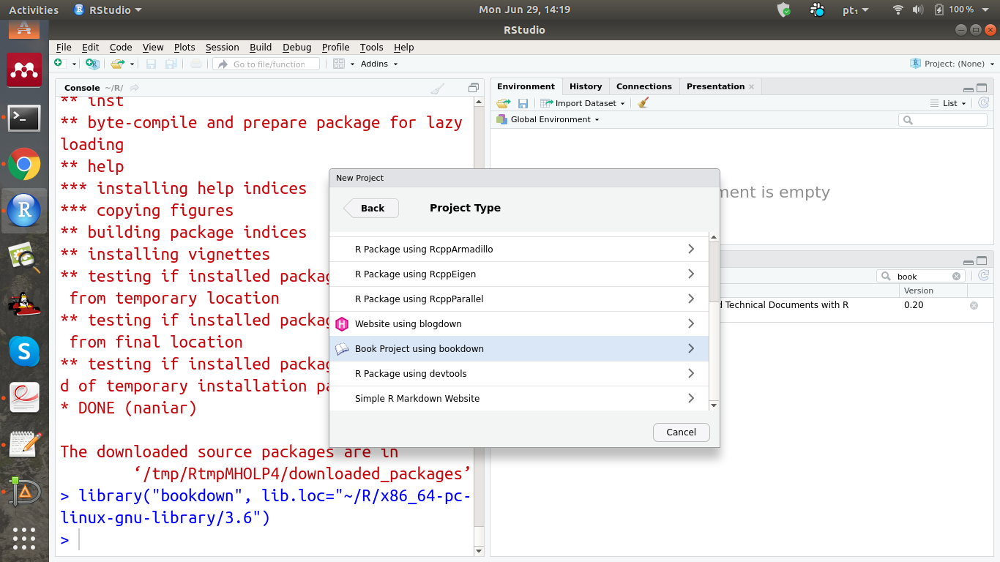
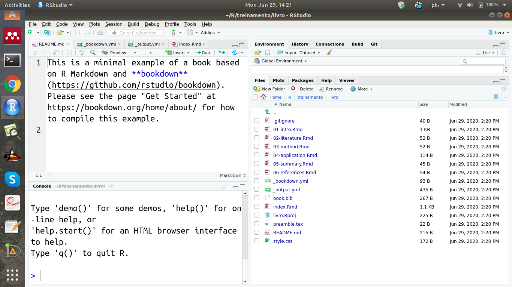

# Introdução {#intro}

A primeira palavra que devemos pensar 
ao encarar um curso de ferramentas de 
escrita de textos é *oportunidade*.

Quando pensamos em texto simples e rápidos, 
podemos naturalmente usar ferramentas como 
WYSIWYG (*What You See Is What You Get*)
como **LibreOffice Writer** ou 
     **Microsof Office Word**. Entretanto, 
trabalhar com textos longos, como relatórios, 
trabalhos de conclusão de curso (TCC), 
dissertações ou teses pode exigir 
recursos mais avançados como LaTeX.

## Criação do projeto do livro

Faremos uso mais uma vez de recursos 
gráficos da interface do *Rstudio*
para a criação do projeto do livro. 
Este material foi prepara utilizando 
a estrutura mínima disponibilizada pelo 
*template* do pacote *bookdown*. 
As etapas a seguir serão o suficiente 
para entender a criação e uso desse *template*:

1. Após a instalação e carregamento da biblioteca 
*bookdown*, podemos utilizar o *template*, 
primeiro devemos clicar no canto superior direito em *projetos* como:

2. Em seguida, selecionar *New Directory*: 

3. Selecionar *Book Project with bookdown*

4. Em seguida o template com a versão mínima será 
disponibilizado por meio de uma pasta com o nome escolhido na etapa anterior. 

Na lista apresentada acima são identificados 
arquivos com as seguintes extensões:

* **.Rmd**
* **.bib**
* **.yml**
* **.tex**
* **.css**

Aqueles arquivos cuja a extensão é *.Rmd*
são utilizados para a escrita dos 
conteúdos do livro em R Markdown. Entretanto, 
entre eles
há um especial, *index.Rmd*, que constrói 
a página principal, por meio de 
comandos **yml**. Algumas configurações 
são reservadas em dois arquivos com extensão
**.yml**. Sendo o arquivo _bookdown.yml para
configurações gerais que serão úteis para quaisquer 
tipo de documento de saída, por exemplo, a definição
se o título de cada capítulo será chamado de 
**Chapter ** ou **Capítulo **, especialmente 
para este treinamento fizemos esta alteração. Enquanto
que para o arquivo *_output.yml* são apresentadas 
configurações especiais para cada tipo de saída, 
como *bookdown::gitbook*, *bookdown::pdf_book:* ou 
*bookdown::epub_book:*. Especialmente para o 
caso do *gitbook* é necessário a existência do arquivo
*style.css* para algumas configurações. Já o arquivo
*book.bib* é uma estrutura especial do pacote *bibtex*
do LaTeX e contem as informações de artigos que serão citados. 
