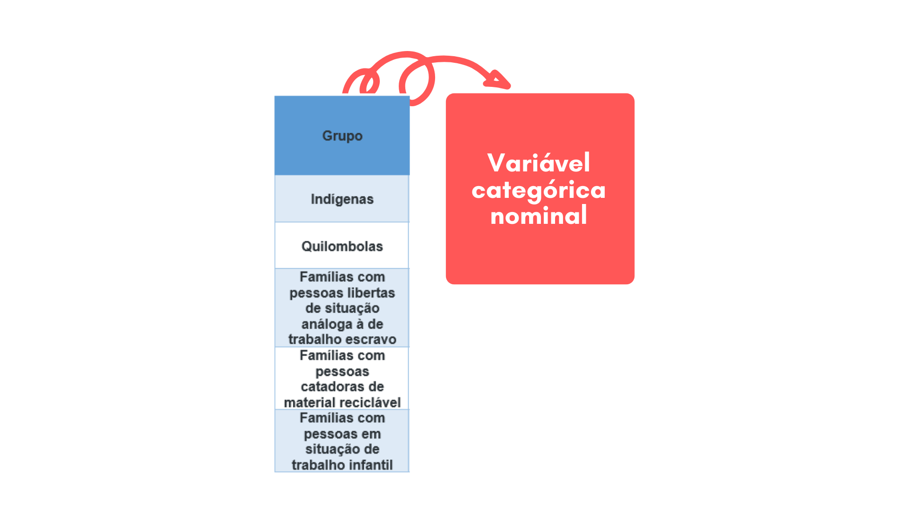

# Construindo uma base de dados {#c02}

No capítulo anterior, você aprendeu sobre dados e viu, resumidamente, que a forma como os dados estão armazenados chama-se estrutura de dados. Neste capítulo vamos resgatar e aprofundar um pouco mais do que você já aprendeu de modo que você seja capaz de construir a sua própria base de dados. Mas antes, precisamos entender o que é e para que serve uma base de dados.


*Será que você já teve contato com alguma base de dados no decorrer de sua vida?*


## O que é uma base de dados?

*Você já ouviu falar sobre o Programa Bolsa Família?*


O Programa Bolsa Família (PBF) é uma [política pública](https://www.todospelaeducacao.org.br/conteudo/o-que-e-uma-politica-publica-e-como-ela-afeta-sua-vida) que visa cooperar para a inclusão social de famílias em situação de vulnerabilidade, contribuindo com alívio imediato da situação de pobreza e fome. O PBF estimula um melhor acompanhamento do atendimento do público-alvo pelos serviços de saúde, além de ajudar a superar indicadores que marcam negativamente a trajetória educacional de crianças mais pobres; como por exemplo os altos índices de evasão escolar e a repetência. Desde que foi criado em 2003, o PBF evoluiu e se tornou um dos mais eficientes mecanismos de enfrentamento a pobreza do mundo, consolidando-se como um dos maiores programas de transferência direta de renda existentes. Em todo o país, segundo dados do Ministério da Cidadania, em junho de 2020 o PBF atendia a mais de 14 milhões de famílias, das quais 180.706 mil estavam em Salvador, sendo 476.633 mil pessoas diretamente beneficiadas com o PBF na capital baiana.

*Interessante, né? Mas o que o bolsa família tem a ver com uma base de dados?*

Bem, para ser beneficiária do PBF a família precisa estar cadastrada no Cadastro Único para Programas Sociais (CadÚnico). O CadÚnico é a **base de dados** do governo federal onde estão registrados dados sobre famílias de baixa renda; ou seja, famílias que possuem renda mensal de até ½ salário mínimo por pessoa ou 3 salários mínimos no total. É a partir dos dados registrados no CadÚnico que é possível identificar as famílias que necessitam do bolsa família e encaminha-las para serem beneficiarias do programa.

*Portanto, sem uma base de dados não seria possível que uma política pública do tamanho e da importância do Programa Bolsa Família existisse.*

*E como podemos, exatamente, definir uma base de dados?*

Uma base de dados é um conjunto de **dados** inter-relacionados (possuem relação), que estão armazenados em uma estrutura que permite que **informações** sejam extraídas.


```{r ch1, fig.align='center',out.width="100%",fig.width=50 ,echo=FALSE}

knitr::include_graphics("fig_cap2/cap2_gif1.gif")

``` 

Na base de dados da nossa discussão, o CadÚnico, dados referentes a raça, sexo, ocupação, moradia, escolaridade e muitos outros, estão relacionados a cada família que compõem o cadastro. Dessa forma, o governo consegue extrair informações referentes a habitação, saúde, educação, renda; possibilitando que se pense em formas de melhor atender as necessidades da população que compoem o cadastro. Atualmente, o CadÚnico conta com o registro dos dados de aproximadamente 29 milhões de famílias, mais de 76 milhões de pessoas. Isto é, o CadÚnico armazena dados de quase 40% da população brasileira.

O CadÚnico funciona tão bem porque cumpre um requisito muito importante para bases de dados: a armazenagem eficiente dos dados. Para que a sua base de dados funcione do mesmo jeito, os seus dados precisam estar armazenados de maneira correta. Na próxima seção vamos discutir um pouco mais sobre isso.


## Como montar uma tabela 

*Vimos que em uma base de dados, os dados estão armazenados em uma estrutura que permite que informações sejam extraídas. Nessa seção, vamos entender um pouco mais sobre essas estruturas.*

Já aprendemos no capítulo 1 que dados são observações que foram coletadas e armazenadas de alguma forma. A maneira como esses dados são armazenados varia e algumas dessas formas de se armazenar os dados são mais eficientes que outras pois auxiliam na análise e visualização dos dados. Quanto à maneira como os dados estão armazenados podemos classifica-los de duas formas principais: estruturados e não-estruturados


Os **dados não-estruturados**, como o nome indica, não possuem uma estrutura bem definida e previamente pensada para se armazenar os dados. Como exemplo de dados não estruturados podemos citar as redes-sociais, imagens, filmes, vídeos, músicas e documentos de texto.

```{r ch2, fig.align='center', fig.cap="Exemplo de dados não-estruturados", fig.width=50 ,echo=FALSE,out.width="80%"}

knitr::include_graphics("fig_cap2/cap2_fig1.png")

```


Os **dados estruturados** por sua vez, possuem uma estrutura bem definida, rígida e previamente pensada para se armazenar os dados. A tabela é uma das formas mais comuns e simples dessas estruturas pois nela os dados ficam dispostos em linhas e colunas que é uma forma de se armazenar dados bastante organizada e de fácil entendimento. Vamos entender mais sobre essa forma de organização. Leia o fragmento de texto abaixo extraído e adaptado do [site](https://aplicacoes.mds.gov.br/sagirmps/bolsafamilia/index.html "Cadastro Único, Conhecer Para Incluir")


```{r ch3, fig.align='center', fig.width=50,out.width="70%",echo=FALSE}

knitr::include_graphics("fig_cap2/cap2_fig2.png")

``` 

Observe agora como os dados referentes aos grupos prioritários do PBF ficam organizados em uma tabela:


```{r ch4, fig.align='center',fig.width=50,out.width="100%",echo=FALSE}

knitr::include_graphics("fig_cap2/cap2_fig3.png")

``` 


As **linhas**, partes horizontais da tabela, que também podemos chamar de amostras, representam indivíduos ou observações, que são os nossos objetos de estudo. No nosso exemplo, as observações são os grupos de famílias prioritárias ao PBF: "Indígenas", "Quilombolas", "Famílias com pessoas libertas de situação análoga à de trabalho escravo", "Famílias com pessoas catadoras de material reciclável" e "Famílias com pessoas em situação de trabalho infantil" 

As **colunas**, parte vertical da tabela, representam atributos, ou seja, representam características referentes as observações. Em nosso exemplo, "Grupo", "Quantidade" e "Percentual" são os atributos que caracterizam nossas observações.


Note que à medida que percorremos uma linha, todos os atributos são referentes a aquela observação. Por exemplo, quando percorremos a linha cuja observação é do grupo “Indígenas”, os atributos: “Quantidade” e “Percentual” se referem a ela. No caso 5 e 0,0% respectivamente. Portanto, existem 5 famílias que fazem parte do grupo prioritário “Indígenas”, representando, aproximadamente, 0,0% do total entre todos os beneficiários do Bolsa Família em Salvador.

*Das mais de 180 mil famílias que recebem o Bolsa Família em Salvador, apenas 5 são famílias indígenas. Em sua opinião, por que isso acontece? Que tal buscar dados referentes a populações indígenas existentes em sua cidade?*

```{r ch5, fig.align='center',fig.cap="Sentido de leitura da linha" ,fig.width=50,echo=FALSE,out.width="100%"}

knitr::include_graphics("fig_cap2/cap2_fig4.png")

``` 

Observe também que quando descemos em uma coluna da tabela, todos os valores representam a mesma característica. Por exemplo, quando descemos na coluna "Quantidade", todos os valores representam quantidades. As quantidades variam dependendo da observação que está sendo avaliada, mas o atributo é o mesmo: Quantidade. 

```{r ch6, fig.align='center',fig.cap="Sentido de leitura da coluna" ,fig.width=50,echo=FALSE,out.width="100%"}


``` 


O fato de os valores dos atributos variarem indica que os dados possuem **variabilidade**. Quando você for analisar seus dados, perceber a variabilidade dos dados é um passo muito importante. Os atributos também são chamados de **variáveis**. Perceba que existe relação entre os termos **variáveis** e **variabilidade**. A palavras "variável" indica que os valores dos dados variam. Nos acompanhe na próxima seção para entender um pouco mais sobre variáveis.


## Tipos de variáveis 

Já vimos que variáveis (atributos) são simplesmente características de nossas observações (indivíduos). Ou seja, são atributos que pertencem aos nossos objetos de estudo. 

Imagine que você decide estudar sobre os impactos que o Programa Bolsa Família tem sobre os hábitos e práticas alimentares dos beneficiários. Você decidiu seu objeto de estudo: famílias beneficiárias do PBF. Depois de definir o objeto de estudo, você se pergunta “Quais as informações que eu poderia levantar sobre meu objeto de estudo?”. Bem, você pode levantar muitas informações: o tipo de alimento consumido, a quantidade, se são alimentos ricos em gorduras ou em açucares, se o PBF faz com que as famílias se alimentem de maneira mais saudável, e muitas outras informações. Essas informações são os atributos do seu objeto de estudo, suas variáveis.

No exemplo da seção anterior, o nosso objeto de estudo foram os grupos prioritários ao Programa Bolsa Família. E as variáveis que caracterizaram o nosso objeto de estudo foram: "Grupo", que indica quais são esses grupos prioritários; "Quantidade", que indica a quantidade de famílias que compõem esses grupos e "Percentual" que indica a porcentagem que esses grupos representam em relação ao total de beneficiários em Salvador. 

Agora que já sabemos o que são variáveis, vamos discutir sobre os seus dois principais tipos: variáveis categóricas e variáveis numéricas.


### Variáveis Numéricas

Variáveis numéricas são aquelas que assumem **valores numéricos** finitos ou infinitos, ou seja, são variáveis **quantitativas**. Essas variáveis podem ser **contínuas** ou **discretas**.

As variáveis numéricas discretas são aquelas que só podem ser representadas por números inteiros. Vamos entender um pouco mais: famílias beneficiárias do PBF que tenham em sua composição gestantes, nutrizes (mães que amamentam) e crianças e adolescentes de 0 a 15 anos, recebem o benefício de R$ 41,00 para cada membro da família e cada família pode acumular até 5 benefícios por mês. Então, imagine que uma mãe que possua 5 filhos entre 0 e 15 anos irá receber o benefício de R$ 41,00 para cada filho; mas o que aconteceria se ela tivesse 5,5 filhos? Faz sentido dizer que uma pessoa tem 5,5 filhos (cinco filhos e meio)? Não, né?! Isso acontece porque a variável "Quantidade de filhos" é uma variável numérica discreta pois só pode assumir valores inteiros (0,1,2,3...). As variáveis discretas geralmente são resultado de contagens.

Já as variáveis numéricas contínuas são aquelas que podem assumir valores contínuos. Ou seja, são variáveis que podem assumir qualquer valor nos números reais. Vamos retomar o exemplo acima para entendermos melhor, mas dessa vez vamos falar sobre a variável “Idade”. Para você faria sentido dizer que um dos filhos dessa mulher tem 5,5 anos (cinco anos e meio)? Sim, né?! O que estamos dizendo é que essa criança tem 5 anos e 6 meses de idade; ou quem sabe 5 anos 6 meses e 2 dias, 5 anos 6 meses 2 dias e 15 horas, e assim por diante. Isso acontece porque a variável “Idade” é uma variável contínua e pode assumir qualquer [valor real](https://www.educamaisbrasil.com.br/enem/matematica/numeros-reais "Conjunto dos números reais"). As variáveis contínuas geralmente resultam de medições.


Vamos retomar o exemplo dos grupos prioritários ao PBF e ver quais foram as nossas variáveis numéricas:


```{r ch7, fig.align='center', fig.width=50,echo=FALSE,out.width="100%"}

knitr::include_graphics("fig_cap2/cap2_fig6.png")

```


### Variáveis Categóricas 

Variáveis categóricas são qualitativas, finitas e expressam um valor determinado de categorias ou níveis. Ou seja, são variáveis que representam uma classificação das observações. Normalmente as variáveis categóricas representam valores que possuem palavras. Essas variáveis podem ser nominais ou ordinais. 

Variáveis categóricas ordinais existe uma ordenação entre as categorias. Como exemplo podemos pensar na escolaridade dos beneficiários do PBF, (1º,2º,3º grau)

Variáveis categóricas nominais não possuem ordenação entre as categorias. Como exemplo podemos pensar no sexo dos beneficiários do PBF, que pode ser masculino ou feminino


A variável categórica do nosso exemplo é do tipo nominal, pois não existe ordenação entre as categorias:

```{r ch8, fig.align='center', fig.width=50 ,echo=FALSE,out.width="100%"}



```

Até aqui você já aprendeu sobre o que são bases de dados, como montar tabelas, o que são e quais os tipos de variáveis; ou seja, já apendeu o básico necessário para montar a sua própria base de dados. Na próxima seção, você vai aprender a acessar bases de dados que estão disponíveis para serem acessadas por qualquer pessoa: as bases de dados abertas.


## Como buscar base de dados abertas

Já vimos que o CadÚnico é a base de dados do governo federal onde estão registrados dados de família de baixa renda residentes no Brasil. Entre os muitos dados que estão registrados no CadÚnico, constam também a identificação de cada pessoa; informações como RG, CPF e endereço.Por conta disso, o acesso a essa base de dados é restrito, sendo permitindo apenas a pesquisadores através de um procedimento administrativo. Logo, o CadÚnico não é uma base de dados aberta. 

*Mas o que são bases de dados abertas?*

Para entendermos o que são bases de dados abertas, vamos falar sobre **dados abertos**

A [Open Knowledge Foundation]( https://okfn.org/), organização sem fins lucrativos que tem por objetivo promover o conhecimento livre, define dados abertos da seguinte forma:

> Dados abertos são dados que podem ser livremente usados, reutilizados e redistribuídos por qualquer pessoa - sujeitos, no máximo, à exigência de atribuição da fonte e compartilhamento pelas mesmas regras.
>
>Você pode acessar a definição completa: [Open Definition](http://opendefinition.org/od/2.1/en/). Mas, resumindo os pontos mais importantes da definição de dados abertos, temos:

>> - Disponibilidade e Acesso: os dados devem estar disponíveis como um todo e sob custo não maior que um custo razoável de reprodução, preferencialmente possíveis de serem baixados pela internet. Os dados devem também estar disponíveis de uma forma conveniente e modificável.
 - Reutilização e Redistribuição: os dados devem ser fornecidos sob termos que permitam a reutilização e a redistribuição, inclusive a combinação com outros conjuntos de dados.
- Participação Universal: todos devem ser capazes de usar, reutilizar e redistribuir - não deve haver discriminação contra áreas de atuação ou contra pessoas ou grupos.

Portanto, podemos definir uma base de dados abertas como um conjunto de dados abertos que podem ser livremente usados, reutilizados e redistribuídos por qualquer pessoa.

Na proxima seção você vai conhecer algumas bases de dados abertas que podem ser uteis para você a apartir de agora


### Dados abertos governamentais

Dados abertos governamentais são dados produzidos pelos governos que devem ser colocados à disposição de qualquer cidadão para qualquer fim^[W3C BRASIL, 2011, p. 4]

A seguir, alguns exemplos de base de dados abertas governamentais:


  - [Dados abertos da Câmara dos Deputados](https://dadosabertos.camara.leg.br/#a1)
 
Nesta base de dados você terá acesso a dados sobre as atividades parlamentares da câmara dos deputados através de uma plataforma bastante intuitiva.
  
```{r ch9,fig.cap="Dados abertos da Câmara dos Deputados" ,fig.align='center',fig.width=50,echo=FALSE,out.width="70%"}

knitr::include_graphics("fig_cap2/cap2_fig8.png")

```
  
  - [Dados abertos do Senado Federal](https://www12.senado.leg.br/dados-abertos)
  
Fornece dados relativos a contratos firmados pelo Senado Federal, dados relativos a servidores aposentados, pensionistas, estagiários e terceirizados do Senado Federal e demais dados que você pode verificar

  
```{r ch10,fig.cap="Dados abertos do Senado Federal" ,fig.align='center',fig.width=50,echo=FALSE,out.width="70%"}

knitr::include_graphics("fig_cap2/cap2_fig9.png")

```
  
  - [Dados Abertos Ministério da Justiça e Segurança](https://www.justica.gov.br/dados-abertos/dados)
  
Na base de dados do Ministério da Justiça você encontra dados referentes a ocorrências criminais, violência contra mulher, refugiados e muitos outros que você pode verificar
    
```{r ch11,fig.cap="Dados abertos do Ministério da Justiça e Segurança" ,fig.align='center',fig.width=50,echo=FALSE,out.width="70%"}

knitr::include_graphics("fig_cap2/cap2_fig10.png")

```
  _______________________________________
  
As bases de dados acima foram apenas alguns exemplos de dados abertos governamentais que você pode acessar. Abaixo, temos mais algumas bases de dados para você conferir:
  
 
  - [Dados Abertos sobre Emprego](https://sineaberto.economia.gov.br/)
  
  - [Dados Abertos - INEP](http://portal.inep.gov.br/web/guest/dados)
  
  - [Educação em Números: Bahia](http://escolas.educacao.ba.gov.br/eduemnumeros)
  
  - [Educação em Números: Salvador](http://educacao.salvador.ba.gov.br/educacao-em-numeros/)
  
  - [Estatística Acidentes - Transalvador](http://transalvador.salvador.ba.gov.br/conteudo/index.php/estatisticaAcidente/acidenteComVitima)
  
  - [Secretaria de Segurança Pública da Bahia](http://www.ssp.ba.gov.br/modules/conteudo/conteudo.php?conteudo=110)
  
  - [Proteção aos povos indigenas e ODS 15](https://observatorionacional.cnj.jus.br/observatorionacional/index.php/protecao-aos-povos-indigenas-e-ods-15)
  
  - [Portal Brasileiro de Dados Abertos](https://dados.gov.br/)
  


### Kaggle

[Em reconstrução]

### UCL

```{r ch12, fig.align='center',out.width="100%",fig.width=100,echo=FALSE}

knitr::include_graphics("fig_cap2/cap2_gif2.gif")

``` 

[Em reconstrução]

## Indo Além

[Em reconstrução]

## Referências


