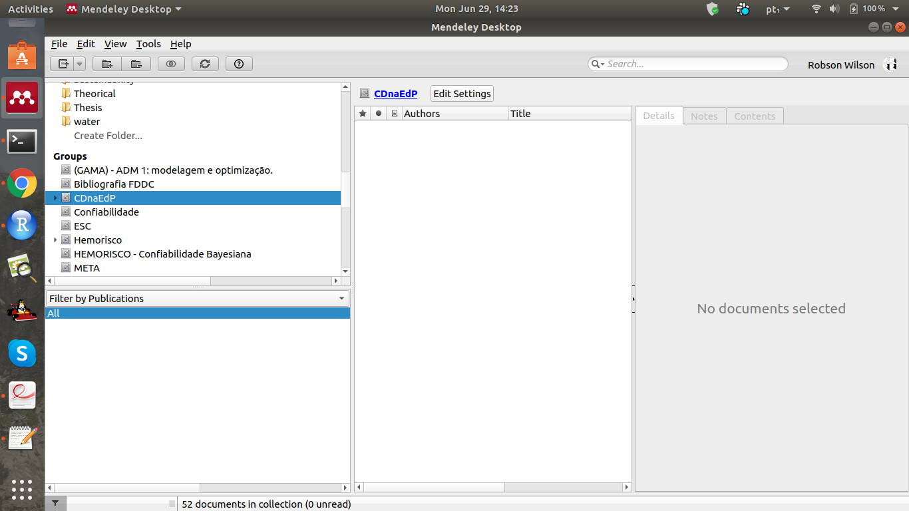
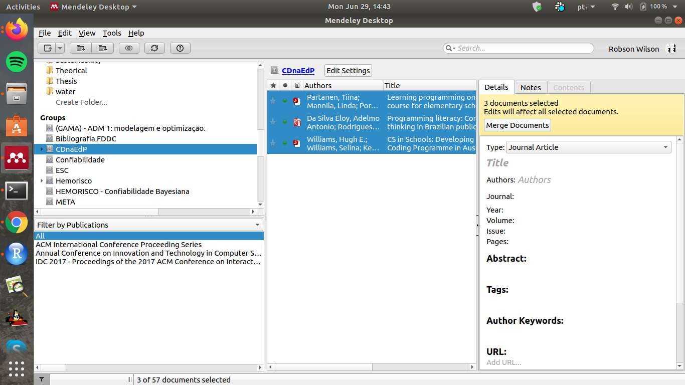
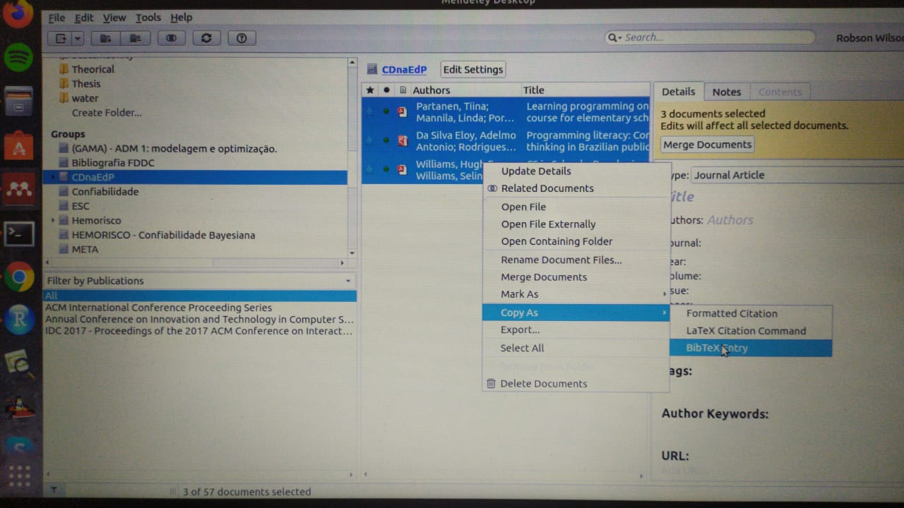

# Literatura e bibtex

O foco deste capítulo está numa das 
principais potencialidades do LaTeX
utilizas pelo R Markdown a capacidade
de citar os documentos adequadamente
organizados num arquivo *.bib*, 
especialmente neste exemplo aproveitamos 
o arquivo gerado pela estrutura mínima 
*bookdown*. 

Para esta etapa aproveitaremos como exemplo 
os artigos do projeto organizados na 
plataforma Mendeley, seguindo os 
seguintes passos: 

1. Abrir Medeley Desktop; 
2. Abrir pasta do grupo nomeada por CDnaEP; 
3. Selecionar os artigos que pretende citar no seu documento; 
4. Clicar com o botão direito do mouse, selecionar *Copy as* e em seguida *BibTex entry*. 
5. Abrir o arquivo *book.bib* e colar os metadados 
dos artigos na última linha do arquivo depois da 
última chave **}**. 
6. Em seguida, salve e feche o arquivo *book.bib*. 

As figuras a seguir estão de acordo com a sequência acima apresentada:

Uma informação importante para quem ainda não 
é familiarizado com LaTeX é o fato 
da primeira informação dos metados 
de um artigo dentro do arquivo *.bib*
ser a *label*, a informação que será 
usada para citações ao longo do documento. 

![Identificação da *label* do livro do ([@xie2015])](fig/rstudio_open_bookbib_first.png)

![Identificação da *label* de cada artigo ([@DaSilvaEloy2017])](fig/rstudio_open_bookbib_second.png)

![Identificação da *label* de cada artigo ([@Williams2020])](fig/rstudio_open_bookbib_third.png)

Nas subseções a seguir mostramos como citar alguns desses trabalhos.

## Exemplo de citação simples 
Vamos considerar a citação do artigo [@Partanen2016].

## Citações de dois ou mais artigos
Agora incluiremos mais duas citações [@DaSilvaEloy2017,@Williams2020].