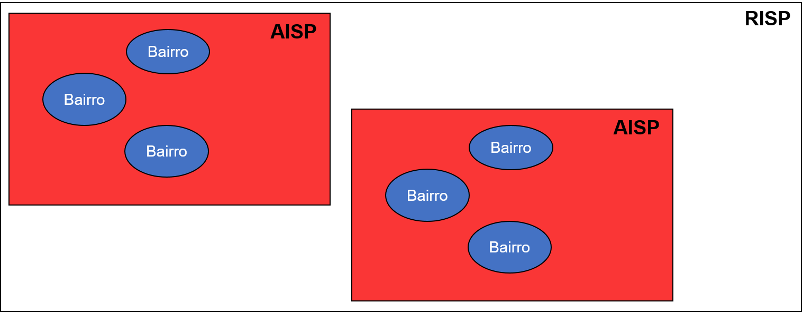

```{python solve_plot_bugs, eval=TRUE,echo=FALSE}
import os
os.environ['QT_QPA_PLATFORM_PLUGIN_PATH'] = 'C:/ProgramData/Anaconda3/Library/plugins/platforms'
```

# Descrevendo e Construindo indicadores básicos com a ciência de dados

Apesar da ciência de dados ser bem conhecida atualmente através das aplicações mais práticas e incríveis da Inteligência Artificial como demonstrado no vídeo abaixo:

<div align = "center">
<iframe width="560" height="315" src="https://www.youtube.com/embed/CRy2g_-SqKY" frameborder="0" allow="accelerometer; autoplay; clipboard-write; encrypted-media; gyroscope; picture-in-picture" allowfullscreen></iframe>
</div>
</br>

A ciência de dados está presente de outras formas no dia a dia do brasileiro de forma sutil.

```{r f50, echo=FALSE, fig.cap="Manchetes de jornais com termos da ciência de dados", align = "center", out.width = '99%', fig.align='center'}
knitr::include_graphics("fig_cap5/machetes_media.PNG")
```

Na Figura \@ref(fig:f50) destacamos alguns termos, consegue identificá-los? Eles são muito recorrentes neste imenso universo que é a ciência de dados e seus conceitos são bem simples de entender além de práticos!

Porém, você pode estar se questionando "Porque devo aprender mais sobre eles?" ou "Vou usar isso em algum momento da minha vida?". Questões como essas podem ser recorrentes durante a aprendizagem e são importante serem endereçadas. A área que é apresentada na Figura \@ref(fig:f50) e que será discutida neste capítulo é chamada de **estatística descritiva**. Ao estudar os dados, é comum o cientista buscar padrões desconhecidos e quantificar grandes quantidades de números em um só valor e nesse aspecto que esta ferramenta simples e eficaz é aplicada. 

O nome pode parecer complicado, porém se trata de um ramo da matemática com uma série de técnicas para descrever e resumir uma grande massa de informações. Essa área pode ser dividida em três grupos de medidas: tendência central, dispersão e forma. Neste capítulo focaremos nas duas primeiras. Além disso iremos explorar formas de visualizações utilizando estes conceitos como o diagrama de caixas e distribuições.

## Objeto de estudo
Para compreender a importância dessas medidas estatísticas e como  usa-las vamos estudar os dados de segurança pública da cidade de Salvador disponibilizados pela Secretaria de Segurança Pública (SSP) no [portal](http://www.ssp.ba.gov.br/modules/conteudo/conteudo.php?conteudo=109) para compreender um pouco da realidade que Salvador convive: a violência. Porém, antes de apresentar nosso tema central de estudo precisamos entender como funciona essa base de informações. 

Disponibilizados através de boletins mensais, as ocorrências dos principais delitos na capital bahiana são separados por áreas e regiões. Os principais tipos de delitos considerados são:

- Homicídio Doloso

- Lesão Corporal Seguida de Morte

- Roubo com Resultado Morte (Latrocínio)

- Tentativa de Homicídio

- Estupro

- Roubo a Ônibus (Urbano e em Rodovia)

- Roubo de Veículo

- Furto de Veículo

- Uso/Porte de Substância Entorpecentes (Usuários)

Você viu que eu citei "áreas" e "regiões" certo? Elas são definidas pela SSP em Salvador respectivamente como Área Integrada de Segurança Pública (AISP) e Região Integrada de Segurança Pública (RISP). Para entender melhor essas divisões vamos usar uma abordagem de conjuntos:

```{r f51, echo=FALSE, fig.cap="Conceito por trás das divisões AISP e RISP", align = "center", out.width = '99%', fig.align='center'}

```

Através da Figura \@ref(fig:f51) podemos explicar bem estes conceitos: **AISP** são conjuntos de bairros, ou seja, cada **AISP** representa uma quantidade de bairros da cidade. Já **RISP** se trata de um conjunto de **AISP** e finalmente, o conjunto total de **RISP** representa toda a extensão da cidade de Salvador. Essa divisão é realizada para facilitar a vida dos profissionais de segurança em compreender como cada região se comporta de acordo a um determinado tipo de delito, além de agrupar melhor os bairros, que somam um valor superior a 160 em Salvador. Imagina como seria mais complexo de apresentar um plano para cada bairro em específico?

```{r f52, echo=FALSE, fig.cap="RISP Atlântico de Salvador realizado pela SSP", align = "center", out.width = '99%', fig.align='center'}
knitr::include_graphics("fig_cap5/risp_atlantico.png")
```

```{r f53, echo=FALSE, fig.cap="RISP Baía de Todos os Santos (BTS) de Salvador realizado pela SSP", align = "center", out.width = '99%', fig.align='center'}
knitr::include_graphics("fig_cap5/risp_baia.png")
```

```{r f54, echo=FALSE, fig.cap="RISP Central de Salvador realizado pela SSP", align = "center", out.width = '99%', fig.align='center'}
knitr::include_graphics("fig_cap5/risp_central.png")
```

As Figuras \@ref(fig:f52), \@ref(fig:f53) e \@ref(fig:f54) mostram as divisões referentes as AISP e RISP em Salvador. Para contextualizar, a maioria das escolas que participaram do projeto "Meninas na Ciência de Dados" são localizadas no bairro da federação e este bairro está contido na AISP - Rio Vermelho que, por sua vez, está contida na RISP - Atlântico.

Com toda estas informações em mente como tipos dos principais delitos, divisões e subdivisões territoriais de Salvador determinada pela SSP podemos de fato identificar um objeto de estudo com um propósito: entender um pouco a violência em Salvador. Será analisado em específico um tipo de delito principal nos meses de janeiro, feveireiro e março de 2019 em Salvador: **Roubo a Ônibus urbano e em rodovia**. Essas escolhas não foram aleatórias. Os três meses citados foram escolhidos por ser um período de grande movimentação na capital: estação de verão, um dos principais períodos para turismo em Salvador,onde a grande maioria dos trabalhadores entram de férias. Além disso o delito de roubo a ônibus é uma realidade presente para quem depende do serviço público para se locomover na capital bahiana, seja a trabalho, estudos ou a lazer.

```{r f55, echo=FALSE, fig.cap="Manchetes do jornal G1 sobre roubos a ônibus na cidade de Salvador em diferentes períodos", align = "center", out.width = '99%', fig.align='center'}
knitr::include_graphics("fig_cap5/manchetes_roubo.png")
```

Na Figura \@ref(fig:f55) podemos verificar uma realidade referente a este crime: **em média ocorreu 3 assaltos em Salvador por dia avaliados durante um ano**. Neste capítulo frases como essa serão compreendidas por vocês de forma mais simples e intuitiva!

A base de dados referente aos assaltos à coletivos na cidade de Salvador na estação do verão em 2019 é apresentada abaixo:

```{r tabela1, echo=FALSE, message=FALSE}
library(kableExtra);
library(dplyr);
df = read.csv('data/segurança_boletim_01_02_03_2019_rouboOnibus.csv', encoding = 'latin-1', sep = ';');
kbl(df) %>% 
  kable_styling(bootstrap_options = c("striped", "hover"))
```

Nesta tabela vemos valores para cada uma das regiões divididas pela Secretária de Segurança Pública que serão estudados no decorrer deste capítulo. Alguns valores são bem alarmantes como a AISP de Tancredo Neves com um total de 40 ocorrências de assalto à coletivos em janeiro e 33 em março. Em contrapartida, outras AISP como Barra e CIA apresentam valores muito baixos em comparação com 1 ou 2 ocorrências.

Porém, e se quisermos **resumir esses valores para gerar indicadores para uma determinada região (RISP) ou para a cidade nesta época de verão?** **Como esses indicadores poderiam ajudar os gestores a entender como está determinada região ou área em relação ao aumento da violência, considerando este delito?** E principalmente: **Como podemos visualizar e passar estas ideias de forma fácil e intuitiva para gerar ações públicas de combate?**

Para responder esses e outros questionamentos, vamos estudar alguns conceitos importantes da ciência de dados como medidas de tendência central, medidas de dispersão, diagrama de caixas e distribuição no decorrer deste capítulo.

```{python imports_configs_c5, eval=TRUE,echo=FALSE}
# Modulos
import numpy as np
import pandas as pd
import seaborn as sns
import matplotlib.pyplot as plt
import matplotlib.colors as mcol

# Variaveis contendo padroes para os graficos do pyplot
TAMANHO_FONTE_TICKS = 25
TAMANHO_FONTE_LABEL = 30
TAMANHO_FONTE_TITLE = 35
ESCRITA_FONTE = 'Franklin Gothic Book'

# Aplicando padroes
plt.rc('font', family=ESCRITA_FONTE)
plt.rc('axes', titlesize=TAMANHO_FONTE_TITLE, labelsize=TAMANHO_FONTE_LABEL)
plt.rc('xtick', labelsize=TAMANHO_FONTE_TICKS)
plt.rc('ytick', labelsize=TAMANHO_FONTE_TICKS)
plt.rc('legend', fontsize=TAMANHO_FONTE_TICKS, title_fontsize=TAMANHO_FONTE_LABEL)

# Criar colormap
cm1 = mcol.LinearSegmentedColormap.from_list("WhiteToRed",["white","r"])
```

```{python import_dados_c5, eval=TRUE,echo=FALSE}
# Importando
df = pd.read_csv('data/segurança_boletim_01_02_03_2019_rouboOnibus.csv', sep=';',encoding='latin-1')

# Variáveis
risp_atc = ['Brotas','Rio Vermelho','Boca do Rio','Itapuã','Barra','Nordeste','Pituba']
risp_bts = ['Barris','Liberdade','Bonfim','São Caetano','Periperi','CIA']
risp_ctl = ['Pau da Lima','Tancredo Neves','Cajazeiras'] 

# DATASET - Mapa de calor
df_calor = df.drop(axis=1,columns=['RISP']).copy().set_index('AISP',drop=True);
```

## Medidas de tendência central

As **medidas de tendência central** são aquelas que buscam refletir o ponto de equilíbrio dos dados, ou seja, o seu ponto central. Diversas medidas existem com esse intuito e as mais básicas são: média, mediana e moda. Porém você pode se perguntar “Porque existe mais de uma medida se elas apresentam o mesmo significado?” Bom, cada uma dessas medidas possui suas vantagens e desvantagens, onde entendê-las pode ser fundamental para compreender aquele conjunto de informações da forma mais coerente com a realidade. 

Porém, antes de cair de cabeça nestas medidas vamos avaliar a Tabela apresentada na seção anterior (número de ocorrências de roubo à ônibus) através de um **mapa de calor**.

```{python f56, fig.cap='Mapa de calor da incidência de roubos à ônibus nas áreas de Salvador', out.width='100%', fig.asp=.99, fig.align='center', echo=FALSE}
# Grafico 01 - Mapa de calor geral
plt.figure(figsize=(10,15));
sns.heatmap(data=df_calor, annot=True, annot_kws={'fontsize':TAMANHO_FONTE_TICKS, 'color':'black'}, vmin=0, linewidths=0.02, linecolor='black', cmap=cm1, cbar=False);
plt.ylabel('');
            
# Mostrar e fechar objeto grafico
plt.tight_layout();
plt.show();
plt.close('all');
```

Apesar do mapa de calor parecer bastante com uma tabela, existe uma diferença: Cada célula (campo do gráfico) apresenta uma coloração de acordo a grandeza representada. 

Na Figura \@ref(fig:f56) apresentamos um mapa de calor para todas as áreas de Salvador, onde a grandeza representa é o número de ocorrências de assalto, onde quanto mais avermelhada for aquela região, maior é o valor e quanto menor for o número de ocorrências mais esbranqueçida se torna a célula. Ainda na Figura \@ref(fig:f56) podemos verificar que o setor Tancredo Neves, localizado na RISP Central, apresenta os maiores valores disparado, enquanto o restante em sua grande maioria aparece com um tom mais rosa. Em contrapartida a situação de Tancredo Neves, as áreas Barra e CIA apresentam os menores números de ocorrência, não passando de duas ocorrências por mês. Visualmente falando, já conseguimos extrair algumas informações deste gráfico não é? No geral:

- O setor com maior incidência é, de forma disparada, Tancredo Neves em todos os meses do verão.

- Barra e CIA são os setores com os menores números de ocorrência no geral.

Além dessas informações, você consegue extrair mais conhecimento deste gráfico?

Apesar da Figura \@ref(fig:f56) apresentar um panorama geral das ocorrências, podemos notar um detalhe curioso: O fato da área Tancredo Neves apresentar altas incidências, torna os outros setores, visualmente, menos perigosos. E se fizermos uma análise por região, será que conseguiremos identificar novas regiões de periculosidade? 

```{python f57, fig.cap='Mapa de calor particionado por regiões de Salvador', out.width='100%', fig.asp=.99, fig.align='center', echo=FALSE}
# Grafico 02 - Mapa de calor por RISP
fig, axes = plt.subplots(nrows=3,ncols=1,figsize=(10,25));

# Loop nas RISP
for aisp,risp,p in zip([risp_atc,risp_bts,risp_ctl],['Atlântico','BTS','Central'], [0,1,2]):
    sns.heatmap(data=df_calor.loc[aisp,:], annot=True, annot_kws={'fontsize':TAMANHO_FONTE_TICKS,'color':'black'},
                vmin=0, linewidths=0.02, linecolor='black', cmap=cm1, cbar=False,ax=axes[p]);
    axes[p].set_title('RISP - '+risp);
    axes[p].set_ylabel('');
# Mostrar e fechar objeto grafico
plt.tight_layout();
plt.show();
plt.close('all');
```

Na Figura \@ref(fig:f57) apresentamos novamente o mapa de calor, agora separado por regiões. Cada uma das três regiões apresentam características interessantes no verão:

- Na região "Atlântico" podemos verificar que as áreas Brotas e Itapuã são as mais perigosas de modo geral, onde em Janeiro ocorreu em ambas o maior número de ocorrências com 17 casos. Além disso, Pituba e Rio Vermelho possuem um grande tom de rosa, mostrando que elas não são tão seguras.

- Na região "BTS" nota-se que diversas áreas apresentam tons avermelhados, mostrando um grande perigo nesta região com destaque para São Caetano e Periperi que apresentam os maiores valores.

- Na região "Central" é possível perceber que a área Tancredo Neves é a mais perigosa, mantendo o mesmo padrão apresentado na Figura \@ref(fig:f57).

Com esta nova análise conseguimos perceber que as vezes até uma imagem podem acabar nos enganando no que se refere a perspectiva: Na Figura \@ref(fig:f56) apenas a área de Tancredo Neves se destacavam em comparação as outras, porém ao fazer uma análise mais aprofundada, considerando a característica referente a região, verificamos que outras áreas apresentam uma grande quantidade de ocorrências. Este padrão será observado nesta seção quando avaliarmos as medidas de tendência central.

A primeira medida de tendência central a ser analisada será a **Média**. Trata-se da medida mais conhecida e usada em nosso dia a dia como vimos no início deste capítulo. De forma geral ela é calculada através 


## Medidas de dispersão

## Visualizando com *Boxplot*

## Distribuição
