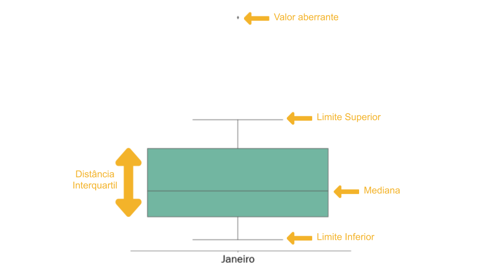

```{python solve_plot_bugs, eval=TRUE,echo=FALSE}
import os
os.environ['QT_QPA_PLATFORM_PLUGIN_PATH'] = 'C:/ProgramData/Anaconda3/Library/plugins/platforms'
```

# Descrevendo e Construindo indicadores básicos com a ciência de dados

Apesar da ciência de dados ser bem conhecida atualmente através das aplicações mais práticas e incríveis da Inteligência Artificial como demonstrado no vídeo abaixo:

<div align = "center">
<iframe width="560" height="315" src="https://www.youtube.com/embed/CRy2g_-SqKY" frameborder="0" allow="accelerometer; autoplay; clipboard-write; encrypted-media; gyroscope; picture-in-picture" allowfullscreen></iframe>
</div>
</br>

Ela está presente de outras formas no dia a dia do brasileiro de forma sutil.

```{r f50, echo=FALSE, fig.cap="Manchetes de jornais com termos da ciência de dados", align = "center", out.width = '99%', fig.align='center'}
knitr::include_graphics("fig_cap5/machetes_media.PNG")
```

Na Figura \@ref(fig:f50) destacamos alguns termos, consegue identificá-los? Eles são muito recorrentes neste imenso universo que é a ciência de dados e seus conceitos são bem simples de entender além de práticos!

Porém, você pode estar se questionando "Porque devo aprender mais sobre eles?" ou "Vou usar isso em algum momento da minha vida?". Questões como essas podem ser recorrentes durante a aprendizagem e são importante serem endereçadas. A área que é apresentada na Figura \@ref(fig:f50) e que será discutida neste capítulo é chamada de **estatística descritiva**. Ao estudar os dados, é comum o cientista buscar padrões desconhecidos e quantificar grandes quantidades de números em um só valor e é neste aspecto que esta ferramenta simples e eficaz é aplicada. 

O nome pode parecer complicado, porém se trata de um ramo da matemática com uma série de técnicas para descrever e resumir uma grande massa de informações. Essa área pode ser dividida em três grupos de medidas: tendência central, dispersão e forma. Neste capítulo focaremos nas duas primeiras. Além disso iremos explorar formas de visualizações utilizando estes conceitos como o diagrama de caixas e distribuições.

## Objeto de estudo
Para compreender a importância dessas medidas estatísticas e como  usá-las vamos estudar os dados de segurança pública da cidade de Salvador disponibilizados pela Secretaria de Segurança Pública (SSP) no [portal](http://www.ssp.ba.gov.br/modules/conteudo/conteudo.php?conteudo=109) para compreender um pouco da realidade que Salvador convive: a violência. Porém, antes de apresentar nosso tema central de estudo precisamos entender como funciona essa base de informações. 

Disponibilizados através de boletins mensais, as ocorrências dos principais delitos na capital bahiana são separados por áreas e regiões. Os principais tipos de delitos considerados são:

- Homicídio Doloso

- Lesão Corporal Seguida de Morte

- Roubo com Resultado Morte (Latrocínio)

- Tentativa de Homicídio

- Estupro

- Roubo a Ônibus (Urbano e em Rodovia)

- Roubo de Veículo

- Furto de Veículo

- Uso/Porte de Substância Entorpecentes (Usuários)

Você viu que eu citei "áreas" e "regiões" certo? Elas são definidas pela SSP em Salvador respectivamente como Área Integrada de Segurança Pública (AISP) e Região Integrada de Segurança Pública (RISP). Para entender melhor essas divisões vamos usar uma abordagem de conjuntos:

```{r f51, echo=FALSE, fig.cap="Conceito por trás das divisões AISP e RISP", align = "center", out.width = '99%', fig.align='center'}
knitr::include_graphics("fig_cap5/aisp_risp_explicacao.png")
```

Através da Figura \@ref(fig:f51) podemos explicar bem estes conceitos: **AISP** são conjuntos de bairros, ou seja, cada **AISP** representa uma quantidade de bairros da cidade. Já **RISP** se trata de um conjunto de **AISP** e finalmente, o conjunto total de **RISP** representa toda a extensão da cidade de Salvador. Essa divisão é realizada para facilitar a vida dos profissionais de segurança em compreender como cada região se comporta de acordo a um determinado tipo de delito, além de agrupar melhor os bairros, que somam um valor superior a 160 em Salvador. Imagina como seria mais complexo de apresentar um plano para cada bairro em específico para um gestor municipal ou estadual?

```{r f52, echo=FALSE, fig.cap="RISP Atlântico de Salvador realizado pela SSP", align = "center", out.width = '99%', fig.align='center'}
knitr::include_graphics("fig_cap5/risp_atlantico.png")
```

```{r f53, echo=FALSE, fig.cap="RISP Baía de Todos os Santos (BTS) de Salvador realizado pela SSP", align = "center", out.width = '99%', fig.align='center'}
knitr::include_graphics("fig_cap5/risp_baia.png")
```

```{r f54, echo=FALSE, fig.cap="RISP Central de Salvador realizado pela SSP", align = "center", out.width = '99%', fig.align='center'}
knitr::include_graphics("fig_cap5/risp_central.png")
```

As Figuras \@ref(fig:f52), \@ref(fig:f53) e \@ref(fig:f54) mostram as divisões referentes as AISP e RISP em Salvador. Para contextualizar, a maioria das escolas que participaram do projeto "Meninas na Ciência de Dados" são localizadas no bairro da federação e este bairro está contido na AISP - Rio Vermelho que, por sua vez, está contida na RISP - Atlântico.

Com toda estas informações em mente como os principais tipos delitos, divisões e subdivisões territoriais de Salvador determinada pela SSP podemos de fato identificar um objeto de estudo com um propósito: entender um pouco a violência em Salvador. Será analisado em específico um tipo de delito principal nos meses de janeiro, feveireiro e março de 2019 em Salvador: **Roubo a Ônibus urbano e em rodovia**. Essas escolhas não foram aleatórias. Os três meses citados foram escolhidos por ser um período de grande movimentação na capital: estação de verão, um dos principais períodos para turismo em Salvador,onde a grande maioria dos trabalhadores entram de férias. Além disso o delito de roubo a ônibus é uma realidade presente para quem depende do serviço público para se locomover na capital bahiana, seja a trabalho, estudos ou a lazer.

```{r f55, echo=FALSE, fig.cap="Manchetes sobre roubos a ônibus na cidade de Salvador", align = "center", out.width = '99%', fig.align='center'}
knitr::include_graphics("fig_cap5/manchetes_roubo.png")
```

Na Figura \@ref(fig:f55) podemos verificar uma realidade referente a este crime: **em média ocorreram 3 assaltos em Salvador por dia avaliados durante 2019**. Neste capítulo frases como essa serão compreendidas por vocês de forma mais simples e intuitiva!

A base de dados referente aos assaltos à coletivos na cidade de Salvador na estação do verão em 2019 é apresentada abaixo:

```{r tabela1, echo=FALSE, message=FALSE}
library(kableExtra);
library(dplyr);
df = read.csv('data/segurança_boletim_01_02_03_2019_rouboOnibus.csv', encoding = 'latin-1', sep = ';');
kbl(df) %>% 
  kable_styling(bootstrap_options = c("striped", "hover"))
```

Nesta tabela vemos valores para cada uma das regiões divididas pela Secretária de Segurança Pública que serão estudados no decorrer deste capítulo. Alguns valores são bem alarmantes como a AISP de Tancredo Neves com um total de 40 ocorrências de assalto à coletivos em janeiro e 33 em março. Em contrapartida, outras AISP como Barra e CIA apresentam valores muito baixos em comparação com 1 ou 2 ocorrências.

Porém, e se quisermos **resumir esses valores para gerar indicadores para uma determinada região (RISP) ou para a cidade nesta época de verão?** **Como esses indicadores poderiam ajudar os gestores a entender como está determinada região ou área em relação ao aumento da violência, considerando este delito?** E principalmente: **Como podemos visualizar e passar estas ideias de forma fácil e intuitiva para gerar ações públicas de combate?**

Para responder esses e outros questionamentos, vamos estudar alguns conceitos importantes da ciência de dados como medidas de tendência central, medidas de dispersão, diagrama de caixas e distribuição no decorrer deste capítulo.

```{python imports_configs_c5, eval=TRUE,echo=FALSE}
# Modulos
import numpy as np
import pandas as pd
import seaborn as sns
import matplotlib.pyplot as plt
import matplotlib.colors as mcol
from scipy import stats
# Variaveis contendo padroes para os graficos do pyplot
TAMANHO_FONTE_TICKS = 25
TAMANHO_FONTE_LABEL = 30
TAMANHO_FONTE_TITLE = 35
ESCRITA_FONTE = 'Franklin Gothic Book'

# Aplicando padroes
plt.rc('font', family=ESCRITA_FONTE)
plt.rc('axes', titlesize=TAMANHO_FONTE_TITLE, labelsize=TAMANHO_FONTE_LABEL)
plt.rc('xtick', labelsize=TAMANHO_FONTE_TICKS)
plt.rc('ytick', labelsize=TAMANHO_FONTE_TICKS)
plt.rc('legend', fontsize=TAMANHO_FONTE_TICKS, title_fontsize=TAMANHO_FONTE_LABEL)

# Criar colormap
cm1 = mcol.LinearSegmentedColormap.from_list("WhiteToRed",["white","r"])

# Funcao para anotar no grafico de barras
def fazer_anotacao_frequencia_absoluta(eixo, coord_texto_xy, barra_eixo_y=True, use_int=True):
    # Loop em cada barra que existe no gráfico
    for barra in eixo.patches:
        if barra_eixo_y:
            tamanho_barra = barra.get_width() # Pegar o tamanho da barra
            texto_barra = tamanho_barra # Texto que sera anotado referente a barra
            coord_anotacao_xy = (barra.get_x() + tamanho_barra, barra.get_y()) # Coordenada de onde sera a anotacao no grafico
            eixo.annotate(texto_barra, coord_anotacao_xy, xytext=coord_texto_xy, fontsize=20, color='black',
                          weight='bold',textcoords='offset points', horizontalalignment='right')
        else:
            tamanho_barra = barra.get_height() # Pegar o tamanho da barra
            texto_barra = tamanho_barra # Texto que sera anotado referente a barra
            coord_anotacao_xy = (barra.get_x(), barra.get_y() + tamanho_barra) # Coordenada de onde sera a anotacao no grafico
            if use_int:
                eixo.annotate(int(round(texto_barra,0)),coord_anotacao_xy,xytext=coord_texto_xy,fontsize=TAMANHO_FONTE_TICKS,
                              color='black',weight='bold',textcoords='offset points', horizontalalignment='right')
            else:
                eixo.annotate(texto_barra, coord_anotacao_xy, xytext=coord_texto_xy, fontsize=TAMANHO_FONTE_TICKS,
                              color='black',weight='bold',textcoords='offset points', horizontalalignment='right')   
```

```{python import_dados_c5, eval=TRUE,echo=FALSE}
# Importando
df = pd.read_csv('data/segurança_boletim_01_02_03_2019_rouboOnibus.csv', sep=';',encoding='latin-1');

# Variaveis
risp_atc = ['Brotas','Rio Vermelho','Boca do Rio','Itapuã','Barra','Nordeste','Pituba'];
risp_bts = ['Barris','Liberdade','Bonfim','São Caetano','Periperi','CIA'];
risp_ctl = ['Pau da Lima','Tancredo Neves','Cajazeiras']; 
risp_nomes = ['Atlântico','BTS','Central']
meses = df.columns[2:].to_list()

# DATASET - Mapa de calor
df_calor = df.drop(axis=1,columns=['RISP']).copy().set_index('AISP',drop=True);

# DATASET - Medidas Centrais
df_central = df.groupby('RISP').aggregate([('Média','mean'),('Mediana',np.median)]).round(2);

# DATASET - Medidas Dispersao
df_disp = df.groupby('RISP').aggregate([('Amplitude',np.ptp),('Desvio Padrão',np.std),('Distância Interquartil',stats.iqr)]).round(2);
df_disp = df_disp.unstack().to_frame().reset_index(); # Transformar em um dataframe linear
df_disp.rename(columns={'level_0':'Mês','level_1':'Medidas',0:'Valor'},inplace=True); # Corrigir nome das colunas

# DATASET - Boxplot & Distribuicao
df_box = df.melt(id_vars=['AISP','RISP'], var_name='Meses',value_name='Ocorrências');
```

## Medidas de tendência central

As **medidas de tendência central** são aquelas que buscam refletir o ponto de equilíbrio dos dados, ou seja, o seu ponto central. Diversas medidas existem com esse intuito e as mais básicas são: média, mediana e moda. Porém você pode se perguntar “Porque existe mais de uma medida se elas apresentam o mesmo significado?” Bom, cada uma dessas medidas possui suas vantagens e desvantagens, onde entendê-las pode ser fundamental para compreender aquele conjunto de informações da forma mais coerente com a realidade. 

Porém, antes de cair de cabeça nestas medidas vamos avaliar a Tabela apresentada na seção anterior (número de ocorrências de roubo à ônibus) através de um **mapa de calor**.

```{python f56, fig.cap='Mapa de calor da incidência de roubos à ônibus nas áreas de Salvador', out.width='100%', fig.asp=.99, fig.align='center', echo=FALSE}
# Grafico 01 - Mapa de calor geral
plt.figure(figsize=(10,15));
sns.heatmap(data=df_calor, annot=True, annot_kws={'fontsize':TAMANHO_FONTE_TICKS, 'color':'black'}, vmin=0, linewidths=0.02, linecolor='black', cmap=cm1, cbar=False);
plt.ylabel('');
            
# Mostrar e fechar objeto grafico
plt.tight_layout();
plt.show();
plt.close('all');
```

Apesar do mapa de calor parecer bastante com uma tabela, existe uma diferença: Cada célula (campo do gráfico) apresenta uma coloração de acordo a grandeza representada. 

Na Figura \@ref(fig:f56) apresentamos um mapa de calor para todas as áreas de Salvador considerando o número de ocorrências, onde quanto mais avermelhada for aquela região, maior é a incidência de delitos e quanto menor for o número de ocorrências mais branca se torna a célula. Ainda na Figura \@ref(fig:f56) podemos verificar que o setor Tancredo Neves, localizado na RISP Central, apresenta os maiores valores disparado, enquanto o restante em sua grande maioria aparece com um tom mais rosa. Em contrapartida as áreas Barra e CIA apresentam os menores números de ocorrências, não passando de duas ocorrências por mês. Visualmente falando, já conseguimos extrair algumas informações deste gráfico não é? 

Em geral percebemos que:

- O setor com maior incidência é, de forma disparada, Tancredo Neves em todos os meses do verão.

- Barra e CIA são os setores com os menores números de ocorrência no geral.

Além dessas informações, você consegue extrair mais conhecimento deste gráfico?

Apesar da Figura \@ref(fig:f56) apresentar um panorama completo das ocorrências, podemos notar um detalhe curioso: O fato da área Tancredo Neves apresentar altas incidências, torna outros setores, visualmente, menos perigosos. E se fizermos uma análise por região, será que conseguiremos identificar novas zonas de periculosidade? 

```{python f57, fig.cap='Mapa de calor particionado por regiões de Salvador', out.width='100%', fig.asp=.99, fig.align='center', echo=FALSE}
# Grafico 02 - Mapa de calor por RISP
fig, axes = plt.subplots(nrows=3,ncols=1,figsize=(10,25));

# Loop nas RISP
for aisp,risp,p in zip([risp_atc,risp_bts,risp_ctl],['Atlântico','BTS','Central'], [0,1,2]):
    sns.heatmap(data=df_calor.loc[aisp,:], annot=True, annot_kws={'fontsize':TAMANHO_FONTE_TICKS,'color':'black'},
                vmin=0, linewidths=0.02, linecolor='black', cmap=cm1, cbar=False,ax=axes[p]);
    axes[p].set_title('RISP - '+risp);
    axes[p].set_ylabel('');
# Mostrar e fechar objeto grafico
plt.tight_layout();
plt.show();
plt.close('all');
```

Na Figura \@ref(fig:f57) apresentamos novamente o mapa de calor, agora separado por regiões. Cada uma das três regiões apresentam características interessantes no verão:

- Na região Atlântico podemos verificar que as áreas Brotas e Itapuã são as mais perigosas de modo geral, onde em Janeiro ocorreu em ambas o maior número de ocorrências com 17 casos. Além disso, Pituba e Rio Vermelho possuem um grande tom de rosa, mostrando que elas não são tão seguras.

- Na região BTS nota-se que diversas áreas apresentam tons avermelhados, mostrando um grande perigo nesta região com destaque para São Caetano e Periperi que apresentam os maiores valores.

- Na região Central é possível perceber que a área Tancredo Neves é a mais perigosa, mantendo o mesmo padrão apresentado na Figura \@ref(fig:f57).

Com esta nova análise conseguimos perceber que as vezes até uma imagem podem acabar nos enganando no que se refere a perspectiva: Na Figura \@ref(fig:f56) apenas a área de Tancredo Neves se destacava em comparação as outras, porém ao fazer uma análise mais aprofundada, considerando uma comparação apenas dentro das regiões definidas pela SSP, verificamos que outras áreas apresentam uma grande quantidade de ocorrências. Este padrão será observado nesta seção quando avaliarmos as medidas de tendência central, onde vamos entender o impacto de um **valor aberrante**.

A primeira medida de tendência central a ser analisada será a **Média**. Trata-se da medida mais conhecida e usada em nosso dia a dia, como vimos no início deste capítulo. 

Ela é calculada através do **somatório de todos os valores dividido pela sua quantidade**. Com este conhecimento em mãos vamos montar uma tabela da média de ocorrência para os meses do verão de acordo a região:

RISP      | Janeiro | Fevereiro | Março |
:--------:|:-------:|:---------:|:-----:|
Atlântico | 9.29    | 5.57      | 6.71  |
BTS       | 11.50   | 8.67      | 11.83 |
Central   | 18.67   | 12.67     | 16.0  |

Porém, antes de analisar esta tabela, por quê calculamos a média? Bom, o intuito é apresentar um indicador para o número de ocorrências para as regiões de Salvador encontrando uma medida capaz de resumir todos os valores daquelas áreas. Assim, ao invés de avaliar área por área, temos um valor único que resume aquela imensa quantidade de dados em um só representativo.

Da Tabela de médias calculadas, podemos perceber que:

- O mês de fevereiro como um todo possui os menores índices de ocorrências em comparação a janeiro e fevereiro.

- A RISP Central possui as maiores médias de ocorrências nos meses de verão, mesmo sendo uma região com apenas 3 áreas catalogadas. Note que a área com maior incidência, Tancredo Neves, pertence a esta região.

- A RISP Atlântico possui os melhores indicadores em todos os meses, ou seja, possui a menor média de ocorrências e, portanto, poderia ser considerada a região mais segura.

Através da média, conseguimos extrair indicadores capazes de fazer comparações diretas entre as regiões! Isso é importante para avaliar situações de forma mais abrangente em um cenário mais amplo para a cidade de Salvador.

Note que os valores de média são decimais, porém estamos tratando de números de ocorrências certo? Você nunca ouviu algo como "Ontem acontecem 2.5 assaltos naquele ponto de ônibus" ou "Aconteceu em Salvador 30.5 furtos de veículos na região do litoral" e mesmo assim o valor da média é decimal. Isto ocorre, pois estamos tratando de uma variável que por natureza é **inteira**, ou seja, aumenta em unidades, porém a forma como a média é calculada não é garantido que o resultado seja também um **inteiro** (algumas vezes pode acontecer). Logo, é comum realizar uma aproximação simples seguindo as regras:

- Caso a parte decimal seja maior ou igual 0.5, você aproxima para o maior valor inteiro próximo do seu número

- Caso a parte decimal seja menor que 0.5, você aproxima para o menor valor inteiro próximo do seu número

Esta regra vale para qualquer valor decimal que você queira representar e não somente a média. Aplicando esta regra na tabela anterior temos:

RISP      | Janeiro | Fevereiro | Março |
:--------:|:-------:|:---------:|:-----:|
Atlântico | 9       | 6         | 7     |
BTS       | 12      | 9         | 12    |
Central   | 19      | 13        | 16    |

Assim, fica mais simples manter a ideia deste indicador: representar um ponto de equilíbrio para o número de ocorrências de assaltos a ônibus por região em Salvador.

Com os valores das médias calculados por região, podemos assinalar outro situação, protagonizada pela novamente pela área Tancredo Neves na região Central... Você conseguiu perceber?

Olhe para as médias da região Central: 19 ocorrências em Janeiro, 13 ocorrências em Fevereiro e 16 ocorrências em Março. Agora olhe novamente para esta mesma região na Figura \@ref(fig:f57) e responda: estes valores de média fazem sentido?

Infelizmente não. A situação que ocorre aqui mostra uma das fraquezas desta medida: **valores aberrantes**. Tratam-se de observações demasiadamente grandes ou pequenos que apresentam um grande afastamento das demais. 

Neste caso a responsável por esses valores é o setor Tancredo Neves, com números de ocorrências muito maiores em comparação aos demais. Os valores aberrantes influenciam bastante na média e isso será discutido mais a frente ...

Agora que aprendemos como calcular e utilizar a média, podemos compreender a frase dita no início desta seção:

**"Em média ocorreram 3 assaltos em Salvador por dia avaliados durante o ano"**

Basicamente o que o jornal apresentou foi um tratamento similiar ao que fizemos anteriormente: Adquiriu todos os os boletins mensais disponibilizados pela SSP, somou todos os números de ocorrências de Janeiro até Dezembro e então dividiu pelo total de dias que existem no ano, 365 dias. É provável que o valor encontrado tenha sido decimal também, e então foi aproximado para este valor que verificamos: três ocorrências em média!

Além disso, com a tabela calculada podemos dizer frases como:

- "Durante o período de Janeiro, em média ocorreram doze assaltos à ônibus"

- "Em Fevereiro, na Região BTS, aconteceram nove assaltos à ônibus em média"

Depois de compreender um pouco sobre a medida mais usada e saber uma de suas falhas (valores aberrantes), será que existe alguma outra medida que seja blindada a esta questão? Para nossa sorte, ela existe e se chama **Mediana**.

A mediana é definida como o valor que divide os dados na metade, 50% estão acima da mediana e 50% estão abaixo. A obtenção da mediana é feita ordenando-se os dados e escolhendo-se o valor do meio. Por exemplo se temos 11 valores, a mediana estará na 6º posição (5 valores abaixo e 5 valores acima). No caso de uma quantidade amostral par, computamos a média dos dois valores “centrais”. Abaixo é apresentado a Tabela com os valores das medianas para cada região de Salvador:

RISP      | Janeiro | Fevereiro | Março |
:--------:|:-------:|:---------:|:-----:|
Atlântico | 7.0     | 6.0       | 6.0   |
BTS       | 10.5    | 9.5       | 11.5  |
Central   | 11.0    | 9.0       | 9.0   |

Note que algumas regiões apresentam valores decimais, assim como aconteceu com a média e o motivo é o mesmo: ao calcular a média dos valores "centrais" não garantimos um resultado inteiro.

Para compreender melhor este resultado, vamos organizar de forma crescente os números de ocorrências em cada região para o mês de janeiro:

- RISP Atlântico: 2,4,5,**7**,13,17,17

- RISP BTS: 1,8,**8**,**13**,17,22

- RISP Central: 5,**11**,40

Vimos anteriormente que cada uma das regiões listadas possuem respectivamente sete, seis e três AISP no total. Apenas a região BTS possui um valor par e é por isso que a incidência de medianas decimais são nesta região! Para as outras, apenas foi pego os valores que separam o conjunto de dados em 50% para cada lado, sendo destacados em negrito.

```{python f58, fig.cap='Gráfico de pontos para as ocorrências em Salvador', out.width='100%', fig.asp=.99, fig.align='center', echo=FALSE, results='hide'}
# Grafico de pontos
fig, axes = plt.subplots(nrows=1,ncols=3,figsize=(25,10));

# Loop para fazer os plots
for mes, idx in zip(meses, [0,1,2]):
    # Gerar grafico
    sns.stripplot(x=mes, y='RISP', data=df, size=25, ax=axes[idx],
                  linewidth=0.5,edgecolor='black', color=plt.get_cmap("Set2")(0));
    
    # Detalhes visuais do grafico
    axes[idx].set_title(mes, fontweight='bold');
    axes[idx].set_xlabel('');
    axes[idx].set_ylabel('');
    axes[idx].spines['right'].set_visible(False);
    axes[idx].spines['top'].set_visible(False);
    
    # Detalhes visuais especificos
    if idx != 0:
        axes[idx].set_yticks([]);
    else:
        axes[idx].yaxis.set_tick_params(labelsize=30);

# Fazer plots das médias e medianas no gráfico
acrescimo = -0.15;

# Loop para fazer plot das medidas centrais
for mes, idx in zip(meses, [0,1,2]):
    for risp, coordX in zip(risp_nomes, [0+acrescimo,1+acrescimo,2+acrescimo]):
        # Gerar media
        coordY = df_central.loc[risp][mes]['Média'];
        axes[idx].plot([coordY],[coordX], marker='P',color='red', markersize=25, label='Média',linestyle = 'None');
        coordY = df_central.loc[risp][mes]['Mediana'];
        axes[idx].plot([coordY],[coordX], marker='D',color='gray', markersize=20, label='Mediana', linestyle='None');

# Inserir legenda
plt.legend(['Média','Mediana'], title='Medidas', bbox_to_anchor=(1.15,0.65), fontsize=30);        

# Mostrar e fechar objeto grafico
plt.tight_layout();
plt.show();
plt.close('all');
```

Na Figura \@ref(fig:f58) avaliamos essas duas medidas junto a grandeza estudada através de uma nova visualização: **gráfico de pontos**.

Podemos perceber na Figura \@ref(fig:f58) que para as regiões Atlâtico e BTS os valores de média e mediana são próximos, diferente da região Central. Essa disparidade é explicada pelo que vimos anteriormente: O **valor aberrante** distorce o valor da média, puxando-a em sua direção como vocês percebem.

A comparação de média e mediana pode ser um bom indicativo para verificar a  presença de um valor aberrante: quanto mais próximos essas medidas forem, mais provável a ausência de valores aberrantes.

Nesta análise em específico, verificamos que a mediana seria uma melhor medida para representar a região Central como um todo, já para as outras duas regiões a escolha entre ambas as medidas é arbitrária, pois elas estão bem próximas.

São visualizações como essas que ajudam o cientista de dados a tomar melhores decisões na escolha de indicadores ou medidas de resumo. Logo, conseguimos perceber que no geral a região mais perigosa, ou melhor, a área mais perigosa durante o verão de 2019 foi Tancredo Neves.

Finalmente, a última medida de tendência central a ser mencionada neste capítulo é a **moda**. Trata-se da medida de maior frequência em um conjunto de dados, em outras palavras, o valor que mais se repete em uma amostra será a moda deste dado. Este conceito é muito usado com variáveis categóricas. Como neste capítulo trabalhamos com valores numéricos, não cabe sua análise deste medida.

## Medidas de dispersão
Como já foi visto as medidas de posição ou se preferir, tendência central, podem ser utilizadas para descrever as informações através de um único valor. Porém e se dois conjuntos possuirem o mesmo valor de média ou mediana, podemos dizer que eles são equivalentes?

**A resposta é Não!** Apesar destas medidas resumirem bem os conjuntos de informações, perdemos outras características importantes ... Para alcançar uma visão geral e expandir nossas análises usamos também as **medidas de dispersão**. 

```{r f59, echo=FALSE, fig.cap="Explicação das medidas de dispersão", align = "center", out.width = '99%', fig.align='center'}
knitr::include_graphics("fig_cap5/disp.png")
```

Para entender melhor este conceito e a necessidade de saber entender melhor essas medidas dispersão avalie a Figura \@ref(fig:f59) onde apresentamos duas situações: Na "Situação 1" podemos perceber que os dados apresentam um espalhamento ou dispersão em relação a medida de posição, lembre que o triângulo busca resumir todas as bolinhas. Isto significa dizer que há variação entre os valores observados em comparação a uma medida qualquer de posição, o que torna este conjunto **heterogêneo**, ou seja, bem diversificado. Já na "Situação 2" vemos uma situação oposta, onde a massa de dados está bem localizada ao redor da medida de posição inclusive bastante próxima, mostrando assim um conjunto de dados **homogêneo**.

Quanto mais homogêneo for um conjunto em relação a uma medida de posição, maior será o poder de explicação desta medida sobre o conjunto.

Portanto, medidas de dispersão são medidas capazes de relacionar o afastamento dos dados em comparação à uma medida de posição, que estudamos na seção anterior. Existem várias formas de se medir, porém será tratado como tópico de discussão a **Amplitude**, **Desvio padrão** e **Distância Interquartil**. Essas medidas se tratam de um complemento, pois agora conseguimos entender como os dados estão espalhados em relação a medida central calculada.

A primeira medida a ser trabalha é a **amplitude** definida como:

$$Amplitude=Valor\ Máximo\ -\ Valor\ Minímo$$ 
Seu conceito é bastante simples de entender.

```{python f510, fig.cap='Gráfico de pontos para as ocorrências em Salvador', out.width='100%', fig.asp=.99, fig.align='center', echo=FALSE, results='hide'}
# Grafico de pontos
fig, axes = plt.subplots(nrows=1,ncols=3,figsize=(25,10));

# Loop para fazer os plots
for mes, idx in zip(meses, [0,1,2]):
    # Gerar grafico
    sns.stripplot(x=mes, y='RISP', data=df, size=25, ax=axes[idx],
                  linewidth=0.5,edgecolor='black', color=plt.get_cmap("Set2")(0));
    
    # Detalhes visuais do grafico
    axes[idx].set_title(mes, fontweight='bold');
    axes[idx].set_xlabel('');
    axes[idx].set_ylabel('');
    axes[idx].spines['right'].set_visible(False);
    axes[idx].spines['top'].set_visible(False);
    
    # Detalhes visuais especificos
    if idx != 0:
        axes[idx].set_yticks([]);
    else:
        axes[idx].yaxis.set_tick_params(labelsize=30);

# Mostrar e fechar objeto grafico
plt.tight_layout();
plt.show();
plt.close('all');
```

Na Figura \@ref(fig:f510) apresentamos novamente o gráfico de pontos da seção anterior para o número de ocorrências. Podemos perceber de forma visual, que a amplitude da região Central será maior do que todas as outras regiões em todos os meses, pois a área de Tancredo Neves apresenta grandes índices de assaltos, como foi discutido anteriormente. Em geral, a amplitude apenas permite comparar dois ou mais conjuntos no sentido de avaliar quem apresentar a maior ou menor variação em relação a outra, porém não dá resposta em relação à distribuição dos dados e como eles estão espalhados em torno de uma medida de posição. Além disso, assim como a média essa medida sofre bastante com a presença de valores aberrantes, a amplitude também sofre ... Você consegue identificar o motivo?

Agora que entendemos um conceito mais simples, vamos partir para a compreensão de dois conceitos um pouco mais complexos: Desvio padrão e Distância Interquartil.

O **Desvio Padrão** relaciona a diferença entre cada elemento do conjunto com a média aritmética através de uma fórmula matemática. Ou seja, cada elemento terá um determinado valor de variação em relação à média do grupo e desta forma, é possível saber quando os conjuntos analisados são heterogêneos ou homogêneos. Isso confirma que esta medida consegue representar a dispersão dos dados, já que utiliza todos os valores do conjunto no seu cálculo. Sua fórmula não será apresentada neste material, pois foge do escopo do livro. Na ciência, esta medida junto com a média é essencial para construir análises e resultados, pois esta dupla se complementa, sendo as mais utilizadas.

A **Distância Interquartil**, diferente da amplitude, é mais robusta à valores aberrantes. Para entender a distância interquartil precisamos inicialmente definir os quartis. Quartis são valores que dividem os dados em quatro partes e eles são:

- $Q1$ (primeiro quartil) define o valor para o qual 25% dos valores estão abaixo dele;

- $Q2$ (segundo quartil) é o valor que tem 50% dos valores abaixo e 50% acima;

- $Q3$ (terceiro quartil) define o valor que possui 75% dos dados abaixo dele.

Onde, a fórmula para a distância interquartil será a diferença entre o primeiro e terceiro quartil:

$$Distância\ Interquartil\ =Q3-Q1$$

Note que o $Q2$ é um conhecido nosso: a **mediana**. Logo, dá para perceber que para calcular essa medida precisamos fazer o mesmo método que utilizamos: ordenar os dados e extrair os quartis. Para facilitar o cálculo desta medida, podemos utilizar o seguinte procedimento:

- 1) Ordenar os dados de forma crescente

- 2) Seja $N$ a quantidade de valores do seu conjunto, podemos calcular a posição dos quartis $Q3$ e $Q1$ da seguinte forma:

$$Posição\ de\ Q1=N*0,25$$
$$Posição\ de\ Q3=N*0,75$$ 

Caso alguma dessas posições seja um número inteiro, será necessário calcula uma média aritmética entre o valor naquela posição e o valor seguinte para conseguir o resultado para o quartil. Caso contrário, o valor daquela posição será o nosso quartil. Finalmente, com os quartis em mãos, calcule a distância entre o terceiro e o primeiro para encontrar a **Distância Interquartil**.

Para entender melhor estes conceitos, vamos calcula-los para o nosso caso de estudo: número de ocorrências de assalto à ônibus em Salvador.

```{python f511, fig.cap='Medidas de dispersão aproximadas em gráfico de barras das ocorrências de Salvador', out.width='100%', fig.asp=.99, fig.align='center', echo=FALSE, message=FALSE, results='hide'}
# Plot
fig, ax = plt.subplots(nrows=3,ncols=1,figsize=(25,15));

# Loop
for risp_nome, idx in zip(risp_nomes, [0,1,2]):
    # Gerar plot
    sns.barplot(x='Mês',y='Valor',hue='Medidas',data=df_disp[df_disp['RISP']==risp_nome],ci=None,ax=ax[idx],palette='Set2');
    # Configuracoes do grafico
    ax[idx].spines['left'].set_visible(False);
    ax[idx].spines['right'].set_visible(False);
    ax[idx].spines['top'].set_visible(False);
    ax[idx].set_title(risp_nome, pad=-50);
    ax[idx].set_xlabel('');
    ax[idx].set_ylabel('');
    ax[idx].set_yticks([]);
    fazer_anotacao_frequencia_absoluta(ax[idx], (75, 7), barra_eixo_y=False, use_int=True);
    
    if idx == 1:
        ax[idx].legend(title='Medidas',bbox_to_anchor=(1.0,0.95), fontsize=30);
    else:
        ax[idx].get_legend().remove()

    

# Mostrar e fechar objeto grafico
plt.tight_layout();
plt.show();
plt.close('all');
```

A Figura \@ref(fig:f511) resume os resultados encontrados dessas medidas para cada região de Salvador separado por mês. Conseguimos extrair as seguintes informações:

- Considerando a **amplitude**, vemos que a região central é que mais varia em todos os meses em comparação com BTS e Atlântico. Isso indica uma grande disparidade entre o máximo de ocorrências, Tancredo Neves, com as demais. Esta região impacta inclusive no resultado do **Desvio Padrão** que é o dobro em comparação as demais regiões.

- O menor **Desvio Padrão** avaliado está no mês de fevereiro para a RISP Atlântico. O valor 4 pode ser lido da seguinte forma "No mês de fevereiro a diferença entre o número de ocorrências por área com a média da região é de quatro ocorrências"

- No geral, o conjunto com maior espalhamento é representado pela RISP Central, que demonstrou os maiores valores em todas medidas. Essa tendência é observada também na Figura \@ref(fig:f510) onde as outras regiões mostram número de ocorrências similares.

Um fato a ser ressaltado sobre a Distância Interquartil: Apesar de ser uma medida robusta a valores aberrantes, assim como a mediana, ao avalia-la com um conjunto muito pequeno, como é o caso da RISP Central, essa robustez acaba se tornando fraca.

Outro ponto a ser ressaltado é que amplitude e desvio padrão possuem uma relação: quanto mais próximos os dados estiverem do valor médio, significa que há uma amplitude menor e consequentemente um desvio padrão dos dados também será pequeno, por outro lado quando os dados se afastam do valor da média, é indicado que a amplitude é maior e consequentemente, o desvio padrão também será maior. 

No geral utilizar mais de uma medida descritiva é essencial para se atingir uma boa conclusão a respeito dos dados que estão sendo avaliados. Além disso, o diagnóstico encontrado ao se utilizar uma medida é confirmado pelas outras. Por isso a importância de conhecer as medidas de Tendência Central e Dispersão para interpretar nossos dados e garantir conclusões confiáveis!

Na próxima seção iremos expandir ainda mais o que aprendemos aqui, trazendo conclusões mais factíveis ao nosso caso de estudo através do Diagrama de caixas.

## Visualizando com Diagramas de Caixa

Nesta seção vamos tratar sobre o **Diagrama de Caixa**. Trata-se de uma de uma das principais visualizações de dados numéricos que resume os dois conceitos apresentados anteriormente: medida de posição e dispersão.

Antes de mergulhar em sua utilização através do nosso caso de estudos, vamos explicar o que é cada parte dessa "caixinha".

```{r f512, echo=FALSE, fig.cap="Diagrama de caixa explicado para o mês de Janeiro", align = "center", out.width = '99%', fig.align='center'}

```

Na Figura \@ref(fig:f512) apresentamos de forma elegante nosso diagrama de blocos referente ao mês de janeiro. No geral, quando olhamos este tipo de visualização focamos 4 elementos principais:

- **Mediana**: Trata-se da medida de posição, blindada a valores aberrantes e que separa o conjunto de dados em 50% para cada lado como aprendemos anteriormente.

- **Distância Interquartil**: Nossa medida de dispersão definida anteriormente. Assim como a mediana, trata-se de uma medida blindada a valores aberrantes.

- **Limites**: São valores calculados a partir da distância interquartil e de seus elementos. Responsáveis por definir "a última fronteira" entre valores comuns e aberrantes. São separados em dois elementos como vimos na Figura \@ref(fig:f512): Limite Superior e Limite Inferior.

O **Limite Superior** calculado:
$$Limite\ Superior=Q3+1,5*Distância\ Interquartil$$ 

Já o **Limite Inferior** é calculado como:
$$Limite\ Inferior=Q1-1,5*Distância\ Interquartil$$ 

- **Valor Aberrante**: Todo valor que ultrapassa a barreira definida pelos limites. Na maioria das vezes são definidos como pontinhos.

Considerando os principais elementos apresentados, conseguimos perceber que:

- a linha superior da nossa caixa retrata o $Q3$, já a linha inferior o $Q1$, pois $Q3-Q1=Distância\ Interquartil$ como vimos na Figura \@ref(f512). Finalmente, a linha do meio, que divide a caixa em duas, é a nossa $Mediana$.

- Não é garantido a existência de valores aberrantes como na Figura \@ref(f512). Eles só ocorrem se ultrapassar o limite superior ou inferior.

- Apesar de usarmos mediana e distância interquartil, poderíamos ter utilizado a média junto com o desvio padrão, porém o mais comum é utilizar os dois primeiros.

Neste momento você pode se perguntar: "Mais o que este gráfico pode me oferecer? Qual o sentido de eu aprender seus elementos?". Para responder essa pergunta como uma frase:

**Ele condensa muitas informações de forma simples e robusta**

O diagrama de caixas nos fornece diversas várias informações: dispersão dos dados (distância interquartil) em torno de uma medida de posição (mediana), presença de valores aberrantes e assimetria dos dados.

Vamos discuti-las através do nosso caso de estudo: construindo diagramas de caixa para cada mês do verão de 2019.

```{python f513, fig.cap='Diagrama de caixa das ocorrências mensais', out.width='100%', fig.asp=.99, fig.align='center', echo=FALSE, message=FALSE}
# Diagrama de caixas
fig, ax = plt.subplots(nrows=1,ncols=1,figsize=(20,10));
sns.boxplot(x='Meses', y='Ocorrências', data=df_box, ax=ax, palette='Set2');

# Configuracoes do grafico
ax.spines['right'].set_visible(False);
ax.spines['top'].set_visible(False);
ax.set_xlabel('');
ax.set_ylabel('Ocorrências', labelpad=20);  

# Mostrar e fechar objeto grafico
plt.tight_layout();
plt.show();
plt.close('all');
```

Através da Figura \@ref(f512) avaliamos as ocorrências de assaltos à ônibus em Salvador dividos pelos meses do verão. Note que não estamos trabalhando mais com AISP ou RISP e sim com a cidade de Salvador, ou seja, reduzimos aquela tabela inicial em três caixinhas!

Primeiramente, vamos avaliar de forma aprofundada o que conseguimos verificar nesses três meses de 2019:

- Se considerarmos a **mediana**, podemos verificar que Janeiro apresentou o maior valor. Em outras palavras, podemos dizer que ....

- Considerando a **distância interquartil**, ou se preferir a altura da caixa, verificamos que o mês de janeiro apresentou a maior variação em torno da mediana, valor que separa o conjunto em duas partes de 50%. Mas ... O que significa dizer isso? Significa dizer que tivemos áreas com muitos assaltos e poucos assaltos. Considerando o mês de Janeiro por exemplo, vemos que o **limite inferior** é equivalente à 5 ocorrências de assalto enquanto o **limite superior** está entre 15 e 20 ocorrências, mais de três vezes o valor inferior!

- Conseguem ver aqueles potinhos em cima de cada caixa? Eles são nossos **valores aberrantes** e são de uma área bastante citada neste capítulo: AISP Tancredo Neves. Os valores de ocorrência foram tão altos nessa região que o diagrama de caixa os colocam como valores aberrantes. 

Outro aspecto importante a ser considerado: **50% dos valores estão definidos dentro de cada caixa**. Podemos dizer que para cada mês, dentro de cada caixa temos 50% das áreas de salvador registradas ali. A posição da mediana possui uma importância fundamental para demonstrar a assimetria deste conjunto.


análise temporal da subida e descida

## Distribuição

```{python f514, fig.cap='Distribuição das ocorrências separadas por mês', out.width='100%', fig.asp=.99, fig.align='center', results='hide', echo=FALSE, message=FALSE}
# Distribuição
fig, ax = plt.subplots(nrows=3,ncols=1,figsize=(15,15));

# Loop para gerar os graficos
for mes, idx, xlimite in zip(meses, [0,1,2], [55, 55,55]):
    sns.distplot(df_box.loc[df_box['Meses'] == mes,'Ocorrências'], ax=ax[idx], hist=False, 
                 color=plt.get_cmap("Set2")(0), kde_kws={"shade": True});
    
    # Gerar linha da media e mediana
    media = df_box.loc[df_box['Meses'] == mes,'Ocorrências'].mean();
    mediana = df_box.loc[df_box['Meses'] == mes,'Ocorrências'].median();
    ax[idx].axvline(x=media, color='r', linestyle='-',label='Média');
    ax[idx].axvline(x=mediana, color='b', linestyle='-',label='Mediana');
    
    # Configuracoes do grafico
    ax[idx].spines['right'].set_visible(False);
    ax[idx].spines['top'].set_visible(False);
    ax[idx].set_title(mes);
    ax[idx].set_yticks([]);
    ax[idx].set_xticks(np.arange(0, xlimite, step=5));
    ax[idx].set_xlim(xmin=0);
    if idx != 2:
        ax[idx].set_xlabel('');
    if idx == 1:
      ax[idx].legend(['Média','Mediana'], title='Medidas',bbox_to_anchor=(1.30,0.75), fontsize=30);  

# Mostrar e fechar objeto grafico
plt.tight_layout();
plt.show();
plt.close('all');
```

```{python f515, fig.cap='Distribuição das ocorrências em Salvador', out.width='100%', fig.asp=.99, fig.align='center', echo=FALSE, message=FALSE}
# Distribuição
fig, ax = plt.subplots(nrows=1,ncols=1,figsize=(10,10));

# Loop para gerar os graficos
for mes, cor in zip(meses,[0,1,2]):
    # Gerar grafico
    sns.distplot(df_box.loc[df_box['Meses'] == mes,'Ocorrências'], ax=ax, 
                 hist=False, color=plt.get_cmap("Set2")(cor), kde_kws={"shade": True},label=mes);
    
# Configuracoes do grafico
ax.spines['right'].set_visible(False);
ax.spines['top'].set_visible(False);
ax.set_yticks([]);
ax.set_xticks(np.arange(0, 65, step=5));
ax.set_xlim(xmin=0);
plt.legend(title='Meses')
# Mostrar e fechar objeto grafico
plt.tight_layout();
plt.show();
plt.close('all');
```

## Concluindo ...

## Indo Além

