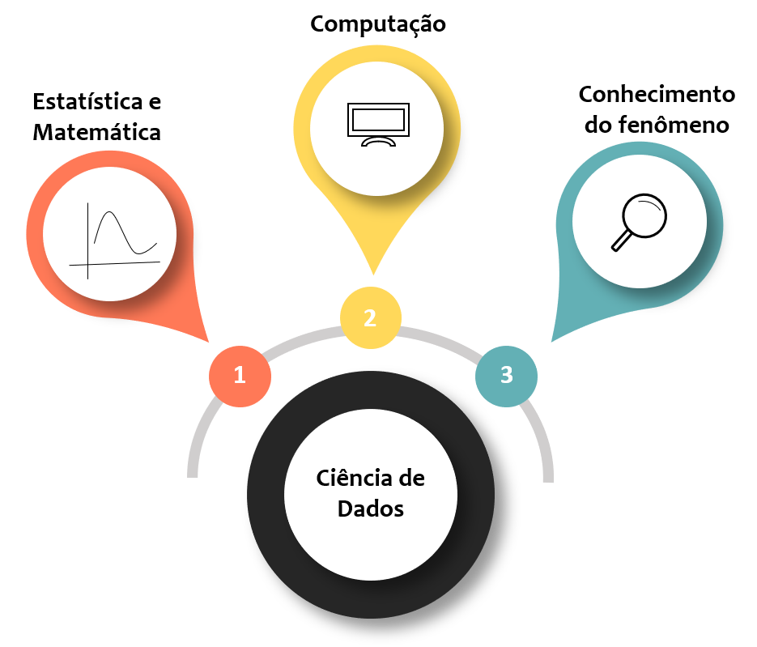
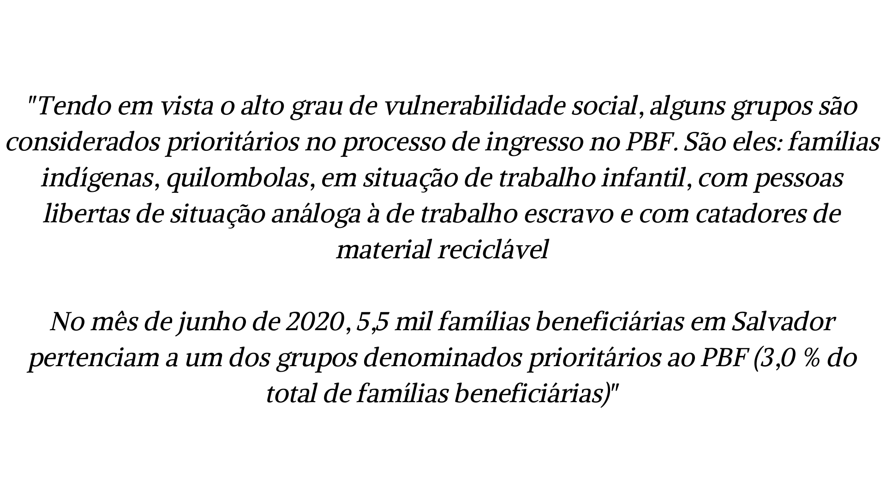
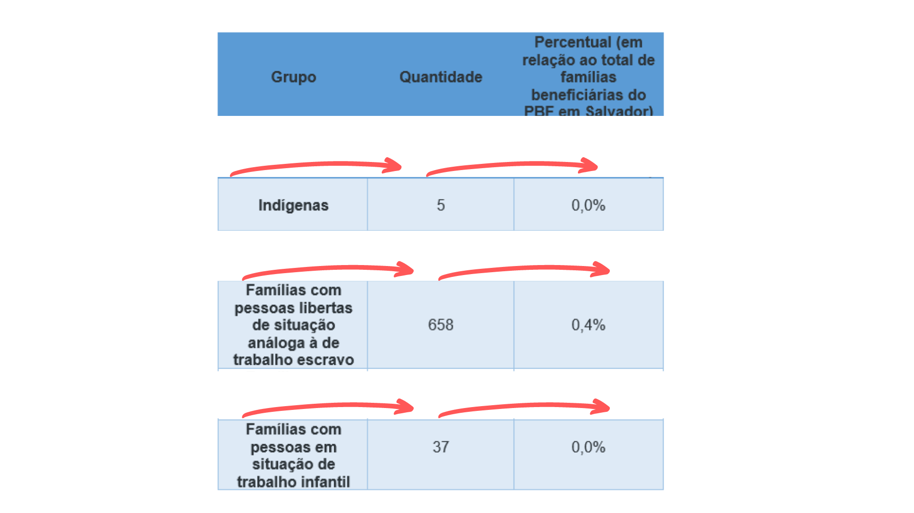
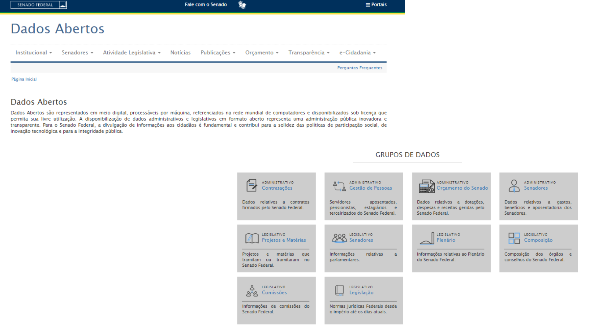
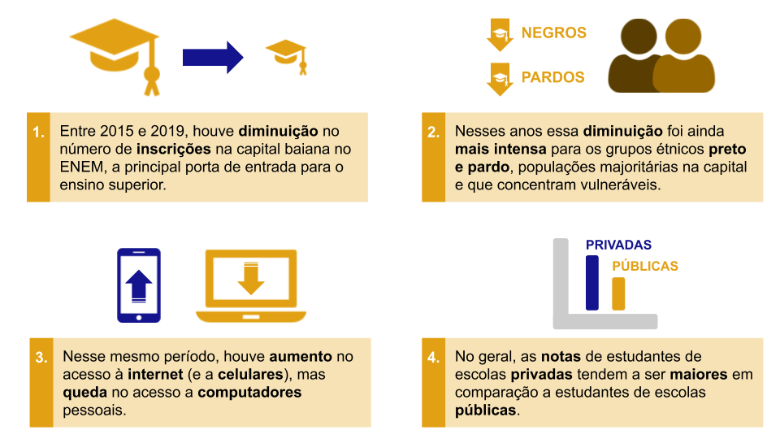
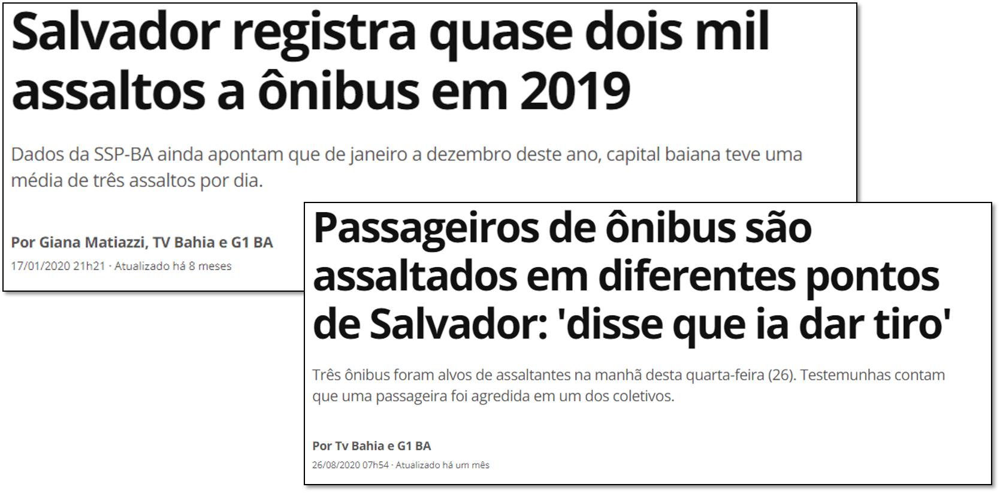
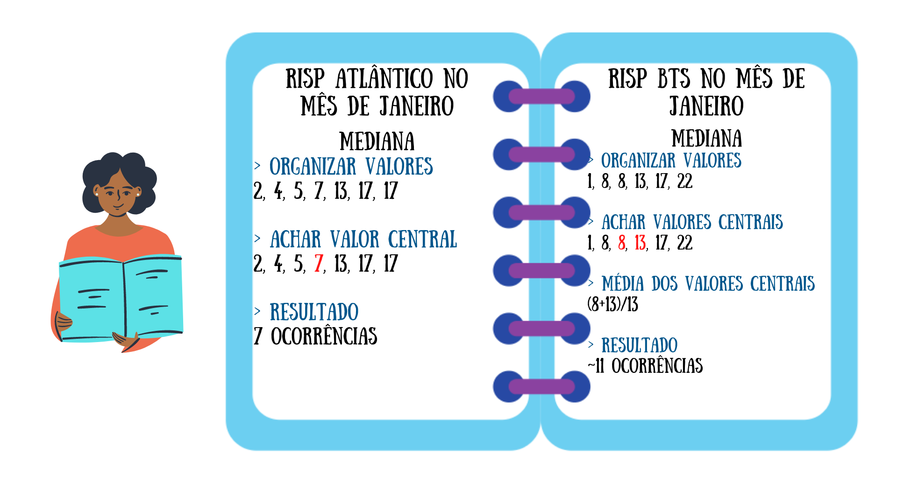
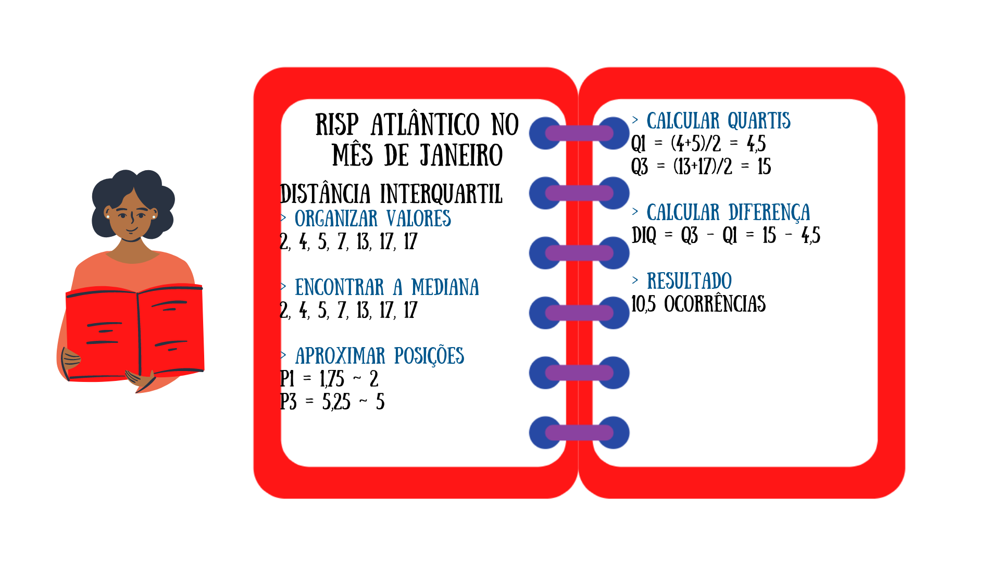
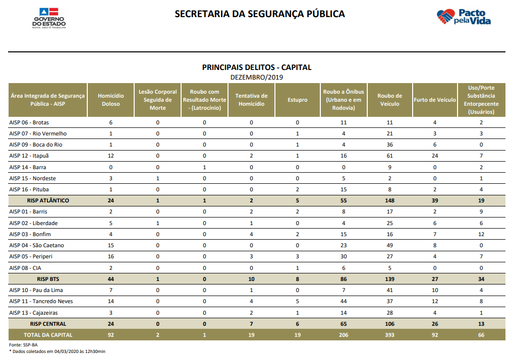

--- 
title: 'Uma introdução gentil à Ciência de Dados'
author: "Kaike Wesley Reis, Júlia Bijos e Janaína Souza"
date: "`r Sys.Date()`"
#output: pdf_document
output: 
  bookdown::html_document2:
    fig_caption: yes
    cap_caption: yes
  bookdown::pdf_document2:
    fig_caption: yes
    cap_caption: yes
lang: pt
description: e-Book de ensino de ciência de dados na educação pública
documentclass: book
link-citations: yes
bibliography:
- book.bib
- packages.bib
site: bookdown::bookdown_site
biblio-style: apalike
classoption: oneside
---

```{r, eval=TRUE,echo=FALSE}
library(knitr)

knitr::opts_chunk$set(error = TRUE, fig.align="center")

# SOLVE - Manter o tamanho das imagens em HTML equivalente ao PDF
output <- knitr::opts_knit$get("rmarkdown.pandoc.to")
if (output=="html") opts_chunk$set(fig.width=11, fig.height=11)
if (output=="pdf") opts_chunk$set(fig.width=11,  fig.height=11)
```


# Prefácio {-}

Escrever prefácio. 


<!--chapter:end:index.Rmd-->

# Introdução à Ciência de Dados {#c01}

Provavelmente você deve estar pensando que não faz ideia do que seja Ciência de Dados, já que nunca teve contato com esta área da ciência. Mas, será mesmo? Ao longo deste capítulo vamos entender o que é a **Ciência de Dados** e refletir como ela está inserida no nosso dia a dia. 

_A Ciência de Dados pode ser definida como o campo do conhecimento que busca transformar **dados** em **informações**._
  
_Mas, o que isto significa?_

Observe a Figura \@ref(fig:figura1) que trata algumas situações vivenciadas na nossa cidade ou comunidade, que precisam ser adaptadas para melhorar o bem estar dos cidadãos. Você consegue imaginar como a Ciência de Dados poderia ajudar a lidar com estas dificuldades? Verifique os setores observados, os questionamentos e possíveis soluções indicados nas caixas em azul.

```{r figura1, echo=FALSE, fig.cap="Ciência de Dados para o bem social", align = "center", out.width = '100%', fig.align='center'}

```

Esta imagem é um bom referencial de algumas aplicações da Ciência de Dados para o bem da sociedade. Além disso, mostra como podemos partir de problemas e perguntas iniciais para realizar investigações. Observe o questionamento 1, em que os ônibus não passam no horário esperado. Uma das formas de solucionar este problema é através de uma estimativa da frequência ideal de ônibus neste ponto, com base em um tempo de espera que se imagina ser adequado. Então, para definir esta frequência é necessário saber: 

* a **frequência dos ônibus** que ali passam para conhecer a situação atual
* a **quantidade de passageiros** que utiliza o transporte
* a **melhor rota** que deve ser percorrida, de forma que evite atrasos no translado

A definição destes tópicos é importante, pois eles indicam quais dados são necessários obter. A partir do momento que são obtidos, o processo investigativo evolui até que se saiba qual é a frequência ideal de ônibus neste ponto da cidade!  

Observe como temos questionamentos em tantas áreas diferentes. Isto indica que a Ciência de Dados é um campo do conhecimento que nos permite abordar problemas de uma forma abrangente e com aplicações em diversos setores! 

No processo da Ciência de Dados, o **dado** é transformado em informação relevante por meio de etapas que permitem analisar tendências e prever comportamentos futuros! Estas informações geradas permitem extrair conclusões e criar **sacadas** (os famosos _**insights**_ ou "lampejos de ideias") para responder a perguntas e solucionar problemas.

> _Que tal conhecer alguns setores que tem aplicado Ciência de Dados aqui no Brasil?_
> Transportes e Mobilidade Urbana: [link 1](https://jornal.usp.br/ciencias/ciencias-humanas/dados-sobre-onibus-em-sp-permitirao-analises-criticas-do-servico/) [link 2](https://www.caf.com/pt/presente/noticias/2019/03/ciencia-dados-para-aprimorar-as-politicas-publicas-a-experiencia-de-cordoba/)  
> Saúde: [link](https://www.einstein.br/Pages/Home.aspx)  
> Segurança pública: [link](https://jornal.usp.br/universidade/acoes-para-comunidade/pesquisadores-aplicam-ciencia-de-dados-e-inteligencia-artificial-no-combate-ao-crime/)  
> Comunicação  com clientes: [link](https://g1.globo.com/jornal-nacional/noticia/2019/03/09/ligacoes-de-robos-incomodam-muitos-brasileiros.ghtml)  
> Turismo: [link](https://datascienceacademy.com.br/blog/7-casos-de-uso-de-data-science-no-turismo/)  
> Atividade Jurídica: [link](http://www.crb8.org.br/entrevista-sofia-marshallowitz-ciencia-de-dados-aplicada-ao-direito/)

Para aplicar esta ciência é preciso ter conhecimentos de Estatística, Computação e conhecimento sobre o problema investigado! Isto porque as ferramentas de solução são baseadas nestes conteúdos, por isso eles são a essência da Ciência de Dados! Mas não se engane, estas ferramentas "matemáticas" são vinculadas à ciências sociais, biológicas, ambientais, ao setor de negócios, tecnologia, entre outros, a fim de descobrir padrões em problemas de diferentes naturezas (como vimos na Figura \@ref(fig:figura1)). Por este motivo, a Ciência de Dados é uma área **interdisciplinar**. A Figura \@ref(fig:figura2) esquematiza os conteúdos básicos da Ciência de Dados.

```{r figura2, echo=FALSE, fig.cap="Interdisciplinaridade da Ciência de Dados", align = "center", out.width = '60%', fig.align='center'}

```

_Mas por quê a Ciência de Dados se tornou indispensável?_  
A popularidade da área veio a partir do aumento de dados disponíveis atualmente. É impossível gerir tantos dados sem a utilização de computadores, que apresentam alta capacidade de processamento. Mas atenção, embora a Ciência de Dados seja favorecida pela tecnologia, é importante ressaltar que são seres humanos que direcionam, criam regras, avaliam e manuseiam todo o processo investigativo. Portanto, a criticidade de um profissional que avalie a execução de cada etapa realizada é essencial para garantir análises e interpretações coerentes a cada situação.

_Para compreender melhor como o processo de Ciência de Dados ocorre, vamos pensar na seguinte situação:_   
Sabemos que atualmente o lazer está muito vinculado ao uso de tecnologias e, portanto, estamos a um clique de uma música que gostamos de ouvir, ou de um vídeo que queremos assistir, uma busca no _google_ sobre algum tema de interesse. O fato de realizarmos estas buscas revela nossos interesses, você concorda? A partir da análise do nosso histórico de buscas, várias propagandas ou recomendações podem começar a nos ser feitas. Pense em quantas vezes você pesquisou sobre algum item e depois surgiram várias propagandas sobre ele. Ou quando você assistiu no _youtube_ o clipe de uma banda e depois apareceram sugestões de outros clipes desta mesma banda, como na Figura \@ref(fig:figura3). Observe que nesta imagem estamos assistindo a um vídeo da banda _Coldplay_, e ao lado existem várias sugestões de outras músicas deles, inclusive há uma indicação de outra banda. 

```{r figura3, echo=FALSE, fig.cap="Mecanismo de recomendação do Youtube", align = "center", out.width = '80%', fig.align='center'}
knitr::include_graphics("fig_cap1/youtube.png")
```

_Que tal entender melhor como este mecanismo ocorre?_  
Imagine que você será responsável por escolher um filme para assistir junto com seus amigos. Porém, eles disseram gostar de filmes de terror, romance, suspense, ação, comédia, ficção científica e drama. Para você ficou quase impossível escolher frente à tantas opções, já que quer ter certeza que eles irão curtir o filme. Assim, como podemos saber qual gênero de filmes deve ser escolhido? Sabendo isso, a sua escolha será certeira e a diversão estará garantida! 

Podemos solucionar este problema utilizando a Ciência de Dados para analisar as preferências de filme dos seus amigos, de forma similar ao mecanismo de recomendações do _youtube_, por exemplo. Nas próximas seções deste capítulo, vamos solucionar cada etapa desta investigação!

> Quer saber mais sobre onde a Ciência de Dados se aplica? Assista ao vídeo abaixo:

<div align = "center">
<iframe width="560" height="315" src="https://www.youtube.com/embed/WjSimFnfPF0" frameborder="0" allow="accelerometer; autoplay; encrypted-media; gyroscope; picture-in-picture" allowfullscreen></iframe>
</div>
</br>
Depois de tantos exemplos uma conclusão é real: a Ciência de Dados está por toda parte e nós, fazemos parte dela ao consumir ou gerar dados. Você concorda?

## O que são "dados" e onde estão presentes?

No item anterior vimos que a Ciência de Dados é algo indispensável, já que é impossível lidar com tantos dados sem o uso de tecnologias. Vimos também, que parte destes dados, somos nós quem geramos. Precisamos entender o que significa a palavra **dados** neste contexto. 

Vamos dar sequência no nosso exemplo, onde queremos descobrir qual é o gênero de filmes que você deve escolher. Para isto, podemos avaliar qual é o gênero favorito de cada amigo seu a partir dos filmes que eles assistiram recentemente e o gênero destes filmes. Desta forma, iremos verificar se eles têm a preferência em comum por algum gênero. Para iniciar a investigação, devemos criar um registro para cada pessoa, contendo características importantes coletadas para a avaliação das preferências deles, como: 

* Nome
* Filmes assistidos
* Gênero do filme

Portanto, o nosso registro irá conter observações de cada característica citada, para cada pessoa. Assim, dizemos que as observações destas determinadas características são os nossos dados.  

_Em outras palavras: dados são **observações** que foram coletadas e armazenadas de alguma forma. Inicialmente, compõem apenas registros e não apresentam relevância. Qualquer dado pode ser armazenado, caso contrário não pode ser considerado um dado._

>*O dado por si só não apresenta significado e por isso não serve para gerar respostas, interpretações e informações. Assim, somente após processar e transformá-los é que se torna possível tirar conclusões.*

</br>
Parte do trabalho do investigador é avaliar quais dados são de fato importantes para o processo de análise. Muitas vezes temos uma grande quantidade de dados, mas ao avaliar a natureza do problema percebemos que nem todos são fatores importantes para a situação investigada. 

No nosso exemplo, queremos saber qual gênero de filmes você deve escolher para assistir com seus amigos. Já vimos que algumas características são importantes para guiar a sua decisão final, mas podem existir outras que também complementariam nossos dados. Todavia, deve ser feita uma valiação sobre a importância delas para o problema abordado. Por exemplo, poderíamos coletar a altura e peso de cada amigo, mas, isso seria relevante para a nossa investigação? Claramente não, portanto não faria sentido registrar estes dados. Observe também que você obteve os dados por meio de uma pesquisa realizada com os seus amigos. Todavia, há muitas outras fontes de obtenção de dados. Basta lembrar que nós mesmos somos geramos dados quando interagimos em uma rede social. 

_Portanto, os dados podem ser obtidos pelo uso de celulares, computadores, sensores, registros escolares, pesquisas de opinião ou qualquer forma de registro._ 
</br>
E porquê é tão importante entendermos a definição de dados e como eles são obtidos? Basicamente, porque eles são a essência da Ciência de Dados. Sem eles não é possível gerar informações e aplicar o processo investigativo. A análise dos dados permite observar uma **tendência** ou **padrão** em processos, fenômenos na natureza ou mesmo nos nossos comportamentos. E este é o grande objetivo da Ciência de Dados, **reconhecer padrões** e **interpretá-los** para tomar boas decisões!


### Posso compartilhar dados?

Vamos voltar à nossa investigação sobre os filmes. Lembre-se que para nós é importante registrar os últimos filmes assistidos pelos nossos amigos, o gênero dos filmes e a identificação da pessoa. Podemos nos questionar se estes registros serão restritos à você que está analisando ou se serão abertos à qualquer pessoa (inclusive seus amigos). É um questionamento pertinente? Haveria algum incômodo se qualquer pessoa tivesse acesso a estes registros? 

Outro questionamento que poderia ser feito antes mesmo de seus amigos aceitarem participar do experimento é: como os dados serão utilizados e com qual finalidade?

Estas perguntas são importantes porque as informações adquiridas a partir dos dados revelam gostos pessoais e padrões de comportamento dos seus amigos. E, portanto, quem tiver acesso a estes dados vai ter conhecimento sobre as preferências deles. E a forma como esta informação será utilizada é extremamente importante. Assim, temos duas observações: 

*1. dados são gerados a todo momento*

*2. dados são transformados em informações que revelam padrões desconhecidos.*

Por este motivo, empresas e organizações tem tanto interesse em deter dados de usuários dos seus serviços, pois isso permite conhecer o cliente a ponto de fazer ofertas que se adequem ao perfil de cada um. Mas, quais são as consequências dessa prática? Para compreender mais, vamos discutir sobre a **privacidade**.

### Privacidade de dados

A privacidade antes de tudo é um direito. Este direito nos resguarda da exposição de nossas informações pessoais. O contexto atual de estarmos conectados, com uma constante troca de informação, traz algumas preocupações quanto à garantia da nossa privacidade. 

Podemos começar citando o exemplo das publicações em redes sociais. Por meio delas, divulgamos sobre nosso local de trabalho ou estudo, quem são nossos familiares, nosso itinerário, datas importantes e tantas outras informações, na maioria das vezes sem refletir o que isto representa. E estes são os dados que nós sabemos que estamos divulgando!

Além disso, os aplicativos que temos em nossos *smartphones* podem ter acesso à nossa câmera, microfone e contatos. Sim, ao fazer o download de um aplicativo e concordarmos com os termos de condição de uso, damos acesso à todos estes dados. Você já leu os termos de condições antes de prosseguir com a instalação de um aplicativo?   

Mas muito além do que publicamos, existe uma infinidade de dados que são coletados sobre nós que nem temos ideia. Eles alimentam grandes *bases de dados* de empresas, organizações ou instituições. Nossas preferências de lazer, política, estilo, gostos musicais, itens que compramos, informações bancárias, local de viagens, são convertidos em informações nas mãos de quem pode manipulá-los. Ficamos expostos, sendo influenciados por serviços e propagandas e, ao mesmo tempo, não temos acesso à forma que processam estes dados. 

Assim, sempre que abrimos nossos aplicativos, automaticamente somos direcionados a interagir com posts de conteúdos preparados para prender a nossa atenção, ou sempre existem propostas imperdíveis para adquirir itens que geralmente nos interessamos. 

O ponto central que deve ser levantado aqui é que podemos sim fazer uso de aplicativos, redes sociais e sites, mas devemos ter criticidade para entender que somos monitorados e possivelmente influenciados. Para refletir mais sobre a privacidade dos dados, assista ao vídeo indicado.

<div align = "center">
<iframe width="560" height="315" src="https://www.youtube.com/embed/qw_TGrpPdkw" frameborder="0" allow="accelerometer; autoplay; encrypted-media; gyroscope; picture-in-picture" allowfullscreen></iframe>
</div>
<br />

>_Já ouviu o termo **LGPD**?_ <br />
Diante da problemática da privacidade e segurança dos dados, o Brasil aprovou a _Lei n° 13.709/18 (Lei de Proteção de Dados - LGPD)_, o que vai exigir a adequação de empresas e corporações que realizam coleta, tratamento, processamento ou comércio de dados em prol de grantir a privacidade e a segurança de usuários. Isso será feito por meio de políticas e planos de proteção de dados. Ao mesmo tempo, nós usuários deveremos estar mais atentos à segurança que as empresas oferecem aos nossos dados. *(Para saber mais sobre esta lei, assista ao [vídeo](https://www.youtube.com/watch?v=fuuudzh1qEo))*  
A rede social Facebook é um exemplo de organização que já iniciou as alterações recomendadas pela lei em busca de transparência. A Figura \@ref(fig:figura4) exibe partes da mensagem que aparece ao realizar o acesso à página. 


```{r figura4, echo=FALSE, fig.cap="Notificação do Facebook", align = "center", out.width = '100%', fig.align='center'}
knitr::include_graphics("fig_cap1/facebook.png")
```


## O ciclo dos Dados - Construindo uma pergunta estatística

No início do capítulo, definimos Ciência de Dados como um campo da ciência que realiza a transformação de dados em informação por meio de etapas. Neste tópico, vamos compreender melhor sobre cada etapa que ocorre neste processo. Primeiramente, esta série de etapas é denominada como *Ciclo dos dados*. 

A compreensão do ciclo dos dados dá uma noção geral sobre o que deverá ser realizado na metodologia de investigação, possibilitando um melhor planejamento de cada etapa.

Uma vez que a Ciência de Dados busca extrair padrões para lidar com problemas, é essencial que inicialmente se tenha uma pergunta a ser respondida. Esta pergunta irá direcionar todo o nosso processo em relação à quais dados devem ser coletados, quais são os melhores métodos de análise e qual a natureza do problema.

O Ciclo dos Dados compreende quatro etapas, como indicado na Figura \@ref(fig:figura5):

```{r figura5, echo=FALSE, fig.cap="Etapas do ciclo de Dados", out.width = '80%', fig.align='center'}
knitr::include_graphics("fig_cap1/cap1_fig1.png")
```

Vamos lembrar do nosso exemplo inicial, cuja pergunta é: Qual gênero de filme você deve escolher para assistir com seus amigos com base nas preferências deles?

Observe que geramos uma pergunta inicial que só poderá ser respondida a partir dos dados. Isto significa dizer que precisaremos coletar dados, analisá-los e, por fim, interpretá-los para tomar uma decisão. Por este motivo, esta pergunta é definida como **pergunta estatística**. A partir dela todas as outras etapas do ciclo dos dados serão direcionadas, a fim de respondê-la. A Figura \@ref(fig:figura6) indica como cada etapa se desenvolve.

```{r figura6, echo=FALSE, fig.cap="O que fazer em cada etapa?", align = "center", out.width = '80%', fig.align='center'}

```

Mas, como saber se temos uma pergunta estatística ou não? Lembre-se que uma pergunta estatística deve atender os requisitos citados no parágrafo anterior. Portanto, se eu te perguntasse: "Qual a sua idade?", esta seria uma questão estatística? 

Bom, você me responderia a sua idade. Porém, não seria necessário coletar mais dados para responder a pergunta, pois apenas uma única observação já foi suficiente. Ou seja, a etapa de análise de dados não se faz necessária e por isso, não chegamos à etapa de interpretação dos dados. Por estes motivos, comprovamos que esta questão não é uma pergunta estatística, pois não indica variabilidade. 

_Uma **pergunta estatística** sinaliza a **variabilidade** dos dados, que acontece quando existem observações que diferem da maioria registrada._
</br>
Podemos adaptar a pergunta para que ela se torne uma questão estatística! No caso, poderíamos perguntar: "Qual é a idade dos estudantes do Projeto Ciência de Dados na Educação Pública?". Ao coletar a idade de cada estudante perceberíamos que muitas se repetem, mas também há algumas que variam. Por exemplo, observamos estudantes de 11 a 15 anos. Todas as observações coletadas poderiam tranquilamente ser dispostas em um gráfico ou tabela que seriam usados para mostrar o padrão de idades da turma de estudantes do projeto. Graficamente, notamos que a maioria das idades equivale a 14 anos! Assim, todas as etapas do ciclo de dados se cumprem para responder esta pergunta. 

Veja a Figura \@ref(fig:figura7) que aponta diferenças entre estes dois tipos de perguntas. 

```{r figura7, echo=FALSE, fig.cap="Pergunta estatística e não estatística", align = "center", out.width = '100%', fig.align='center'}
knitr::include_graphics("fig_cap1/idades_paint.png")
```

Outro conceito relevante para qualquer investigação, é que para responder a uma pergunta estatística, podemos estabelecer **hipóteses**, que pode ser considerada como uma suposição que será testada ao longo do processo. Esta hipótese pode estar correta, neste caso ajudando a solucionar o problema, ou pode estar incorreta. Neste caso, precisamos investigar os motivos pelos quais ela é incorreta, e pode até indicar que a nossa pergunta precisa ser melhorada. Pense no caso do nosso exemplo dos filmes, poderíamos estabelecer uma hipótese onde arriscamos dizer qual será o gênero preferido. Bom, esta hipótese será testada ao longo da investigação, e ao final, poderemos dizer se estava certa ou não. 


## Estruturando os dados

Após definir a pergunta estatística, devemos coletar os dados e armazená-los em algum formato. Chamamos de **estrutura de dados** o formato em que estes dados ficam armazenados. 

A tabela é uma forma muito comum de se estruturar dados, embora não seja a única. Este formato é comum pois os dados ficam dispostos de uma forma organizada e de fácil entendimento. 

A tabela é composta por linhas e colunas. Veja como exemplo a Tabela 1:

Nome | Filme assistido | Gênero | 
:-----:|:---:|:---:|:----:|
Gabrielle | Entre Realidades | Drama
Gabrielle | Getúlio | Drama
Gabrielle | Até que a sorte nos separe | Comédia
Gabrielle | Terremoto: A falha de _San Andreas_ | Ação 
Karen | A Lista de Schindler | Drama
Karen | Férias Frustradas | Comédia
Karen | Letra e Música | Romance
Karen | Pantera Negra | Ação
Isaac | Madagascar | Comédia
Isaac| Karatê Kid | Ação
Isaac | Um senhor estagiário | Comédia
Isaac | A mulher de preto | Terror

Observe que as colunas trazem as características dos dados que coletamos. Já as linhas trazem as observações coletadas para cada pessoa, a respeito das características. Perceba que para uma mesma característica temos observações que podem ser iguais ou diferentes. Embora um mesmo **Gênero** possa aparecer repetidas vezes, notamos que há observações que diferem. Por isso a tabela também permite enxergar a variabilidade dos dados. No capítulo 2 este tópico será abordado de forma mais aprofundada.

>Além de representar os dados por meio de tabelas, você aprenderá no capítulo \@ref(c02) como representar os dados de forma gráfica. Este formato permite visualizar as informações de uma forma mais clara e mais explicativa.

## Identificando o tipo de problema

Um grande diferencial da Ciência de Dados é a investigação sobre o que os dados revelam acerca do futuro. Portanto, esta ciência não só obtém diagnósticos sobre situações já ocorridas como também traz _insights_  sobre o que pode acontecer (Lembra deste termo? São aquelas **sacadas** que comentamos no início do capítulo). A isto chamamos de **predição**.  
Parte do trabalho da Ciência de Dados é realizar predições, e para isto, existem métodos estatísticos que podem ser aplicados. Em geral, podemos dividir as situações em problemas de **Regressão** ou **Classificação**. A Figura \@ref(fig:figura8) exemplifica estes métodos.

</br>
```{r figura8, echo=FALSE, fig.cap="Regressão x Classificação", align = "center", out.width = '100%', fig.align='center'}
knitr::include_graphics("fig_cap1/reg_class.png")
```

Você irá aprender detalhadamente como aplicar estes métodos nos capítulos  \@ref(c09) e  \@ref(c10) deste *e-book*. 

## Considerações finais

Neste capítulo você foi apresentado à área de Ciência de Dados e percebeu como ela está presente no nosso dia a dia. Outro ponto relevante foi a percepção da nossa atividade enquanto consumidores e geradores de dados. Esta nova forma de gerar informações exige um conhecimento mínimo sobre como podemos ser influenciados a todo tempo.


*Vamos finalizar o nosso exemplo?*  
Na tabela que constrímos, temos 4 observações para cada pessoa. Ao analisarmos quantas vezes cada gênero aparece, temos: 

* Drama: 3 observações
* Comédia: 4 observações
* Ação: 3 observações
* Romance: 1 observação
* Terror: 1 observação

Ao analisar o grupo de observações percebemos que o gênero **Comédia** aparece mais vezes no nosso conjunto de dados. Ao verificar a tabela, é possível notar que ele aparece pelo menos uma vez para cada pessoa. Portanto, é uma preferência comum a todo o grupo. Por isso, se você escolher um filme deste gênero sua chance de acerto será alta, concorda? 

A Figura \@ref(fig:figura9) sintetiza os conceitos discutidos neste capítulo introdutório.

```{r figura9, echo=FALSE, fig.cap="Esquema de conceitos", align = "center", out.width = '100%', fig.align='center'}
knitr::include_graphics("fig_cap1/mapaconceitualcap01.png")
```

Viu quantos conteúdos novos você aprendeu neste capítulo? Este aprendizado vai se aprofundar mais à medida que você avançar no estudo deste _e-book_ e tiver curiosidade em relação aos assuntos abordados! A Ciência de Dados tem revolucionado os setores onde é aplicada, pois busca constantemente obter respostas valiosas. Portanto, o cientista de dados é movido pela curiosidade! 

## Referências 

Tecmundo (2018). Do futebol à medicina: a ciência de dados está em todo lugar. Disponível em: https://youtu.be/WjSimFnfPF0.

Provocações Filosóficas (2018). A privacidade na internet. Diponível em: https://youtu.be/qw_TGrpPdkw. 

Figura \@ref(fig:figura1): Pingado sociedade ilustrativa (2010). Adaptada de: Cidade Sustentável. Disponível em: http://www.pingado.com/imagem/0811cidade_gra.jpg.

Figura \@ref(fig:figura2): Coldplay (2011). Adaptada de: Coldplay - Viva la Vida (Live in Madrid 2011). Disponível em: https://youtu.be/9ldOuVuas1c.

LGPD Brasil. Lei Geral de Proteção de Dados - Lei n° 13.709/18. Disponível em: https://www.lgpdbrasil.com.br/.

Brasil. LEI Nº 13.709, DE 14 DE AGOSTO DE 2018. Lei Geral de Proteção de Dados Pessoais (LGPD). Disponível em: http://www.planalto.gov.br/ccivil_03/_ato2015-2018/2018/lei/L13709.html. 

McAfee (2019). Desafios Tecnológicos para atender a LGPD. Disponível em: https://youtu.be/fuuudzh1qEo.

Figura \@ref(fig:figura5): O Ciclo de Dados. Adaptada de: Introduction to Data Science v_5.0 (IDS). Lesson 4: The Data Cycle. The Data Cycle file (LMR_1.3_Data Cycle)


<!--chapter:end:01-cap1.Rmd-->


# Construindo uma base de dados {#c02}

No capítulo anterior, você aprendeu sobre dados e viu, resumidamente, que a forma como os dados estão armazenados chama-se estrutura de dados. Neste capítulo vamos resgatar e aprofundar um pouco mais do que você já aprendeu de modo que você seja capaz de construir a sua própria base de dados. Mas antes, precisamos entender o que é e para que serve uma base de dados.


*Será que você já teve contato com alguma base de dados no decorrer de sua vida?*


## O que é uma base de dados?

*Você já ouviu falar sobre o Programa Bolsa Família?*


O Programa Bolsa Família (PBF) é uma [política pública](https://www.todospelaeducacao.org.br/conteudo/o-que-e-uma-politica-publica-e-como-ela-afeta-sua-vida) que visa cooperar para a inclusão social de famílias em situação de vulnerabilidade, contribuindo com alívio imediato da situação de pobreza e fome. O PBF estimula um melhor acompanhamento do atendimento do público-alvo pelos serviços de saúde, além de ajudar a superar indicadores que marcam negativamente a trajetória educacional de crianças mais pobres; como por exemplo os altos índices de evasão escolar e a repetência. Desde que foi criado em 2003, o PBF evoluiu e se tornou um dos mais eficientes mecanismos de enfrentamento a pobreza do mundo, consolidando-se como um dos maiores programas de transferência direta de renda existentes. Em todo o país, segundo dados do Ministério da Cidadania, em junho de 2020 o PBF atendia a mais de 14 milhões de famílias, das quais 180.706 mil estavam em Salvador, sendo 476.633 mil pessoas diretamente beneficiadas com o PBF na capital baiana.

*Interessante, né? Mas o que o bolsa família tem a ver com uma base de dados?*

Bem, para ser beneficiária do PBF a família precisa estar cadastrada no Cadastro Único para Programas Sociais (CadÚnico). O CadÚnico é a **base de dados** do governo federal onde estão registrados dados sobre famílias de baixa renda; ou seja, famílias que possuem renda mensal de até ½ salário mínimo por pessoa ou 3 salários mínimos no total. É a partir dos dados registrados no CadÚnico que é possível identificar as famílias que necessitam do bolsa família e encaminha-las para serem beneficiarias do programa.

*Portanto, sem uma base de dados não seria possível que uma política pública do tamanho e da importância do Programa Bolsa Família existisse.*

*E como podemos, exatamente, definir uma base de dados?*

Uma base de dados é um conjunto de **dados** inter-relacionados (possuem relação), que estão armazenados em uma estrutura que permite que **informações** sejam extraídas.


```{r ch1, fig.align='center',out.width="100%",fig.width=50 ,echo=FALSE}

knitr::include_graphics("fig_cap2/cap2_gif1.gif")

``` 

Na base de dados da nossa discussão, o CadÚnico, dados referentes a raça, sexo, ocupação, moradia, escolaridade e muitos outros, estão relacionados a cada família que compõem o cadastro. Dessa forma, o governo consegue extrair informações referentes a habitação, saúde, educação, renda; possibilitando que se pense em formas de melhor atender as necessidades da população que compoem o cadastro. Atualmente, o CadÚnico conta com o registro dos dados de aproximadamente 29 milhões de famílias, mais de 76 milhões de pessoas. Isto é, o CadÚnico armazena dados de quase 40% da população brasileira.

O CadÚnico funciona tão bem porque cumpre um requisito muito importante para bases de dados: a armazenagem eficiente dos dados. Para que a sua base de dados funcione do mesmo jeito, os seus dados precisam estar armazenados de maneira correta. Na próxima seção vamos discutir um pouco mais sobre isso.


## Como montar uma tabela 

*Vimos que em uma base de dados, os dados estão armazenados em uma estrutura que permite que informações sejam extraídas. Nessa seção, vamos entender um pouco mais sobre essas estruturas.*

Já aprendemos no capítulo 1 que dados são observações que foram coletadas e armazenadas de alguma forma. A maneira como esses dados são armazenados varia e algumas dessas formas de se armazenar os dados são mais eficientes que outras pois auxiliam na análise e visualização dos dados. Quanto à maneira como os dados estão armazenados podemos classifica-los de duas formas principais: estruturados e não-estruturados


Os **dados não-estruturados**, como o nome indica, não possuem uma estrutura bem definida e previamente pensada para se armazenar os dados. Como exemplo de dados não estruturados podemos citar as redes-sociais, imagens, filmes, vídeos, músicas e documentos de texto.

```{r ch2, fig.align='center', fig.cap="Exemplo de dados não-estruturados", fig.width=50 ,echo=FALSE,out.width="80%"}

knitr::include_graphics("fig_cap2/cap2_fig1.png")

```


Os **dados estruturados** por sua vez, possuem uma estrutura bem definida, rígida e previamente pensada para se armazenar os dados. A tabela é uma das formas mais comuns e simples dessas estruturas pois nela os dados ficam dispostos em linhas e colunas que é uma forma de se armazenar dados bastante organizada e de fácil entendimento. Vamos entender mais sobre essa forma de organização. Leia o fragmento de texto abaixo extraído e adaptado do [site](https://aplicacoes.mds.gov.br/sagirmps/bolsafamilia/index.html "Cadastro Único, Conhecer Para Incluir")


```{r ch3, fig.align='center', fig.width=50,out.width="70%",echo=FALSE}



``` 

Observe agora como os dados referentes aos grupos prioritários do PBF ficam organizados em uma tabela:


```{r ch4, fig.align='center',fig.width=50,out.width="100%",echo=FALSE}

knitr::include_graphics("fig_cap2/cap2_fig3.png")

``` 


As **linhas**, partes horizontais da tabela, que também podemos chamar de amostras, representam indivíduos ou observações, que são os nossos objetos de estudo. No nosso exemplo, as observações são os grupos de famílias prioritárias ao PBF: "Indígenas", "Quilombolas", "Famílias com pessoas libertas de situação análoga à de trabalho escravo", "Famílias com pessoas catadoras de material reciclável" e "Famílias com pessoas em situação de trabalho infantil" 

As **colunas**, parte vertical da tabela, representam atributos, ou seja, representam características referentes as observações. Em nosso exemplo, "Grupo", "Quantidade" e "Percentual" são os atributos que caracterizam nossas observações.


Note que à medida que percorremos uma linha, todos os atributos são referentes a aquela observação. Por exemplo, quando percorremos a linha cuja observação é do grupo “Indígenas”, os atributos: “Quantidade” e “Percentual” se referem a ela. No caso 5 e 0,0% respectivamente. Portanto, existem 5 famílias que fazem parte do grupo prioritário “Indígenas”, representando, aproximadamente, 0,0% do total entre todos os beneficiários do Bolsa Família em Salvador.

*Das mais de 180 mil famílias que recebem o Bolsa Família em Salvador, apenas 5 são famílias indígenas. Em sua opinião, por que isso acontece? Que tal buscar dados referentes a populações indígenas existentes em sua cidade?*

```{r ch5, fig.align='center',fig.cap="Sentido de leitura da linha" ,fig.width=50,echo=FALSE,out.width="100%"}



``` 

Observe também que quando descemos em uma coluna da tabela, todos os valores representam a mesma característica. Por exemplo, quando descemos na coluna "Quantidade", todos os valores representam quantidades. As quantidades variam dependendo da observação que está sendo avaliada, mas o atributo é o mesmo: Quantidade. 

```{r ch6, fig.align='center',fig.cap="Sentido de leitura da coluna" ,fig.width=50,echo=FALSE,out.width="100%"}

knitr::include_graphics("fig_cap2/cap2_fig5.png")

``` 


O fato de os valores dos atributos variarem indica que os dados possuem **variabilidade**. Quando você for analisar seus dados, perceber a variabilidade dos dados é um passo muito importante. Os atributos também são chamados de **variáveis**. Perceba que existe relação entre os termos **variáveis** e **variabilidade**. A palavras "variável" indica que os valores dos dados variam. Nos acompanhe na próxima seção para entender um pouco mais sobre variáveis.


## Tipos de variáveis 

Já vimos que variáveis (atributos) são simplesmente características de nossas observações (indivíduos). Ou seja, são atributos que pertencem aos nossos objetos de estudo. 

Imagine que você decide estudar sobre os impactos que o Programa Bolsa Família tem sobre os hábitos e práticas alimentares dos beneficiários. Você decidiu seu objeto de estudo: famílias beneficiárias do PBF. Depois de definir o objeto de estudo, você se pergunta “Quais as informações que eu poderia levantar sobre meu objeto de estudo?”. Bem, você pode levantar muitas informações: o tipo de alimento consumido, a quantidade, se são alimentos ricos em gorduras ou em açucares, se o PBF faz com que as famílias se alimentem de maneira mais saudável, e muitas outras informações. Essas informações são os atributos do seu objeto de estudo, suas variáveis.

No exemplo da seção anterior, o nosso objeto de estudo foram os grupos prioritários ao Programa Bolsa Família. E as variáveis que caracterizaram o nosso objeto de estudo foram: "Grupo", que indica quais são esses grupos prioritários; "Quantidade", que indica a quantidade de famílias que compõem esses grupos e "Percentual" que indica a porcentagem que esses grupos representam em relação ao total de beneficiários em Salvador. 

Agora que já sabemos o que são variáveis, vamos discutir sobre os seus dois principais tipos: variáveis categóricas e variáveis numéricas.


### Variáveis Numéricas

Variáveis numéricas são aquelas que assumem **valores numéricos** finitos ou infinitos, ou seja, são variáveis **quantitativas**. Essas variáveis podem ser **contínuas** ou **discretas**.

As variáveis numéricas discretas são aquelas que só podem ser representadas por números inteiros. Vamos entender um pouco mais: famílias beneficiárias do PBF que tenham em sua composição gestantes, nutrizes (mães que amamentam) e crianças e adolescentes de 0 a 15 anos, recebem o benefício de R$ 41,00 para cada membro da família e cada família pode acumular até 5 benefícios por mês. Então, imagine que uma mãe que possua 5 filhos entre 0 e 15 anos irá receber o benefício de R$ 41,00 para cada filho; mas o que aconteceria se ela tivesse 5,5 filhos? Faz sentido dizer que uma pessoa tem 5,5 filhos (cinco filhos e meio)? Não, né?! Isso acontece porque a variável "Quantidade de filhos" é uma variável numérica discreta pois só pode assumir valores inteiros (0,1,2,3...). As variáveis discretas geralmente são resultado de contagens.

Já as variáveis numéricas contínuas são aquelas que podem assumir valores contínuos. Ou seja, são variáveis que podem assumir qualquer valor nos números reais. Vamos retomar o exemplo acima para entendermos melhor, mas dessa vez vamos falar sobre a variável “Idade”. Para você faria sentido dizer que um dos filhos dessa mulher tem 5,5 anos (cinco anos e meio)? Sim, né?! O que estamos dizendo é que essa criança tem 5 anos e 6 meses de idade; ou quem sabe 5 anos 6 meses e 2 dias, 5 anos 6 meses 2 dias e 15 horas, e assim por diante. Isso acontece porque a variável “Idade” é uma variável contínua e pode assumir qualquer [valor real](https://www.educamaisbrasil.com.br/enem/matematica/numeros-reais "Conjunto dos números reais"). As variáveis contínuas geralmente resultam de medições.


Vamos retomar o exemplo dos grupos prioritários ao PBF e ver quais foram as nossas variáveis numéricas:


```{r ch7, fig.align='center', fig.width=50,echo=FALSE,out.width="100%"}

knitr::include_graphics("fig_cap2/cap2_fig6.png")

```


### Variáveis Categóricas 

Variáveis categóricas são qualitativas, finitas e expressam um valor determinado de categorias ou níveis. Ou seja, são variáveis que representam uma classificação das observações. Normalmente as variáveis categóricas representam valores que possuem palavras. Essas variáveis podem ser nominais ou ordinais. 

Variáveis categóricas ordinais existe uma ordenação entre as categorias. Como exemplo podemos pensar na escolaridade dos beneficiários do PBF, (1º,2º,3º grau)

Variáveis categóricas nominais não possuem ordenação entre as categorias. Como exemplo podemos pensar no sexo dos beneficiários do PBF, que pode ser masculino ou feminino


A variável categórica do nosso exemplo é do tipo nominal, pois não existe ordenação entre as categorias:

```{r ch8, fig.align='center', fig.width=50 ,echo=FALSE,out.width="100%"}

knitr::include_graphics("fig_cap2/cap2_fig7.png")

```

Até aqui você já aprendeu sobre o que são bases de dados, como montar tabelas, o que são e quais os tipos de variáveis; ou seja, já apendeu o básico necessário para montar a sua própria base de dados. Na próxima seção, você vai aprender a acessar bases de dados que estão disponíveis para serem acessadas por qualquer pessoa: as bases de dados abertas.


## Como buscar base de dados abertas

Já vimos que o CadÚnico é a base de dados do governo federal onde estão registrados dados de família de baixa renda residentes no Brasil. Entre os muitos dados que estão registrados no CadÚnico, constam também a identificação de cada pessoa; informações como RG, CPF e endereço.Por conta disso, o acesso a essa base de dados é restrito, sendo permitindo apenas a pesquisadores através de um procedimento administrativo. Logo, o CadÚnico não é uma base de dados aberta. 

*Mas o que são bases de dados abertas?*

Para entendermos o que são bases de dados abertas, vamos falar sobre **dados abertos**

A [Open Knowledge Foundation]( https://okfn.org/), organização sem fins lucrativos que tem por objetivo promover o conhecimento livre, define dados abertos da seguinte forma:

> Dados abertos são dados que podem ser livremente usados, reutilizados e redistribuídos por qualquer pessoa - sujeitos, no máximo, à exigência de atribuição da fonte e compartilhamento pelas mesmas regras.
>
>Você pode acessar a definição completa: [Open Definition](http://opendefinition.org/od/2.1/en/). Mas, resumindo os pontos mais importantes da definição de dados abertos, temos:

>> - Disponibilidade e Acesso: os dados devem estar disponíveis como um todo e sob custo não maior que um custo razoável de reprodução, preferencialmente possíveis de serem baixados pela internet. Os dados devem também estar disponíveis de uma forma conveniente e modificável.
 - Reutilização e Redistribuição: os dados devem ser fornecidos sob termos que permitam a reutilização e a redistribuição, inclusive a combinação com outros conjuntos de dados.
- Participação Universal: todos devem ser capazes de usar, reutilizar e redistribuir - não deve haver discriminação contra áreas de atuação ou contra pessoas ou grupos.

Portanto, podemos definir uma base de dados abertas como um conjunto de dados abertos que podem ser livremente usados, reutilizados e redistribuídos por qualquer pessoa.

Na proxima seção você vai conhecer algumas bases de dados abertas que podem ser uteis para você a apartir de agora


### Dados abertos governamentais


A seguir, alguns exemplos de base de dados abertas governamentais:


  - [Dados abertos da Câmara dos Deputados](https://dadosabertos.camara.leg.br/#a1)
  
   Fornece dados sobre as atividades parlamentares da Casa a qualquer cidadão que possa se conectar à internet.
  
```{r ch9,fig.cap="Dados abertos da Câmara dos Deputados" ,fig.align='center',fig.width=50,echo=FALSE,out.width="70%"}

knitr::include_graphics("fig_cap2/cap2_fig8.png")

```
  
  - [Dados abertos do Senado Federal](https://www12.senado.leg.br/dados-abertos)
  
  
  
```{r ch10,fig.cap="Dados abertos do Senado Federal" ,fig.align='center',fig.width=50,echo=FALSE,out.width="70%"}



```
  
  _______________________________________
  
  - [Dados Abertos Ministério da Justiça e Segurança](https://www.justica.gov.br/dados-abertos/dados)
  
  - [Dados Abertos sobre Emprego](https://sineaberto.economia.gov.br/)
  


### Kaggle

Kaggle é uma comunidade on-line de cientistas de dados e profissionais de aprendizado de máquina

### UCL

## Referências


<!--chapter:end:02-cap2.Rmd-->


```{python solve_plot_bug, eval=TRUE,echo=FALSE}
import os
os.environ['QT_QPA_PLATFORM_PLUGIN_PATH'] = 'C:/ProgramData/Anaconda3/Library/plugins/platforms'
```

```{python imports_and_configs, eval=TRUE,echo=FALSE}
# Modulos usados
import numpy as np
import pandas as pd
import seaborn as sns
import matplotlib.pyplot as plt

# Variaveis contendo padroes para os graficos do pyplot
TAMANHO_FONTE_TICKS = 25
TAMANHO_FONTE_LABEL = 30
TAMANHO_FONTE_TITLE = 35
ESCRITA_FONTE = 'Franklin Gothic Book'

# Aplicando padroes
plt.rc('font', family=ESCRITA_FONTE)
plt.rc('axes', titlesize=TAMANHO_FONTE_TITLE, labelsize=TAMANHO_FONTE_LABEL)
plt.rc('xtick', labelsize=TAMANHO_FONTE_TICKS)
plt.rc('ytick', labelsize=TAMANHO_FONTE_TICKS)
plt.rc('legend', fontsize=TAMANHO_FONTE_TICKS, title_fontsize=TAMANHO_FONTE_LABEL)
```

```{python datasets, eval=TRUE,echo=FALSE}
# Importando dados - Grafico de barras
dados_ssa_total_estudantes = pd.read_csv('data/educacao_enem_ssa_total_estudantes.csv')
dados_ssa_raca_2016_2019 = pd.read_csv('data/educacao_enem_raca_2016-2019.csv')
dados_ssa_raca_comp_2016_2019 = pd.read_csv('data/educacao_enem_raca_comparacao_2016-2019.csv')

# Importando dados - Grafico de linha
dados_ssa_raca_tendencia =  pd.read_csv('data/educacao_enem_estudantes_cor_2015-2019.csv')

# Importando dados - Grafico de setores
dados_ssa_net_pc_2015 = pd.read_csv('data/educacao_enem_2015_internet_pc.csv')
dados_ssa_net_pc_2019 = pd.read_csv('data/educacao_enem_2019_internet_pc.csv')

# Importando dados - Grafico de dispersao & Histograma
dados_ssa_notas_2019 = pd.read_csv('data/educacao_enem_ssa_notas_privada_publica.csv')
```

```{python plot_functions, eval=TRUE,echo=FALSE}
# FUNCAO - Fazer anotação dos valores com frequencia absoluta em graficos de barras
def fazer_anotacao_frequencia_absoluta(eixo, coord_texto_xy, barra_eixo_y=True, use_int=True):
    # Loop em cada barra que existe no gráfico
    for barra in eixo.patches:
        if barra_eixo_y:
            tamanho_barra = barra.get_width() # Pegar o tamanho da barra
            texto_barra = tamanho_barra # Texto que sera anotado referente a barra
            coord_anotacao_xy = (barra.get_x() + tamanho_barra, barra.get_y()) # Coordenada de onde sera a anotacao no grafico
            eixo.annotate(texto_barra, coord_anotacao_xy, xytext=coord_texto_xy, fontsize=TAMANHO_FONTE_TICKS, color='black',
                          weight='bold',textcoords='offset points', horizontalalignment='right')
        else:
            tamanho_barra = barra.get_height() # Pegar o tamanho da barra
            texto_barra = tamanho_barra # Texto que sera anotado referente a barra
            coord_anotacao_xy = (barra.get_x(), barra.get_y() + tamanho_barra) # Coordenada de onde sera a anotacao no grafico
            if use_int:
                eixo.annotate(int(texto_barra), coord_anotacao_xy, xytext=coord_texto_xy, fontsize=TAMANHO_FONTE_TICKS, color='black', weight='bold', textcoords='offset points', horizontalalignment='right')
            else:
                eixo.annotate(int(texto_barra), coord_anotacao_xy, xytext=coord_texto_xy, fontsize=TAMANHO_FONTE_TICKS,
                              color='black',weight='bold',textcoords='offset points', horizontalalignment='right')

# FUNCAO - Fazer anotação dos valores com frequencia relativa em graficos de barras
def fazer_anotacao_frequencia_relativa(eixo, coord_texto_xy, total_amostras, barra_eixo_y=True):
    # Loop em cada barra que existe no gráfico
    for barra in eixo.patches:
        if barra_eixo_y:
            tamanho_barra = barra.get_width()  # Pegar o tamanho da barra
            texto_barra = str(round(100*tamanho_barra/total_amostras, 2)) + ' %' # Texto que sera anotado referente a barra
            coord_anotacao_xy = (barra.get_x() + tamanho_barra, barra.get_y())
            eixo.annotate(texto_barra, coord_anotacao_xy, xytext=coord_texto_xy, fontsize=TAMANHO_FONTE_TICKS, color='black', 
                          textcoords='offset points', horizontalalignment='right')
        else:
            tamanho_barra = barra.get_height()  # Pegar o tamanho da barra
            texto_barra = str(round(100*tamanho_barra/total_amostras, 2)) + ' %' # Texto que sera anotado referente a barra
            coord_anotacao_xy = (barra.get_x(), barra.get_y() + tamanho_barra)
            eixo.annotate(texto_barra, coord_anotacao_xy, xytext=coord_texto_xy, fontsize=TAMANHO_FONTE_TICKS, color='black', 
                          textcoords='offset points', horizontalalignment='right')

def fazer_grafico_setores(eixo, tamanhos, afastamentos, cores_fatias, theta, titulo, cor_texto='black'):
    _,_,grafico = eixo.pie(tamanhos, explode=afastamentos, autopct='%1.1f%%', shadow=True, startangle=theta, colors=cores_fatias)
    plt.setp(grafico, **{'color':cor_texto, 'weight':'bold', 'fontsize':TAMANHO_FONTE_LABEL})
    eixo.set_title(titulo, fontdict={'fontsize': TAMANHO_FONTE_TITLE});
    eixo.axis('equal');
    return grafico
```

# Visualização e Ciência de dados {#c03}
O capítulo  \@ref(c02) apresenta a tabela como uma forma poderosa para estruturar e visualizar informações. No entanto, quando trabalhamos com enormes tabelas com uma imensa quantidade de linhas e colunas se torna difícil interpretar suas informações, não importa o quão organizadas elas estejam. Às vezes, é muito mais fácil interpretar essas informações através dos gráficos, conteúdo que será explorado no decorrer deste capítulo.

A construção e visualização gráfica é de extrema importância na área de ciência de dados, pois é a partir de um bom gráfico que podemos extrair ideias, hipóteses e um melhor entendimento a respeito de um tema ou uma pergunta. A importância desse tipo de análise pode ser expressa por um ditado popular bastante conhecido: "Uma imagem vale mais que mil palavras".

## Objeto de estudo {#objeto-estudo}
Para compreender a importância da análise gráfica e como utiliza-la corretamente, iremos buscar entender o perfil dos estudantes de Salvador que realizaram a prova do Exame Nacional do Ensino Médio (ENEM) no período de 2015 até 2019. Porém, antes de qualquer coisa: O que é um **Perfil**? Esse termo é muito usado na ciência de dados para **descrever um determinado processo ou objeto de estudo através de padrões e características que o representam**. Para este caso em específico, vamos analisar os estudantes da cidade de Salvador utilizando os microdados do ENEM, publicados pelo Instituto Nacional de Estudos e Pesquisas Educacionais Anísio Teixeira (INEP), disponível ao público através deste [link de acesso](http://inep.gov.br/microdados)^1^.

Como o termo **perfil** pode ser bem vasto e diversas características podem ser extraídas do nosso objeto de estudo, é necessário concentrar essa análise em perguntas mais específicas para nortear o caminho. No decorrer deste capítulo, serão exploradas graficamente as seguintes questões:

- A quantidade de estudantes que realizaram o ENEM aumentou de 2015 para 2019 na capital bahiana?

- Como é a distribuição de estudantes em Salvador por cor/raça? Conseguimos identificar algum padrão para esses valores?

- Na dita era da informação, onde tudo está conectado, como está o acesso dos estudantes a internet em suas residências? E a computadores pessoais?

- O tipo de escola (pública ou privada) pode influenciar nas notas dos estudantes neste exame?

A compreensão desses dados é de suma importância para entender melhor o perfil dos estudantes de Salvador que possuem o ENEM como uma oportunidade de acesso, as vezes única, ao ensino superior no Brasil. No geral, diversos setores da sociedade conseguem se beneficiar destes questionamentos: Estudantes podem buscar compreender se o tipo de escola onde estudam possui algum impacto em suas notas, enquanto gestores de políticas públicas como diretores e coordenadores podem buscar compreender as três primeiras questões para compreender melhor o panorama educacional da cidade de Salvador e assim gerar embasamento para decisões importantes no aperfeiçoamento do ensino no geral.

## Gráfico de barra {#gbarras}
O **Gráfico de barras** é uma forma bastante comum e versátil de visualização na área de ciência de dados. Ele pode ser utilizado tanto com variáveis categóricas quanto numéricas para expressar grandezas. A Figura abaixo apresenta uma de suas utilizações: demonstrar grandezas numéricas.

```{python f31, fig.cap='Número de inscritos no ENEM na capital bahiana', out.width='100%', fig.asp=.99, fig.align='center', echo=FALSE}
# Definir tamanho da figura
plt.figure(figsize=(20,10));

# Realizar grafico
ax = sns.barplot(x='Ano', y='FA', data=dados_ssa_total_estudantes, color='blue');

# Aplicar configuracoes esteticas no grafico
plt.ylabel('Número de estudantes inscritos');
plt.xticks();
plt.yticks([]);
ax.spines['top'].set_visible(False);
ax.spines['left'].set_visible(False);
ax.spines['right'].set_visible(False);
fazer_anotacao_frequencia_absoluta(ax, (145, 10), barra_eixo_y=False, use_int=True);

# Padrao do plot
plt.show();
plt.close('all');
```

Na Figura \@ref(fig:f31) é apresentada a quantidade de inscritos, uma grandeza numérica, que realizaram o ENEM de 2015 até 2019 na capital bahiana. É possível notar uma queda na participação dentre os períodos de 2016 até 2019. Apesar de simples e direto, a análise desse mesmo resultado através de uma tabela pode se mostrar confusa.

```{r t31, echo=FALSE, message=FALSE}
library(kableExtra);
library(dplyr);
df <- data.frame('Ano'=c(2015,2016,2017,2018,2019),
                 'Número\ total\ de\ inscritos\ em\ Salvador' = c(159835,175873,121063,93852,88557), check.names = FALSE)

kableExtra::kable(df, caption='Número total de inscritos no ENEM em Salvador de 2015 até 2019') %>% 
  kable_styling(position = "center")
```

A Tabela \@ref(tab:t31) mostra os mesmos dados apresentados na Figura \@ref(fig:f31). Note que nenhuma informação visual é passada para destacar os anos com mais ou menos participantes. Além disso, fica muito mais visível através da visualização gráfica aqueda de inscrições no ENEM de 2016 até 2019. O gráfico de barras apresenta uma característica muito importante relacionado ao tamanho das barras: elas crescem proporcionalmente de acordo as grandezas que elas se referem, ou seja, quanto maior o valor maior será sua barra. Comumente essas barras apresentam a mesma largura neste tipo de gráfico.

É através da Figura \@ref(fig:f31) que podemos responder a primeira pergunta:"**A quantidade de estudantes que realizaram o ENEM aumentou de 2015 para 2019 na capital bahiana?**" E a resposta é não. Apesar do número de estudantes crescer de 2015 para 2016, observa-se uma queda do número de inscritos no ENEM de Salvador, chegando a diminuir pela metade este número de 2016 para 2019. 

Essa resposta pode levar a novos questionamentos, por exemplo, "O que realmente motivou essa queda?". Infelizmente encontrar a resposta para este questionamento não é trivial, requer pesquisas mais específicas a cerca do tema, o que foge do escopo deste capítulo. Todavia, é interessante refletir como a partir de um simples gráfico, podemos alcançar perguntas ainda mais complexas. 

Agora que respondemos a primeira questão, podemos perceber que a pergunta "**Como é a distribuição de estudantes em Salvador por cor/raça? Conseguimos identificar algum padrão para esses valores?**" está bastante relacionada ao seu resultado.
Inicialmente para entender essa relação, precisamos entender  o que seria essa distribuição de raças no questionário no ENEM. Trata-se de uma pergunta que busca entender  como o estudante se classifica em relação a sua cor. Essa pergunta possui 7 respostas padrões: 

- Não declarado

- Pardo

- Preta

- Branco

- Amarelo

- Indígena

- Opção de não apresentar tal informação

Como foi explicado no Capítulo \@ref(c02), esse questionamento pode ser definido como uma variável categórica dada a quantidade finita de opções apresentadas. Esta pergunta está bastante relacionada com a primeira questão, pois a quantidade total de estudantes inscritos na prova pode alterar essa distribuição, aumentando ou diminuindo a depender das categorias. 

Como tivemos uma diferença tão grande entre o número de inscritos em 2016 e 2019 demonstrado na Figura \@ref(fig:f31), uma análise mais aprofundada nesses dois anos podem trazer resultados interessantes para responder nosso segundo questionamento:

```{python f32, fig.align='center', fig.cap='Distinção de estudantes inscritos por cor/raça da cidade de Salvador para os anos de 2016 e 2019', out.width='100%', fig.asp=.99, echo=FALSE}
# Definir tamanho da figura
plt.figure(figsize=(20,10));
# Realizar grafico
ax = sns.countplot(y='TP_COR_RACA',hue='ANO', data=dados_ssa_raca_2016_2019, color='blue',
                   order=dados_ssa_raca_2016_2019['TP_COR_RACA'].value_counts().index);
# Aplicar configuracoes esteticas no grafico
plt.xticks([]);
plt.ylabel('');
plt.xlabel('');
plt.legend(title="Ano de avaliação",loc='lower right');
ax.spines['bottom'].set_visible(False);
ax.spines['right'].set_visible(False);
ax.spines['top'].set_visible(False);
fazer_anotacao_frequencia_absoluta(ax, (85, -28), barra_eixo_y=True, use_int=True);

# Padroes de plot - mostrar e fechar figuras
plt.show();
plt.close('all');
```

Através da Figura \@ref(fig:f32), são apresentados os valores absolutos da quantidade de estudantes que realizaram o ENEM em cada ano identificados pela sua raça. Note que a grande queda encontrada na Figura \@ref(fig:f31) se reflete neste gráfico também: Em comparação a 2016, todas as categorias apresentaram valores menores. Por exemplo, a quantidade pessoas pardas que realizaram o ENEM caiu quase pela metade, assim como as pessoas auto-declaradas como preta. Além disso, podemos notar uma baixíssima quantidade de pessoas indígenas/amarelas que realizaram este exame e que em sua grande maioria, os estudantes da capital bahiana se declaram como pardos e negros. 

Essa situação já era esperada e reflete uma realidade já conhecida: Segundo o Instituto Brasileiro de Estatística e Geografia (IBGE), em uma [pesquisa realizada em 2017](https://www.acordacidade.com.br/noticias/203087/ibge-ba-salvador-a-capital-mais-negra-do-brasil-e-com-a-maior-desigualdade-salarial-entre-brancos-e-pretos.html?mobile=true)^2^, Salvador é considerada a capital mais preta do brasil, onde 8 em cada 10 moradores se autodeclaravam de cor preta ou parda.

Note que a Figura \@ref(fig:f32) demonstra também a principal função do gráfico de barras: dimensionar variáveis categóricas de acordo a frequência de suas categorias. **Frequência** para uma variável categórica pode ser definida como a quantidade de vezes que ela é representada, podendo ser dividida em dois tipos: absoluta e relativa. 

A frequência absoluta se trata da representação da quantidade de vezes que cada categoria ocorre. Este tipo de frequência é trabalhada na Figura \@ref(fig:f32), onde apresentamos a quantidade de estudantes por cor/raça que realizaram o ENEM nos anos de 2016 e 2019. Ainda na Figura \@ref(fig:f32), conseguimos notar que todas as categorias apresentaram uma queda na quantidade de estudantes que realizaram em 2016 para 2019, mas e se quisermos comparar este valores ainda utilizando um gráfico de barras, seria possível?

Uma boa forma para comparar essas frequências absolutas distintas seria através do segundo tipo de frequência apresentada anteriormente: a frequência relativa. 

A frequência relativa é definida como uma proporção entre o valor que você quer estimar e o valor máximo esperado. Podemos formular este conceito da seguinte forma:
$$Frequência\ Relativa\ (\%) = 100*\frac{\text{Valor para comparar}}{\text{Valor máximo}}$$

Note que não foi mencionado o valor $100$ presente na fórmula. Ele é apresentado para tornar o resultado da frequência relativa em porcentagem. Para compreender melhor este conceito apresentado, vamos continuar respondendo a segunda questão utilizando agora este novo aprendizado:

```{python f33, fig.cap='Comparação entre os estudantes inscritos de Salvador por cor/raça para 2016 e 2019', out.width='100%', fig.asp=.99, fig.align='center', echo=FALSE}
# Definir tamanho da figura
plt.figure(figsize=(20,10));

# Realizar grafico
ax =  sns.barplot(x='FR', y='TP_COR_RACA', data=dados_ssa_raca_comp_2016_2019, color='blue', 
                  order=dados_ssa_raca_comp_2016_2019['TP_COR_RACA']);

# Aplicar configuracoes esteticas no grafico
plt.xticks([]);
plt.ylabel('');
plt.xlabel('');
ax.spines['bottom'].set_visible(False);
ax.spines['right'].set_visible(False);
ax.spines['top'].set_visible(False);
fazer_anotacao_frequencia_relativa(ax, (95, -50), 1, barra_eixo_y=True);

# Padroes de plot - mostrar e fechar figuras
plt.show();
plt.close('all');
```

A Figura \@ref(fig:f33) pode ser vista como uma extensão da Figura \@ref(fig:f32), utilizando a frequência relativa para apresentar uma informação implícita: a proporção dos estudantes que fizeram o ENEM em 2019 em comparação a quantidade de estudantes que realizaram em 2016. Transcrevendo a fórmula da frequência relativa apresentada anteriormente, temos:
$$Frequência\ Relativa\ (\%) = 100*\frac{\text{estudantes que realizaram o ENEM em 2019}}{\text{estudantes que realizaram o ENEM em 2016}}$$

Como nos é apresentada uma proporção, podemos ler o gráfico de barras apresentado na Figura \@ref(fig:f33) como sendo **a quantidade de estudantes que fizeram a prova em 2019 em relação a quantidade que realizou a prova em 2016**.

Podemos identificar, por exemplo, que com exceção dos estudantes auto-declarados de cor branca todas as outras raças apresentaram uma proporção de aproximadamente 50%, ou seja, o número de estudantes pardos, pretos, amarelos, indígenas e não declarados caíram pela metade em comparação ao ano de 2016. Esta informação confirma ainda mais o resultado apresentado na Figura \@ref(fig:f31), mostrando que ocorreu uma grande queda na quantidade de inscrições no geral, porém isso é verificado com maior intensidade entre estudantes não declarados de cor branca na capital bahiana.

Através da análise do gráfico de barras conseguimos avaliar dois questionamentos de uma só vez! Porém para analisar como esses resultados ocorreram de 2016 até 2019 ao invés de dois anos separados, qual seria o melhor tipo de gráfico? Iremos explora-lo na próxima seção deste capítulo.

## Gráfico de tendências {#gtend}

Para responder com mais detalhes os dois questionamentos iniciais trazidos na seção anterior:

- A quantidade de estudantes que realizaram o ENEM aumentou de 2015 para 2019 na capital bahiana?

- Como é a distribuição de estudantes em Salvador por cor/raça? Conseguimos identificar algum padrão para esses valores?

Vamos usar o **gráfico de tendências**. Este tipo de gráfico trata a visualização de uma coleção de observações realizadas ao longo do tempo para acompanhar um evento ou processo. Por se tratar de uma coleta sequencial, ou seja, feita uma após a outra torna o fator de ordem é fundamental: importa saber se determinada observação ocorreu antes ou depois de determinado evento.

Este conceito será importante para expandir as análises realizadas apenas com os anos de 2016 e 2019 para a participação dos estudantes de Salvador por cor e raça apresentadas atráves dos gráficos de barras na seção \@ref(gbarras). Será através deste tipo de gráfico que podemos avaliar como essa quantidade de inscrições se comportou (aumentou ou diminuiu) de 2015 até 2019 por raça, acompanhando sua tendência. 

Note que realizamos este mesmo conceito no início da seção \@ref(gbarras) demonstrando o número absoluto de inscrições no ENEM na capital bahiana de 2015 até 2019, porém quando vamos avaliar vários anos e possibilidades de raça/cor a utilização do gráficos de barras não demonstra ser a melhor opção, pois a visualização se torna muito carregada (cheio de elementos na tela).

Antes de mergulhar na análise desses dois questionamentos utilizando o gráfico de tendências é importante explorar mais um conceito novo: o plano cartesiano.

``` {python fig34, fig.cap='Plano cartesiano simplificado', out.width='100%', fig.asp=.99, fig.align='center', echo=FALSE}
# Preparacao do plot
plt.figure(figsize=(20,10));
fig, eixo = plt.subplots(1,1,figsize=(20,10));
# Definir padroes esteticos da figura
eixo.set_xticks([0,10,20,30,40,50,60,70,80,90,100]);
eixo.set_yticks([10,20,30,40,50,60,70,80,90,100]);
eixo.set_xlabel('Eixo horizontal', fontsize=TAMANHO_FONTE_LABEL, fontweight='bold');
eixo.set_ylabel('Eixo vertical', fontsize=TAMANHO_FONTE_LABEL, fontweight='bold');
eixo.spines['top'].set_visible(False);
eixo.spines['right'].set_visible(False);
# Mostrar e fechar figura
plt.show();
plt.close('all');
```

A Figura \@ref(fig:fig34) apresenta um plano cartesiano simplificado. São definidos dois eixos principais sendo eles o eixo horizontal e o eixo vertical. Cada eixo pode demonstrar o comportamento de uma variável desejada: Para o eixo horizontal, ao aumentarmos o valor se move para a direita e ao diminuir o valor se move para a esquerda, já para o eixo vertical, ao aumentarmos o valor se move para cima e ao diminuir para baixo. Ter esse conceito em mente será importante para as análises futuras.

```{python f35, fig.cap='Quantidade de estudantes inscritos no ENEM na capital bahiana', out.width='100%', fig.asp=.60, fig.align='center', echo=FALSE}
# Definir a figura e seu tamanho
fig, ax = plt.subplots(1,1,figsize=(20,10));
# Fazer grafico
sns.lineplot(x='Ano', y='FA', data=dados_ssa_total_estudantes,marker='o',ax=ax);
# Definir padroes esteticos da figura
plt.xticks([2015,2016,2017,2018,2019]);
ax.set_ylabel('Frequência Absoluta de Estudantes',labelpad=20);
ax.spines['right'].set_visible(False);
ax.spines['top'].set_visible(False);
# Mostrar e fechar figura
plt.show();
plt.close('all');
```

O gráfico apresentado na Figura \@ref(fig:f35) fortalece ainda mais a resposta trazida para o primeiro questionamento: o número de estudantes que realizaram este exame não vem aumentando nos últimos cinco anos. É observada uma queda acentuada de 2016 para 2019. Porém através da análise dessa tendência, vemos que a maior queda ocorre de 2016 para 2017 com uma diminuição de mais de 50 mil inscrições. Esse gráfico mostra que a tendência de queda no ENEM não ocorreu de forma abrupta de 2016 para 2019, mas de forma gradual já que a partir de 2016, os valores apenas diminuiram com 2019 sendo o menor deles. 

Ainda neste gráfico, podemos extrair um conceito bem interessante referente a esta modalidade de visualização: o pico. O pico pode ser  definido como o maior valor identificado em um determinado período. No nosso caso, o pico de inscrições no ENEM em Salvador ocorreu em 2016, pois é o maior valor verificado dentro deste intervalo de cinco anos.

```{python f36, fig.cap='Tendência da quantidade de estudantes inscritos no ENEM por cor de 2015 até 2019', out.width='100%', fig.asp=.60, fig.align='center', echo=FALSE}
# Definir cores dos plots
cores_raca = sns.color_palette("Set2", len(dados_ssa_raca_tendencia['COR'].unique()))

# Fazer grafico
fig, ax = plt.subplots(1,1,figsize=(20,10));
sns.lineplot(x='ANO', y='FA', hue='COR', data=dados_ssa_raca_tendencia, marker='o', palette=cores_raca);
# Padroes esteticos da figura
plt.xticks([2015,2016,2017,2018,2019], fontsize=TAMANHO_FONTE_TICKS);
ax.set_ylabel('Frequência Absoluta de Estudantes',labelpad=20);
ax.spines['right'].set_visible(False);
ax.spines['top'].set_visible(False);

# Solving legend issue
legend = ax.legend(loc='upper right');
legend.texts[0].set_text("Cor/Raça");
plt.show();
plt.close('all');
```

A Figura \@ref(fig:f36) é endereçada ao segundo questionamento. Podemos notar que a tendência das duas primeiras curvas, referente as cores parda e preta dos estudantes de Salvador, seguem um padrão similar ao que foi apresentado na Figura \@ref(fig:f35): Ocorre um pico em 2016 e a partir desse ano os valores decaem gradualmente. Porém este padrão fica bem claro para essas duas primeiras curvas, enquanto as outras se mostram aparentemente retilíneas, ou seja, não demonstram grande mudanças. Essa situação requer cuidados, pois podemos acreditar que para as outras opções não ocorreram nenhuma mudança ao decorrer do tempo. Essa divergência está relacionado a grandeza de cada curva: Valores maiores acabam esticando o gráfico, tornando valores pequenos menos representativos. 

Para visualizar melhor e trazer uma melhor discussão a respeito do segundo questiomento, cada curva foi separada de acordo a raça que ela representa:

```{python f37, fig.cap='Tendência da quantidade de estudantes inscritos no ENEM particionado por cor de 2015 até 2019', out.width='80%', fig.asp=.99, fig.align='center', echo=FALSE}
# Definir figura e eixos
fig, ax = plt.subplots(3,2,figsize=(20,10));

r = 0      # Controlar linha
c = 0      # Controlar coluna de plot

# LOOP para fazer os plots de acordo a cor
for raca,pc in zip(dados_ssa_raca_tendencia['COR'].unique(),cores_raca) :
    aux = dados_ssa_raca_tendencia[dados_ssa_raca_tendencia['COR'] == raca]
    sns.lineplot(x='ANO', y='FA', data=aux,marker='o',color=pc,ax=ax[r][c]);
    ax[r][c].set_xticks([2015,2016,2017,2018,2019]);
    ax[r][c].set_ylabel('');
    ax[r][c].set_xlabel('');
    ax[r][c].set_title('Raça - '+raca,fontweight='bold');
    ax[r][c].spines['right'].set_visible(False);
    ax[r][c].spines['top'].set_visible(False);
    # Controle de index
    c += 1
    if c > 1:
        c = 0
        r += 1

# Adicionar label comum aos subplots
fig.add_subplot(111, frameon=False);
plt.tick_params(labelcolor='none', top=False, bottom=False, left=False, right=False);
plt.xlabel("Ano", labelpad=20);
plt.ylabel("Frequência Absoluta de Estudantes por cor/raça", labelpad=45);
# Mostrar e fechar figura
plt.tight_layout();
plt.show();
plt.close('all');
```

Na Figura \@ref(fig:f37) conseguimos notar a diferença de grandezas que foi mencionado anteriormente ao visualizar o eixo vertical (frequência absoluta de estudantes): para a cor parda, por exemplo, é possível enxergar valores próximos de setenta e cinco mil estudantes enquanto para a cor amarela os valores ficam próximos de três mil estudantes mostrando assim uma grande disparidade. Ao separar os gráficos, cada um consegue ter sua própria escala, diferente da Figura \@ref(fig:f36) onde todos compartilhavam o mesmo eixo. 

Respondendo ao segundo questionamento, verifica-se que as raças parda, preta, amarela e as pessoas não declaradas seguem o padrão verificado dos estudantes inscritos em Salvador exposto na Figura \@ref(fig:f35): ocorre um pico em 2016, e a partir desse período os numéros de inscrições apenas caem. Todavía, para as pessoas de cor branca e indígena o padrão se mantém, porém difere em 2019 onde ocorre um leve aumento em comparação ao ano anterior. Esse aumento no entanto é bem diferente ao considerar a ordem de grandeza entre as raças: enquanto para cor branca esse valor aumenta em torno de doze mil estudantes, para os indígenas eles aumentam em torno de 400 estudantes, ou seja, por mais que ambas as inscrições tenham aumentado, o número de inscritos de cor branca é aproximadamente 30 vezes maior que o número de inscritos indígenas.

Através dessa análise gráfica conseguimos compreender e acompanhar como o número de inscritos no ENEM em Salvador veio se alterando nos últimos anos. Essa análise poderia ser utilizada para justificar tomadas de decisão na área da educação, buscando avaliar formas de aumentar a aderência dos estudantes para se inscrever no ENEM, através de programas sociais de fomento a educação. Além disso, é importante ressaltar a importância deste exame para conseguir ingressar nas faculdades ou universidades da cidade ou país, onde em Salvador infelizmente é mostrado uma tendência de saída dos estudantes nesse exame, principalmente aqueles de cor/raça negra e parda. Essa situação apresenta ainda mais a importância de integrar esses indíviduos para compreender a causa/motivo dessa evasão na capital bahiana.

## Gráfico de setores {#gset}

Nas seções anteriores, conseguimos entender melhor o panorama dos estudantes de Salvador inscritos no ENEM nos últimos anos e como seus valores foram sendo alterados de acordo a quantidade e raça. Agora iremos avaliar o terceiro questionamento proposto no estudo de perfil: "**Na dita era da informação, onde tudo está conectado, como está o acesso dos estudantes a internet em suas residências? E a computadores pessoais?**". Essa pergunta é importante, pois acredita-se que hoje tudo está conectado e que o acesso a essas ferramentas, facilitadoras do aprendizado, é algo comum a todos, mas ... será? É possível que todos os estudantes do ENEM possuam fácil acesso as essas ferramentas no dias atuais? Iremos buscar responder este questionamento no decorrer deste capítulo.

Para isso será apresentado uma nova modalidade gráfica: o **gráfico de setores**. Este gráfico, usado comumente com variáveis categóricas, apresenta sua forma mais comum equivalente ao desenho de uma "pizza", onde cada fatia é referente a uma determinada categoria e seu tamanho é proporcional a sua representatividade. Para responder o primeiro questionamento, relacionado ao acesso da internet, vamos verificar um cenário mais atual e um cenário mais antigo, sendo respectivamente 2019 e 2015. Será que ocorreu melhorias no acesso à internet pelos estudantes do ENEM em Salvador?

```{python f38, fig.cap='Porcentagem de estudantes inscritos no ENEM em Salvador com acesso a internet em 2015 e 2019', out.width='100%', fig.asp=.99, fig.align='center', echo=FALSE}
# Criar variaveis para o gráfico sobre a internet
e15_internet = round(100*dados_ssa_net_pc_2015['Q025'].value_counts()/len(dados_ssa_net_pc_2015), 2);
e19_internet = round(100*dados_ssa_net_pc_2019['Q025'].value_counts()/len(dados_ssa_net_pc_2019), 2);

# Graficos de setores
fig, ax = plt.subplots(1,2, figsize=(20,10));

# 2015
legendas = e15_internet.index;
tamanhos = e15_internet.values;
ax[0] = fazer_grafico_setores(ax[0], tamanhos, (0.1, 0), ('tab:blue', 'tab:red'), -15, '2015');

# 2019
legendas = e19_internet.index;
tamanhos = e19_internet.values;
ax[1] = fazer_grafico_setores(ax[1], tamanhos, (0.1, 0), ('tab:blue', 'tab:red'), -15, '2019');

# Legenda da figura
fig.legend(title='Acesso à Internet',loc='lower center', labels=legendas, bbox_to_anchor=(0.49, 0.05), bbox_transform=fig.transFigure);

# Padroes de plot
plt.tight_layout();
plt.subplots_adjust(bottom=0.25);
plt.show();
plt.close('all');
```

Na Figura \@ref(fig:f38) é apresentada a frequência relativa dos estudantes com e sem acesso a internet de acordo ao total de estudantes soteropolitanos inscritos naquele ano. O uso da frequência relativa neste caso permite uma melhor comparação entre os anos e os resultados foram positivos: Em 2015 tinhamos 72,6% estudantes com acesso a internet e esse valor aumentou para 84,7% em 2019, mostrando uma melhora de 12,1%! Essa melhora é mostrada visualmente atráves do tamanho da fatia referente a resposta "Sim" de 2015 para 2019. Este resultado pode estar associado a diversos fatores como mais acessibilidade a esta ferramenta como a redução de custos, aperfeiçoamento dos projetos sociais de inclusão digital e etc. Deixamos a cargo do leitor buscar compreender os motivos que levaram a melhora nestes resultados.

Note que neste tipo de gráfico, ao utilizar frequência relativa, é necessário que a soma dos valores em todos os setores seja igual a 100%, isso não ocorre para o ano de 2015 devido a aproximação decimal utilizada de uma casa decimal.

Conseguimos encontrar parte da resposta do terceiro questionamento: "**Na dita era da informação, onde tudo está conectado, como está o acesso dos estudantes a internet em suas residências?**" E a resposta é que o acesso dos estudantes inscritos no ENEM à internet melhorou de 2015 para 2019, mas e o acesso a computadores pessoais em suas residências? Vamos utilizar novamente os anos de 2015 e 2019 para continuar esta pergunta: 

```{python f39, fig.cap='Porcentagem de estudantes inscritos no ENEM em Salvador com acesso a computadores pessoais em 2015 e 2019', out.width='100%', fig.asp=.99, fig.align='center', echo=FALSE}
# Definir valores para acesso a computadores pessoais
e15_pc = round(100*dados_ssa_net_pc_2015['Q024'].value_counts()/len(dados_ssa_net_pc_2015), 2);
e19_pc = round(100*dados_ssa_net_pc_2019['Q024'].value_counts()/len(dados_ssa_net_pc_2019), 2);

# Graficos de setores
fig, ax = plt.subplots(1,2, figsize=(20,15));

# 2015
legendas = e15_pc.index;
tamanhos = e15_pc.values;
ax[0] = fazer_grafico_setores(ax[0], tamanhos, (0, 0, 0.25, 0.5, 0.65), ('tab:blue', 'tab:red', 'tab:green','tab:purple','tab:cyan'), 12, '2015');
# 2019
legendas = e19_pc.index;
tamanhos = e19_pc.values;
ax[1] = fazer_grafico_setores(ax[1], tamanhos, (0, 0, 0.25, 0.5, 0.65), ('tab:blue', 'tab:red', 'tab:green','tab:purple','tab:cyan'), 12, '2019');

# Legenda do plot
fig.legend(title='Acesso a computadores',loc='lower center', labels=legendas, bbox_to_anchor=(0.49, 0.10), bbox_transform=fig.transFigure);

# Padroes de plot
plt.tight_layout();
plt.subplots_adjust(bottom=0.25);
plt.show();
plt.close('all');
```

Na Figura \@ref(fig:f39) podemos verificar que o questionário do ENEM em relação a esta pergunta possui 5 respostas representativas. Todavia, diferente do acesso a internet conseguimos avaliar que a fatia referente aos estudantes que possuem pelo menos um computador pessoal diminuiu de 61,5% em 2015 para 46,1% em 2019 enquanto o número de estudantes que não possuiam nenhum computador pessoal em sua residência aumentou de 28,1% em 2015 para 43,6% em 2019. A diferença entre essas duas proporções são semelhantes: enquanto uma fatia caiu 15,4% a outra aumentou 15,5% respectivamente. Esse resultado, associado ao encontrado na Figura \@ref(fig:f38) pode indicar que o acesso a internet realizado pelos estudantes podem surgir de outra fonte: o telefone celular, visto a queda considerável no acesso a computadores pessoais durante o mesmo período.

Ainda na Figura \@ref(fig:f39), podemos avaliar que algumas fatias, referentes a estudantes com mais de um computador pessoal, são menos representativas dado o seu tamanho. Essa situação indica um dos problemas ao utilizar este tipo de visualização: quando uma variável possui muitas categorias ou categorias com pouca representatividade pode dificultar a visualização das informações para o leitor. Em casos como esse uma das recomendações é a utilização dos gráficos de barras. Porém existem outras formas de melhorar essa visualização: Como vimos que as categorias mais dominantes se referem aos estudantes sem ou com pelo menos um computador em casa, vamos juntar as categorias: "Sim, dois", "Sim, três" e "Sim, quatro ou mais" em uma só categoria: "Sim, mais de um". Será que isso pode melhorar a visualização do gráfico anterior?

```{python f310, fig.cap='Porcentagem de estudantes inscritos no ENEM em Salvador com acesso a computadores pessoais em 2015 e 2019', out.width='100%', fig.asp=.99, fig.align='center', echo=FALSE}
# Gerar cópia do resultado anterior
e15_pc_res = e15_pc.copy();
e19_pc_res = e19_pc.copy();

# Criar classe condensada para estudantes com mais de um computador pessoal
e15_pc_res['Sim, mais de um'] = round(sum(e15_pc_res[2:]),2);
e19_pc_res['Sim, mais de um'] = round(sum(e19_pc_res[2:]),2);

# Excluir os outros
e15_pc_res = e15_pc_res[[0,1,5]];
e19_pc_res = e19_pc_res[[0,1,5]][['Não', 'Sim, um', 'Sim, mais de um']];

# Grafico de setores definido
fig, ax = plt.subplots(1,2, figsize=(20,10));

# 2015
legendas = e15_pc_res.index;
tamanhos = e15_pc_res.values;
ax[0] = fazer_grafico_setores(ax[0], tamanhos, (0, 0, 0.25), ('tab:blue', 'tab:red','tab:green'), 12, '2015');

# 2019
legendas = e19_pc_res.index;
tamanhos = e19_pc_res.values;
ax[1] = fazer_grafico_setores(ax[1], tamanhos, (0, 0, 0.25), ('tab:blue', 'tab:red','tab:green'), 12, '2019');

# Legenda do plot
fig.legend(title='Acesso a computadores',loc='lower center', labels=legendas, bbox_to_anchor=(0.49, 0.05), bbox_transform=fig.transFigure);

# Padroes de plot
plt.tight_layout();
plt.subplots_adjust(bottom=0.25);
plt.show();
plt.close('all');
```

Na Figura \@ref(fig:f310) é apresentado o resultado desta alteração. A confecção dessa nova categoria permitiu encontrar uma informação implícita no gráfico anterior: a proporção de estudantes com mais de um computador pessoal em casa se manteve praticamente constante de 2015 para 2019. Isso fortalece ainda mais a narrativa de uma queda na proporção de pessoas com pelo menos um computador pessoal em casa para a proporção de pessoas sem computador pessoal. Esse tipo de informação pode ser utilizada em programas sociais ou intervenções para reverter este quadro e entender quem são as pessoas que sofrem deste tipo de necessidade digital.

Neste momento o leitor pode estar se questionando: Seria possível unir os dois resultados avaliados para este questionamento, acesso à internet e computador pessoal, em um só gráfico? Abaixo é mostrado que sim, podemos.

```{python f311, fig.cap='Porcentagem de estudantes inscritos no ENEM em Salvador sem acesso à internet em relação ao acesso a computadores pessoais em 2015 e 2019', out.width='100%', fig.asp=.99, fig.align='center', echo=FALSE}
# Criar variaveis para o gráfico sobre a internet relacionando cor e raca
e15_pc_NoNet =round(100*dados_ssa_net_pc_2015[dados_ssa_net_pc_2015['Q025']=='Não']['Q024'].value_counts()/sum(dados_ssa_net_pc_2015['Q025']=='Não'), 2);
e19_pc_NoNet =round(100*dados_ssa_net_pc_2019[dados_ssa_net_pc_2019['Q025']=='Não']['Q024'].value_counts()/sum(dados_ssa_net_pc_2019['Q025']=='Não'), 2);
e19_pc_NoNet =e19_pc_NoNet[e15_pc_NoNet.index];

# Criar base condensada do estudo sobre computador (feita anteriormente)
e15_pc_NoNet['Sim, mais de um'] = round(sum(e15_pc_NoNet[2:]),2);
e19_pc_NoNet['Sim, mais de um'] = round(sum(e19_pc_NoNet[2:]),2);

# Excluir os outros
e15_pc_NoNet = e15_pc_NoNet[[0,1,5]][['Não', 'Sim, um', 'Sim, mais de um']];
e19_pc_NoNet = e19_pc_NoNet[[0,1,5]][['Não', 'Sim, um', 'Sim, mais de um']];

# Grafico de setores definido
fig, ax = plt.subplots(1,2, figsize=(20,10));

# 2015
legendas = e15_pc_NoNet.index;
tamanhos = e15_pc_NoNet.values;
ax[0] = fazer_grafico_setores(ax[0], tamanhos, (0, 0.15, 0.25), ('tab:red','tab:blue','tab:green'), 12, '2015');

# 2019
legendas = e19_pc_NoNet.index;
tamanhos = e19_pc_NoNet.values;
ax[1] = fazer_grafico_setores(ax[1], tamanhos, (0, 0.15, 0.25), ('tab:red','tab:blue','tab:green'), 12, '2019');

# Legenda da figura
fig.legend(title='Acesso a computadores',loc='lower center', labels=legendas, bbox_to_anchor=(0.49, 0.05), bbox_transform=fig.transFigure);

# Padroes de plot
plt.tight_layout();
plt.subplots_adjust(bottom=0.25);
plt.show();
plt.close('all');
```

Na Figura \@ref(fig:f311) são mostradas as proporções de estudantes de Salvador que não possuem acesso à internet em 2015 e 2019 em relação ao acesso de computador pessoal. Podemos extrair deste gráfico algumas informações:

- Pode existir alguma incongruência na construção dessa base de dados, pois existem estudantes com mais de um computador pessoal, porém sem acesso à internet o que pode gerar questionamentos. Essa situação pode apresentar diversos motivos e uma das hipóteses mais plausíveis seria algum erro do estudante ao responder este questionário.
- É possível verificar que a maioria dos estudantes sem acesso à internet também não possui computadores pessoais em casa. Esta proporção cresce de 78,8% em 2015 para 88,8% em 2019 seguido pela queda da proporção de estudantes que possui pelo menos um computador pessoal em casa.

Essas informações podem indicar uma possível **correlação**, conceito que será estudado em capítulos futuros e de grande importância na área de ciência de dados.

Assim é possível concluir o terceiro questionamento, que nessa era digital as situações melhoraram em partes: ocorreu um aumento, em termos proporcionais, de estudantes com acesso à internet, porém em contrapartida ocorreu um aumento de estudantes sem acesso a pelo menos um computador pessoal em suas residências o que pode dificultar sua navegação e uso desta ferramenta para o seu aprendizado.

## Gráfico de dispersão {#gdisp}
Até o momento conseguimos observar os dados e refletir sobre três  dos quatro questionamentos referente ao perfil dos estudantes de Salvador que realizaram o ENEM. Para responder o quarto questionamento: "**O tipo de escola (pública ou privada) pode influenciar nas notas dos estudantes neste exame?**" vamos utilizar uma nova ferramenta visual: o gráfico de dispersão. Para entender os motivos da escolha desta ferramenta precisamos antes apresentar seu conceito. 

**Gráficos de dispersão** se tratam de representações usando duas ou mais variáveis através das coordenadas cartesianas para exibir valores de um conjunto de dados. Para ficar mais claro este conceito, vamos focar em responder o quarto questionamento utilizando as notas dos estudantes de Salvador no ano de 2019, considerando apenas aqueles que:

- Apresentaram uma pontuação maior que zero em todas as provas, com exceção no exame de Redação

- Definiram o tipo de colégio no ensino médio: público ou privado

Essas condições foram colocadas para evitar valores atípicos nas análises, pois apenas pessoas ausentes no exame possuem suas notas zeradas (com exceção da nota em Redação) e para focar nossa nossa análise em estudantes de escolas públicas e privadas, desconsiderando aqueles que optaram por não informar o tipo de colégio. Além disso é importante mencionar que no ano de 2019, cerca de 75% dos estudantes de Salvador não responderam a questão referente ao tipo de colégio, logo as análises apresentadas aqui representam cerca de 25% dos estudantes inscritos no ENEM 2019 na capital bahiana, ou seja, 15996 estudantes no total sendo 10760 de escola pública e 5236 de escola privada.

Inicialmente, será mostrado um gráfico de dispersão para as provas da área de exatas: matemática e ciências naturais, mas não se assuste! O gráfico será explicado passo a passo.

```{python f312, fig.cap='Relação entre nota de Ciências Naturais e Matemática particionado pelo tipo de escola em 2019', out.width='100%', fig.asp=.99, fig.align='center', echo=FALSE}
# Definir figura e fazer plot
plt.figure(figsize=(20,10));
eixo = sns.scatterplot(y='NU_NOTA_CN', x='NU_NOTA_MT',hue='TP_ESCOLA', data=dados_ssa_notas_2019, s=75, linewidth=0);
# Definir configuracoes do plot
plt.yticks(fontsize=15);
plt.xticks(fontsize=15);
plt.ylabel('Nota em Matemática e suas tecnologias', fontsize=TAMANHO_FONTE_LABEL, weight = 'bold');
plt.xlabel('Nota em Ciências Naturais e suas tecnologias', fontsize=TAMANHO_FONTE_LABEL, weight = 'bold');
eixo.spines['right'].set_visible(False);
eixo.spines['top'].set_visible(False);

# Resolver problema na legenda
legend = eixo.legend(loc='lower right');
legend.texts[0].set_text("Tipo de Escola");

# Padroes de plot
plt.show();
plt.close('all');
```

Na Figura \@ref(fig:f312) são apresentadas as notas dos estudantes de Salvador em matemática no eixo vertical e no eixo horizontal as notas em ciências naturais, destacando em cores o tipo de colégio: azul escola pública e em amarelo escola privada totalizando assim três variáveis representadas em uma só imagem. Neste gráfico de dispersão são contemplados todos os estudantes que atenderam todos os requisitos expressos anteriormente, onde cada estudante é representado por um ponto de coordenada $(x,\ y)$ ou se preferir $(nota\ em\ ciências\ naturais,\ nota\ em\ matemática)$. Como o ENEM funciona por pontuação, o aluno que apresentar as maiores pontuações em todas as provas possui maior vantagem na escolha de um curso superior, ou seja, os estudantes com melhor rendimento são aqueles que se aproximam do canto superior direito. Apesar desta modalidade gráfica ser bem simples, ela pode trazer resultados interessantes e intuitivos. 

Através da Figura \@ref(fig:f312) podemos verificar que a maioria dos estudantes de escolas públicas se localizam no canto inferior esquerdo, ou seja, estudantes com notas menores em ambas as provas e a medida que crescemos em ambos os eixos, mais dominante se tornam os estudantes de escolas privadas, mostrando um maior rendimento.

Além desta análise, no geral é possível verificar uma **tendência** crescente, onde ao aumentarmos a nota de matemática vemos que a maioria dos estudantes também aumentam a nota em ciências naturais. Compreender tendências deste tipo faz parte do dia a dia do cientista de dados, pois essas tendências são as mais comuns e intuitivas na natureza. Na Figura \@ref(fig:f313) é apresentado dois padrões: em vermelho está uma tendência linear crescente e em azul uma tendência linear decrescente representadas em um plano cartesiano. 

```{python f313, fig.cap='Tendências lineares em um plano cartesiano', out.width='100%', fig.asp=.99, fig.align='center', echo=FALSE}
# Definir vetores para plot
eixo_x = np.arange(0, 1000);
eixo_y1 = eixo_x*(1.5);
eixo_y2 = eixo_x*(-1.5);
# Preparacao do plot
fig, eixo = plt.subplots(1,1,figsize=(20,10));
# Plot
eixo.plot(eixo_x, eixo_y1, 'r');
eixo.plot(eixo_x, eixo_y2, 'b');
eixo.set_xlabel('Eixo horizontal', fontsize=TAMANHO_FONTE_LABEL, fontweight='bold');
eixo.set_ylabel('Eixo vertical', fontsize=TAMANHO_FONTE_LABEL, fontweight='bold');
eixo.spines['right'].set_visible(False);
eixo.spines['top'].set_visible(False);

# Padroes de plot
plt.show();
plt.close('all');
```

É dito linear, pois seu comportamento lembra o formato de uma uma linha: mostra um padrão que está aumentando ou diminuindo a uma taxa constante (fixa).

Os termos crescente e descrescente se referem a como os valores de um eixo se comportam em relação ao outro: na **tendência linear crescente**, ao aumentarmos o valor em um eixo é esperado aumentarmos também o valor no outro eixo, já na **tendência linear decrescente** ocorre o inverso: ao aumentarmos o valor em um dos eixos, é esperado que o valor no outro eixo decaia na mesma proporção.

Na Figura \@ref(fig:f312) conseguimos visualizar o padrão exposto pela reta linear vermelha, ou seja, ao crescermos as notas em matemática, esperamos que cresça as notas em ciências naturais.

Através da Figura \@ref(fig:f312) verificamos que, de certa forma, o tipo de escola que o estudante frequentou possui um fato impacto nas notas dos estudantes de Salvador, porém este padrão se repete caso seja avaliado outra prova?

```{python f314, fig.cap='Relação entre nota de Linguagens e Matemática particionado pelo tipo de escola em 2019', out.width='100%', fig.asp=.99, fig.align='center', echo=FALSE}
# Definir figura e fazer plot
plt.figure(figsize=(20,10));
eixo = sns.scatterplot(x='NU_NOTA_LC', y='NU_NOTA_MT',hue='TP_ESCOLA', data=dados_ssa_notas_2019, s=75, linewidth=0);

# Configuracoes do plot
plt.yticks(fontsize=TAMANHO_FONTE_TICKS);
plt.xticks(fontsize=TAMANHO_FONTE_TICKS);
plt.ylabel('Nota em Matemática e suas tecnologias', fontsize=TAMANHO_FONTE_LABEL, weight = 'bold');
plt.xlabel('Nota em Linguagens e suas tecnologias', fontsize=TAMANHO_FONTE_LABEL, weight = 'bold');
eixo.spines['right'].set_visible(False);
eixo.spines['top'].set_visible(False);

# Resolvendo bugs da legenda
legend = eixo.legend(loc='lower right');
legend.texts[0].set_text("Tipo de Escola");

# Padroes de plot
plt.show();
plt.close('all');
```

A Figura \@ref(fig:f314) apresenta o gráfico de dispersão entre a nota em matemática (eixo vertical) e a nota em Linguagens (eixo horizontal) semelhante a Figura \@ref(fig:f312) e o padrão se repete: no geral, os estudantes de escolas públicas apresentam um rendimento inferior aos estudantes de escolas privadas.

Este conhecimento é importante para ressaltar a necessidade do aperfeiçoamento das escolas públicas no município e buscar formas de reverter ou equiparar este quadro que impacta de forma negativa padrões e classes sociais, dificultando o ingresso de estudantes de escolas públicas em cursos mais concorridos como Engenharia, Direito e Medicina.

## Histograma {#ghist}

Para expandir ainda mais as discussões referentes ao quarto questionamento, vamos utilizar mais uma ferramenta gráfica de visualização: o histograma. Um histograma de um conjunto de dados numéricos se parece muito com um gráfico de barras apresentado anteriormente, embora tenha algumas diferenças importantes que examinaremos nesta seção.

```{python f315, fig.cap='Histograma com as notas de matemática dos estudantes de escolas públicas e privadas de Salvador em 2019 de 300 à 1000 pontos com resolução de 50 pontos', out.width='100%', fig.asp=.99, fig.align='center', echo=FALSE}
# Definir tamanho da figura
fig, eixo = plt.subplots(1,1,figsize=(20,10));

# Definindo os intervalos de categoria
intervalos = [300,350,400,450,500,550,600,650,700,750,800,850,900,950,1000]

# Definir xticks intervalos
xticks_intervalos = [300,350,400,450,500,550,600,650,700,750,800,850,900,950,1000]

# Realizar grafico
dados_ssa_notas_2019['NU_NOTA_MT'].hist(bins=intervalos, grid=False,edgecolor='black', linewidth=1.5, color='g', ax=eixo);
plt.yticks(fontsize=TAMANHO_FONTE_TICKS);
plt.xticks(xticks_intervalos, fontsize=TAMANHO_FONTE_TICKS);
plt.xlabel('Nota em Matemática e suas tecnologias', fontsize=TAMANHO_FONTE_LABEL);
plt.ylabel('Número de estudantes',labelpad=30);
eixo.spines['right'].set_visible(False);
eixo.spines['top'].set_visible(False);

# Padroes de plot
plt.show();
plt.close('all');
```

A Figura \@ref(fig:f315) apresenta o histograma das notas dos estudantes de escolas públicas e privadas de Salvador em matemática no ano de 2019. No eixo horizontal está representado os valores numéricos das notas dos participantes agrupados em intervalos discretos. Fazendo um paralelo com o capítulo \@ref(c02), o intervalo contínuo numérico estudado foi transformado para **K** valores categóricos/discretos. Este valor **K** pode ser definido pelo usuário de duas formas: um valor inteiro, onde o algoritmo irá particionar os números em **K** categorias de mesmo tamanho (largura), ou através de intervalos definidos pelo próprio usuário como foi feito na Figura \@ref(fig:f315) onde foi são definidos limites de 50 em 50 pontos começando em 300 pontos até 1000 pontos. Você pode perceber isso ao contar a quantidade de "caixinhas" que existem no histograma. Já o eixo vertical representa a quantidade de valores que estão em cada categoria, ou seja, quanto mais valores são representados por aquela classe maior será a altura de sua barra. Caso você esteja atento, provavelmente notou uma semelhança com a frequência absoluta apresentada durante a seção do gráfico de barras. 

Antes de discutirmos o quarto questionamento, é importante entender que ao avaliar um histograma é preciso compreender que cada barra representa uma categoria que define um intervalo numérico limitado. Esse intervalo é na maioria das vezes apresentado da seguinte forma:
$$[limite\ inferior,\ limite\ superior)$$
Onde o $limite\ inferior$ representa o menor valor contido naquela categoria e $limite\ superior$ o maior valor daquela categoria. Porém, na matemática os sinais $[$ e $)$ apresentam um significado específico, importantes para compreender a definição de uma categoria do histograma: o primeiro representa um intervalo fechado já o segundo um intervalo aberto. 

Juntando todo este conhecimento é possível dizer que cada **K** categoria em um histograma contém seu limite inferior, mas não contém seu limite superior. Em outras palavras, uma determinada barra (categoria) não representa seu limite superior, logo uma categoria começa no limite inferior e termina no superior, sem incluí-lo.

Na \@ref(fig:f315) é possível observar que a medida que aumentamos a nota em matemática menos representativa se torna aquelas categorias, dificultando a visibilidade das barras. Além disso, o intervalo mais dominante se encontra na faixa entre 400 e 450 pontos. Caso seja desejado melhorar a resolução desses intervalos, será necessário realizar o aumento de categorias.

```{python f316, fig.cap='Histograma com as notas de matemática dos estudantes de escolas públicas e privadas de Salvador em 2019 de 300 à 1000 pontos com resolução de 25 pontos', out.width='100%', fig.asp=.99, fig.align='center', echo=FALSE}
# Definir tamanho da figura
fig, eixo = plt.subplots(1,1,figsize=(20,10));

# Definindo os intervalos de categoria
intervalos = [300,325,350,375,400,425,450,475,500,525,550,575,600,625,650,675,700,725,750,775,800,825,850,875,900,925,950,975,1000]

# Realizar grafico
dados_ssa_notas_2019['NU_NOTA_MT'].hist(bins=intervalos, grid=False,edgecolor='black', linewidth=1.5, color='g', ax=eixo);
plt.yticks(fontsize=TAMANHO_FONTE_TICKS);
plt.xticks(xticks_intervalos,fontsize=TAMANHO_FONTE_TICKS);
plt.xlabel('Nota em Matemática e suas tecnologias', fontsize=TAMANHO_FONTE_LABEL, weight = 'bold');
plt.ylabel('Número de estudantes',labelpad=30);
eixo.spines['right'].set_visible(False);
eixo.spines['top'].set_visible(False);

# Padroes de plot
plt.show();
plt.close('all');
```

Ao utilizar um espaçamento de 25 pontos como apresentado na Figura \@ref(fig:f316) é possível identificar como mais precisão os intervalos de notas dos estudantes da cidade de Salvador. Podemos destacar agora, através da Figura \@ref(fig:f316) que o intervalo mais representado é aquele que começa em 425 pontos até 450 pontos. Isso foi possível graças ao aumento da quantidade de categorias por meio da diminuição do espaçamento de 50 pontos para 25 pontos.

Porém este gráfico apresenta, sem distinção, estudantes de escolas privadas e públicas, mas separando encontramos valores diferentes?

```{python f317, fig.cap='Histograma com 25 categorias de notas de matemática dos estudantes de Salvador em 2019 particionado pelo tipo de escola', out.width='100%', fig.asp=.99, fig.align='center', echo=FALSE}
# Definir pelo estilo de escola
e19_notas_pub = dados_ssa_notas_2019[dados_ssa_notas_2019['TP_ESCOLA'] == 'Pública'];
e19_notas_prv = dados_ssa_notas_2019[dados_ssa_notas_2019['TP_ESCOLA'] == 'Privada'];

# Definir tamanho da figura
fig, ax = plt.subplots(1, 1,figsize=(20,10));

# Realizar grafico
e19_notas_pub['NU_NOTA_MT'].hist(bins=intervalos, grid=False,edgecolor='black', linewidth=1.5,ax=ax, color='#1f77b4');
e19_notas_prv['NU_NOTA_MT'].hist(bins=intervalos, grid=False,edgecolor='black', linewidth=1.5,ax=ax, alpha = 0.75, color='#ff7f0e');
ax.set_xticks(xticks_intervalos);
ax.set_xlabel('Nota em Matemática e suas tecnologias', fontsize=TAMANHO_FONTE_LABEL, weight = 'bold');
ax.set_ylabel('Número de estudantes',labelpad=30);
ax.spines['right'].set_visible(False);
ax.spines['top'].set_visible(False);
ax.legend(['Pública','Privada'], title='Tipo de Escola');

# Padroes de plot
plt.show();
plt.close('all');
```

A Figura \@ref(fig:f317) mostra o mesmo histograma agora com distinção entre os tipos de escola. Inicialmente verificamos que existe uma diferença na quantidade de estudantes de colégio público e privado na edição de 2019, como apontado na seção anterior. Além disso, é possível verificar que o perfil dos estudantes de colégio público é semelhante ao apresentado na Figura \@ref(fig:f316): O intervalo mais representativo está próximo de 450 pontos, porém e para os estudantes de escola privada os intervalos mais representativos estão em entre 600 e 700 pontos. 

Para uma melhor visualização e contornar o problema de diferença de escala entre os tipos de escolas, visto anteriormente na seção \@ref(gtend), vamos separar os histogramas em diferentes gráficos com seus eixos representativos próprios:

```{python f318, fig.cap='Histograma com 25 categorias de notas de matemática dos estudantes de Salvador em 2019 particionado pelo tipo de escola', out.width='100%', fig.asp=.99, fig.align='center', echo=FALSE}
# Definir tamanho da figura
fig, ax = plt.subplots(1,2,figsize=(30,10));
e19_notas_pub['NU_NOTA_MT'].hist(bins=intervalos, grid=False, edgecolor='black', linewidth=1.5, ax=ax[0], color='#1f77b4');
e19_notas_prv['NU_NOTA_MT'].hist(bins=intervalos, grid=False, edgecolor='black', linewidth=1.5, ax=ax[1], color='#ff7f0e');

# Configs - publica
ax[0].set_title('Escola Pública',fontweight='bold');
ax[0].set_xlabel('Nota em Matemática e suas tecnologias', fontsize=TAMANHO_FONTE_LABEL, weight = 'bold');
ax[0].set_ylabel('Número de estudantes',labelpad=30);
ax[0].set_xticks(xticks_intervalos);
ax[0].spines['right'].set_visible(False);
ax[0].spines['top'].set_visible(False);

# Configs - privada
ax[1].set_title('Escola Privada',fontweight='bold');
ax[1].set_xlabel('Nota em Matemática e suas tecnologias', fontsize=TAMANHO_FONTE_LABEL, weight = 'bold');
ax[1].set_xticks(xticks_intervalos);
ax[1].spines['right'].set_visible(False);
ax[1].spines['top'].set_visible(False);

# Padroes de plot
plt.show();
plt.close('all');
```

A Figura \@ref(fig:f318) apresenta ambos os histogramas lado a lado com escalas de grandezas próprias. Você pode notar isso pelos valores máximos alcançados onde na escola pública foi alcançado aproximadamente 1400 em uma categoria enquanto na escola privada foi alcançado 400 em uma categoria. 

Ainda na Figura \@ref(fig:f318) é possível notar que os valores máximos de cada histogramas são bem diferentes: para escola pública, as categorias mais representativas começam em 400 pontos e vão até 475 pontos, já para as escolas privadas gira em torno de 600 a 700 pontos, apresentando assim uma diferença em torno de 200 pontos de diferença. Além disso, um fator alarmante no histograma que representa os estudantes das escolas públicas é a queda nas notas de matemática a medida que a pontuação (eixo horizontal) aumenta a partir dos 475 pontos. Este padrão também ocorre para as escolas privadas, porém para um valor superior a 700 pontos.

Assim, em relação a nota de matemática, podemos dizer que a resposta para o quarto questionamento: "**O tipo de escola (pública ou privada) pode influenciar nas notas dos estudantes neste exame?**" apresenta uma resposta positiva, ou seja, é possível verificar uma diferença visual entre os tipos de escolas através dos histogramas discussões até o momento. Fica a cargo do leitor avaliar se o comportamento das notas de matemática no ENEM 2019 se repetem para as outras avaliações do exame.

**Nota**: É importante ressaltar que alguns materiais trazem o conceito da densidade para o eixo vertical do histograma, porém dado o direcionamento do livro será mantido uma análise sem abordar este conceito visto sua complexidade. A ideia de densidade é importante quando é analisado histogramas com intervalos de tamanhos diferentes, mas para intervalos iguais tanto o conceito de frequência absoluta (contagem) quanto densidade funcionam para o mesmo propósito.

Após concluir a leitura desta seção você pode notar a semelhança entre **histograma** e **gráfico de barras**, porém não confunda: eles são diferentes! Suas principais diferenças são:

- Os gráficos de barras exibem uma quantidade por categoria. Eles são frequentemente usados para exibir as distribuições de variáveis categóricas. Os histogramas exibem as distribuições de variáveis numéricas.

- Todas as barras em um gráfico de barras têm a mesma largura e há uma quantidade igual de espaço entre as barras consecutivas. As barras de um histograma podem ter larguras diferentes e são contíguas.

## Concluindo ... {#conc}
Através deste capítulo conseguimos entender como a visualição gráfica pode trazer diferentes ideias e esclarecimentos a respeito dos nossos questionamentos, apresentando informações de forma simples e de fácil entendimento. Vimos também que cada gráfico pode trazer uma visão distinta e cabe ao leitor saber escolher qual a melhor abordagem a partir da sua pergunta e conjuntos de dados.
Nosso questionamento sobre o **perfil dos estudantes de Salvador que realizaram o ENEM** conseguiu apresentar diversos *insights*, porém desanimadores. Na Figura \@ref(fig:f319) é apresentado o infográfico resumindo as informações extraídas a partir da análise gráfica.  

```{r f319, echo=FALSE, fig.cap="Infográfico dos resultados encontrados para o nosso questionamento", align = "center", out.width = '99%', fig.align='center'}

```

Esses resultados são desanimadores, pois no geral mostra uma grande evasão no número de inscritos de estudantes de vulnerabilidade social e um baixo rendimento dos estudantes de escolas públicas em comparação aos de escola privada. Todavia, para confirmar esses resultados apenas a visualização gráfica é insuficiente: Na ciência de dados precisamos de indicadores e medidas matemáticas para expressar se de nossas hipóteses são verídicas. Esse ferramental será explorado nos próximos capítulos deste livro, então mantenha o estudo!

## Indo Além
Fizemos diversas análises e respondemos alguns questionamentos a respeito do **perfil dos estudantes de Salvador que realizaram o ENEM** não foi? Porém com a riqueza que esta base de dados possui o leitor pode explorar ainda mais!

Utilizando Python, explicada em nosso capítulo de programação, você conseguiria **ir além** e responder os seguintes questionamentos?

- Através do infográfico na Figura \@ref(fig:f319) avaliamos que ocorreu um aumento no número de estudantes sem acesso a computadores pessoais no ENEM de 2015 para 2019, o que pode dificultar os estudos desta parcela de estudantes. Você consegue avaliar a distribuição de cor/raça para esses estudantes em 2019 utilizando o gráfico de barras?

- Na seção \@ref(ghist) verificamos que, infelizmente, na edição de 2019 do ENEM as notas dos estudantes de escolas públicas são menores em comparação aos estudantes de escolas privadas para a prova de Matemática. Utilizando o histograma, você consegue avaliar se este padrão se repete para as notas de Linguagens nesta mesma edição?

## Citações no capítulo
[1] Instituto Nacional de Estudos e Pesquisas Educacionais Anísio Teixeira. **Microdados Exame Nacional do Ensino Médio**. Disponível em: [link de acesso](http://inep.gov.br/microdados)

[2] Acorda Cidade. **IBGE-BA: Salvador é a capital mais negra do Brasil e com a maior desigualdade salarial entre brancos e pretos**. Publicado em 19 de novembro de 2018. Disponível em: [link de acesso](https://www.acordacidade.com.br/noticias/203087/ibge-ba-salvador-a-capital-mais-negra-do-brasil-e-com-a-maior-desigualdade-salarial-entre-brancos-e-pretos.html)


<!--chapter:end:03-cap3.Rmd-->

```{python solve_plot_bugs, eval=TRUE,echo=FALSE}
import os
os.environ['QT_QPA_PLATFORM_PLUGIN_PATH'] = 'C:/ProgramData/Anaconda3/Library/plugins/platforms'
```

# Indicadores básicos na ciência de dados  {#c05}

Apesar da ciência de dados ser bem conhecida atualmente através das aplicações mais práticas e incríveis da Inteligência Artificial como demonstrado no vídeo abaixo:

<div align = "center">
<iframe width="560" height="315" src="https://www.youtube.com/embed/CRy2g_-SqKY" frameborder="0" allow="accelerometer; autoplay; clipboard-write; encrypted-media; gyroscope; picture-in-picture" allowfullscreen></iframe>
</div>
</br>

Ela está presente de outras formas no dia a dia do brasileiro de forma sutil. Na Figura \@ref(fig:f50) destacamos alguns termos desta área, consegue identificá-los?

```{r f50, echo=FALSE, fig.cap="Manchetes de jornais com termos da ciência de dados", align = "center", out.width = '99%', fig.align='center'}
knitr::include_graphics("fig_cap5/machetes_media.PNG")
```

Eles são muito recorrentes neste imenso universo que é a ciência de dados e seus conceitos são bem simples de entender além de práticos!

Porém, você pode estar se questionando "Porque devo aprender mais sobre eles?" ou "Vou usar isso em algum momento da minha vida?". Questões como essas podem ser recorrentes durante a aprendizagem e são importante serem endereçadas. A área que é apresentada na Figura \@ref(fig:f50) e que será discutida neste capítulo é chamada de **estatística descritiva**. Ao estudar os dados, é comum o cientista buscar padrões desconhecidos e quantificar grandes quantidades de números em um só valor e é neste aspecto que esta ferramenta simples e eficaz é aplicada. 

O nome pode parecer complicado, porém se trata de um ramo da matemática com uma série de técnicas para descrever e resumir dados ou informações em indicadores de fácil compreensão. Essa área pode ser dividida em três grupos de medidas: tendência central, dispersão e forma. Neste capítulo focaremos nas duas primeiras. Além disso iremos explorar formas de visualizações utilizando estes conceitos como o diagrama de caixas e distribuições.

## Objeto de estudo
Para compreender a importância dessas medidas estatísticas e como  usá-las, vamos estudar os dados de segurança pública da cidade de Salvador disponibilizados pela Secretaria de Segurança Pública (SSP) no [portal](http://www.ssp.ba.gov.br/modules/conteudo/conteudo.php?conteudo=109)^1^ para compreender um pouco da realidade que Salvador convive: a violência. Porém, antes de apresentar nosso tema central de estudo precisamos entender como funciona essa base de informações. 

Disponibilizados através de boletins mensais, as ocorrências dos principais delitos na capital bahiana são separados por áreas e regiões. Os principais tipos de delitos considerados são:

- Homicídio Doloso

- Lesão Corporal Seguida de Morte

- Roubo com Resultado Morte (Latrocínio)

- Tentativa de Homicídio

- Estupro

- Roubo a Ônibus (Urbano e em Rodovia)

- Roubo de Veículo

- Furto de Veículo

- Uso/Porte de Substância Entorpecentes (Usuários)

Você viu que eu citei "áreas" e "regiões" certo? Elas são definidas pela SSP em Salvador respectivamente como Área Integrada de Segurança Pública (AISP) e Região Integrada de Segurança Pública (RISP). Para entender melhor essas divisões, vamos explicar através da Figura \@ref(fig:f51) estes conceitos usando uma abordagem de conjuntos.

```{r f51, echo=FALSE, fig.cap="Conceito por trás das divisões AISP e RISP", align = "center", out.width = '99%', fig.align='center'}
knitr::include_graphics("fig_cap5/aisp_risp_explicacao.png")
```

**AISP** são conjuntos de bairros, ou seja, cada **AISP** representa uma quantidade de bairros da cidade. Já **RISP** se trata de um conjunto de **AISP** e finalmente, o conjunto total de **RISP** representa toda a extensão da cidade de Salvador. Essa divisão é realizada para facilitar o trabalho dos profissionais de segurança em compreender como cada região se comporta de acordo a um determinado tipo de delito, além de agrupar melhor os bairros, que somam um valor superior a 160 em Salvador. Imagina como seria mais complexo de apresentar um plano para cada bairro em específico para um gestor municipal ou estadual?

```{r f52, echo=FALSE, fig.cap="RISP Atlântico de Salvador realizado pela SSP", align = "center", out.width = '99%', fig.align='center'}
knitr::include_graphics("fig_cap5/risp_atlantico.png")
```

```{r f53, echo=FALSE, fig.cap="RISP Baía de Todos os Santos (BTS) de Salvador realizado pela SSP", align = "center", out.width = '99%', fig.align='center'}
knitr::include_graphics("fig_cap5/risp_baia.png")
```

```{r f54, echo=FALSE, fig.cap="RISP Central de Salvador realizado pela SSP", align = "center", out.width = '99%', fig.align='center'}
knitr::include_graphics("fig_cap5/risp_central.png")
```

As Figuras \@ref(fig:f52), \@ref(fig:f53) e \@ref(fig:f54) mostram as divisões referentes as AISP e RISP em Salvador. Para contextualizar, a maioria das escolas que participaram do projeto "Meninas na Ciência de Dados" são localizadas no bairro da federação e este bairro está contido na AISP - Rio Vermelho que, por sua vez, está contida na RISP - Atlântico.

Com toda estas informações em mente como os principais tipos delitos, divisões e subdivisões territoriais de Salvador determinada pela SSP podemos de fato identificar um objeto de estudo com um propósito: entender um pouco a violência em Salvador. Será analisado em específico um tipo de delito principal nos meses de janeiro, feveireiro e março de 2019 em Salvador: **Roubo a Ônibus urbano e em rodovia**. Essas escolhas não foram aleatórias. Os três meses citados foram escolhidos por ser um período de grande movimentação na capital: estação de verão, um dos principais períodos para turismo em Salvador,onde a grande maioria dos trabalhadores entram de férias. Além disso o delito de roubo a ônibus é uma realidade presente para quem depende do serviço público para se locomover na capital bahiana, seja a trabalho, estudos ou a lazer.

```{r f55, echo=FALSE, fig.cap="Manchetes sobre roubos a ônibus na cidade de Salvador", align = "center", out.width = '99%', fig.align='center'}

```

Na Figura \@ref(fig:f55) podemos verificar uma realidade referente a este crime: **em média ocorreram 3 assaltos em Salvador por dia avaliados durante 2019**. Neste capítulo frases como essa serão compreendidas por vocês de forma mais simples e intuitiva!

A base de dados referente aos assaltos à coletivos na cidade de Salvador na estação do verão em 2019 é apresentada abaixo:

```{r t51, echo=FALSE, message=FALSE}
library(kableExtra);
library(dplyr);
df = read.csv('data/segurança_boletim_01_02_03_2019_rouboOnibus.csv', encoding = 'latin-1', sep = ';');
kbl(df, caption='Ocorrências registradas na cidade de Salvador no período de Janeiro à Março em 2019') %>% 
  kable_styling(bootstrap_options = c("striped", "hover"), position = "center")
```

Na Tabela \@ref(tab:t51) vemos valores para cada uma das regiões divididas pela Secretária de Segurança Pública que serão estudados no decorrer deste capítulo. Alguns valores são bem alarmantes como a AISP de Tancredo Neves com um total de 40 ocorrências de assalto à coletivos em janeiro e 33 em março. Em contrapartida, outras AISP como Barra e CIA apresentam valores muito baixos em comparação com 1 ou 2 ocorrências.

Porém, e se quisermos **resumir esses valores para gerar indicadores para uma determinada região (RISP) ou para a cidade neste período?** **Como esses indicadores poderiam ajudar os gestores a entender como está determinada região ou área em relação ao aumento da violência, considerando este delito?** E principalmente: **Como podemos visualizar e passar estas ideias de forma fácil e intuitiva para gerar ações públicas de combate?**

Para responder esses e outros questionamentos, vamos estudar alguns conceitos importantes da ciência de dados como medidas de tendência central, medidas de dispersão, diagrama de caixas e distribuição no decorrer deste capítulo.

```{python imports_configs_c5, eval=TRUE,echo=FALSE}
# Modulos
import numpy as np
import pandas as pd
import seaborn as sns
import matplotlib.pyplot as plt
import matplotlib.colors as mcol
from scipy import stats
# Variaveis contendo padroes para os graficos do pyplot
TAMANHO_FONTE_TICKS = 25
TAMANHO_FONTE_LABEL = 30
TAMANHO_FONTE_TITLE = 35
ESCRITA_FONTE = 'Franklin Gothic Book'

# Aplicando padroes
plt.rc('font', family=ESCRITA_FONTE)
plt.rc('axes', titlesize=TAMANHO_FONTE_TITLE, labelsize=TAMANHO_FONTE_LABEL)
plt.rc('xtick', labelsize=TAMANHO_FONTE_TICKS)
plt.rc('ytick', labelsize=TAMANHO_FONTE_TICKS)
plt.rc('legend', fontsize=TAMANHO_FONTE_TICKS, title_fontsize=TAMANHO_FONTE_LABEL)

# Criar colormap
cm1 = mcol.LinearSegmentedColormap.from_list("WhiteToRed",["white","r"])

# Funcao para anotar no grafico de barras
def fazer_anotacao_frequencia_absoluta(eixo, coord_texto_xy, barra_eixo_y=True, use_int=True):
    # Loop em cada barra que existe no gráfico
    for barra in eixo.patches:
        if barra_eixo_y:
            tamanho_barra = barra.get_width() # Pegar o tamanho da barra
            texto_barra = tamanho_barra # Texto que sera anotado referente a barra
            coord_anotacao_xy = (barra.get_x() + tamanho_barra, barra.get_y()) # Coordenada de onde sera a anotacao no grafico
            eixo.annotate(texto_barra, coord_anotacao_xy, xytext=coord_texto_xy, fontsize=20, color='black',
                          weight='bold',textcoords='offset points', horizontalalignment='right')
        else:
            tamanho_barra = barra.get_height() # Pegar o tamanho da barra
            texto_barra = tamanho_barra # Texto que sera anotado referente a barra
            coord_anotacao_xy = (barra.get_x(), barra.get_y() + tamanho_barra) # Coordenada de onde sera a anotacao no grafico
            if use_int:
                eixo.annotate(int(round(texto_barra,0)),coord_anotacao_xy,xytext=coord_texto_xy,fontsize=TAMANHO_FONTE_TICKS,
                              color='black',weight='bold',textcoords='offset points', horizontalalignment='right')
            else:
                eixo.annotate(texto_barra, coord_anotacao_xy, xytext=coord_texto_xy, fontsize=TAMANHO_FONTE_TICKS,
                              color='black',weight='bold',textcoords='offset points', horizontalalignment='right')   
```

```{python import_dados_c5, eval=TRUE,echo=FALSE}
# Importando
df = pd.read_csv('data/segurança_boletim_01_02_03_2019_rouboOnibus.csv', sep=';',encoding='latin-1');

# Variaveis
risp_atc = ['Brotas','Rio Vermelho','Boca do Rio','Itapuã','Barra','Nordeste','Pituba'];
risp_bts = ['Barris','Liberdade','Bonfim','São Caetano','Periperi','CIA'];
risp_ctl = ['Pau da Lima','Tancredo Neves','Cajazeiras']; 
risp_nomes = ['Atlântico','BTS','Central']
meses = df.columns[2:].to_list()

# DATASET - Mapa de calor
df_calor = df.drop(axis=1,columns=['RISP']).copy().set_index('AISP',drop=True);

# DATASET - Medidas Centrais
df_central = df.groupby('RISP').aggregate([('Média','mean'),('Mediana',np.median)]).round(2);

# DATASET - Medidas Dispersao
df_disp = df.groupby('RISP').aggregate([('Amplitude',np.ptp),('Desvio Padrão',np.std),('Distância Interquartil',stats.iqr)]).round(2);
df_disp = df_disp.unstack().to_frame().reset_index(); # Transformar em um dataframe linear
df_disp.rename(columns={'level_0':'Mês','level_1':'Medidas',0:'Valor'},inplace=True); # Corrigir nome das colunas

# DATASET - Boxplot & Distribuicao
df_box = df.melt(id_vars=['AISP','RISP'], var_name='Meses',value_name='Ocorrências');
```

## Medidas de tendência central

As **medidas de tendência central** são aquelas que buscam refletir o ponto de equilíbrio dos dados, ou seja, o seu ponto central. Diversas medidas existem com esse intuito e as mais básicas são: média, mediana e moda. Porém você pode se perguntar “Porque existe mais de uma medida se elas apresentam o mesmo significado?” Bom, cada uma dessas medidas possui suas vantagens e desvantagens, onde entendê-las pode ser fundamental para compreender aquele conjunto de informações da forma mais coerente com a realidade^2^. 

Porém, antes de cair de cabeça nestas medidas vamos avaliar a Tabela apresentada na seção anterior (número de ocorrências de roubo à ônibus) através de um **mapa de calor**.

Na Figura \@ref(fig:f56) apresentamos um mapa de calor para todas as áreas de Salvador considerando o número de ocorrências, onde quanto mais avermelhada for aquela região, maior é a incidência de delitos e quanto menor for o número de ocorrências mais branca se torna a célula.

```{python f56, fig.cap='Mapa de calor da incidência de roubos à ônibus nas áreas de Salvador', out.width='100%', fig.asp=.99, fig.align='center', echo=FALSE}
# Grafico 01 - Mapa de calor geral
plt.figure(figsize=(10,15));
sns.heatmap(data=df_calor, annot=True, annot_kws={'fontsize':TAMANHO_FONTE_TICKS, 'color':'black'}, vmin=0, linewidths=0.02, linecolor='black', cmap=cm1, cbar=False);
plt.ylabel('');
            
# Mostrar e fechar objeto grafico
plt.tight_layout();
plt.show();
plt.close('all');
```

Apesar do mapa de calor parecer bastante com uma tabela na Figura \@ref(fig:f56), existe uma diferença: Cada célula (campo do gráfico) apresenta uma coloração de acordo a grandeza representada. Além disso podemos verificar que o setor Tancredo Neves, localizado na RISP Central, apresenta os maiores valores disparado, enquanto o restante em sua grande maioria aparece com um tom mais rosa. Em contrapartida as áreas Barra e CIA apresentam os menores números de ocorrências, não passando de duas ocorrências por mês. Visualmente falando, já conseguimos extrair algumas informações deste gráfico não é? 

Em geral percebemos que:

- O setor com maior incidência é, de forma disparada, Tancredo Neves em todos os meses do verão.

- Barra e CIA são os setores com os menores números de ocorrência.

- Somando o número total de ocorrências por área para cada mês encontramos para janeiro, fevereiro e março respectivamente 190, 129 e 166 ocorrências. Logo, o mês de Janeiro se destaca inicialmente em nossa análise.

Além dessas informações, você consegue extrair mais conhecimento deste gráfico?

Apesar da Figura \@ref(fig:f56) apresentar um panorama completo das ocorrências, podemos notar um detalhe curioso: O fato da área Tancredo Neves apresentar altas incidências, torna outros setores, visualmente, menos perigosos. E se fizermos uma análise por região, será que conseguiremos identificar novas zonas com alta incidência de assaltos? Na Figura \@ref(fig:f57) apresentamos novamente o mapa de calor, agora separado por regiões.

```{python f57, fig.cap='Mapa de calor particionado por regiões de Salvador', out.width='100%', fig.asp=.99, fig.align='center', echo=FALSE}
# Grafico 02 - Mapa de calor por RISP
fig, axes = plt.subplots(nrows=3,ncols=1,figsize=(10,25));

# Loop nas RISP
for aisp,risp,p in zip([risp_atc,risp_bts,risp_ctl],['Atlântico','BTS','Central'], [0,1,2]):
    sns.heatmap(data=df_calor.loc[aisp,:], annot=True, annot_kws={'fontsize':TAMANHO_FONTE_TICKS,'color':'black'},
                vmin=0, linewidths=0.02, linecolor='black', cmap=cm1, cbar=False,ax=axes[p]);
    axes[p].set_title('RISP - '+risp);
    axes[p].set_ylabel('');
# Mostrar e fechar objeto grafico
plt.tight_layout();
plt.show();
plt.close('all');
```

Cada uma das três regiões apresentaram características interessantes no verão:

- Na região Atlântico podemos verificar que as áreas Brotas e Itapuã são as mais perigosas de modo geral, onde em Janeiro ocorreu em ambas o maior número de ocorrências com 17 casos. Além disso, Pituba e Rio Vermelho possuem um grande tom de rosa, mostrando que elas não são tão seguras.

- Na região BTS nota-se que diversas áreas apresentam tons avermelhados, mostrando um grande perigo nesta região com destaque para São Caetano e Periperi que apresentam os maiores valores.

- Na região Central é possível perceber que a área Tancredo Neves é a mais perigosa, mantendo o mesmo padrão apresentado na Figura \@ref(fig:f57).

Com esta nova análise conseguimos perceber que as vezes até uma imagem podem acabar nos enganando no que se refere a perspectiva: Na Figura \@ref(fig:f56) apenas a área de Tancredo Neves se destacava em comparação as outras, porém ao fazer uma análise mais aprofundada, considerando uma comparação apenas dentro das regiões definidas pela SSP, verificamos que outras áreas apresentam uma grande quantidade de ocorrências. Este padrão será observado nesta seção quando avaliarmos as medidas de tendência central, onde vamos entender o impacto de um **valor aberrante**.

A primeira medida de tendência central a ser analisada será a **Média**. Trata-se da medida mais conhecida e usada em nosso dia a dia, como vimos no início deste capítulo. 

Ela é calculada através do **somatório de todos os valores dividido pela sua quantidade**. Com este conhecimento em mãos vamos montar uma tabela da média de ocorrência para os meses do verão de acordo a região:

```{r t52, echo=FALSE, message=FALSE}
df <- data.frame(RISP=c('Atlântico','BTS','Central'),Janeiro = c('9,29','11,50','18,67'),Fevereiro = c('5,57','8,67','12,67'),Março = c('6,71','11,83','16,00'))

kbl(df, caption='Médias encontradas para as ocorrências de assalto à ônibus separada por região') %>% 
  kable_styling(bootstrap_options = c("striped", "hover"), position = "center")
```

Porém, antes de analisar a Tabela \@ref(tab:t52), por quê calculamos a média? Bom, o intuito é apresentar um indicador para o número de ocorrências para as regiões de Salvador encontrando uma medida capaz de resumir todos os valores daquelas áreas. Assim, ao invés de avaliar área por área, temos um valor único que resume aquela imensa quantidade de dados em um só representativo.

Através das médias calculadas na Tabela \@ref(tab:t52), podemos perceber que:

- O mês de fevereiro como um todo possui os menores índices de ocorrências em comparação a janeiro e fevereiro.

- A RISP Central possui as maiores médias de ocorrências nos meses de verão, mesmo sendo uma região com apenas 3 áreas catalogadas. Note que a área com maior incidência, Tancredo Neves, pertence a esta região.

- A RISP Atlântico possui os melhores indicadores em todos os meses, ou seja, possui a menor média de ocorrências e, portanto, poderia ser considerada a região mais segura.

Através da média, conseguimos extrair indicadores capazes de fazer comparações diretas entre as regiões! Isso é importante para avaliar situações de forma mais abrangente em um cenário mais amplo para a cidade de Salvador.

Para deixar ainda mais claro o cálculo desta medida, a Figura \@ref(fig:fmean) apresenta as etapas para calculá-la através do estudo de caso.

```{r fmean, echo=FALSE, fig.cap="Etapas para calcular a média", align = "center", out.width = '99%', fig.align='center'}
knitr::include_graphics("fig_cap5/calc_media.png")
```

A Figura \@ref(fig:fmean) mostra o passo a passo simples para calcular a média de ocorrências para uma das regiões de Salvador em janeiro. Note que ao final a média apresentou um resultado aproximado, diferente da Tabela \@ref(tab:t52) que apresentou alguns valores decimais, mas qual seria o motivo?


Bom, estamos tratando de números de ocorrências, certo? Você nunca ouviu algo como "Ontem acontecem 2,5 assaltos naquele ponto de ônibus" ou "Aconteceu em Salvador 30,5 furtos de veículos na região do litoral" e mesmo assim o valor da média é decimal na Tabela \@ref(tab:t52). Isto ocorre, pois estamos tratando de uma variável que por natureza é **inteira**, ou seja, aumenta em unidades, porém a forma como a média é calculada não é garante que o resultado seja também um **inteiro** (algumas vezes pode acontecer). Logo, é comum realizar uma aproximação simples seguindo as regras:

- Caso a parte decimal seja maior ou igual 0,5, você aproxima para o maior valor inteiro próximo do seu número

- Caso a parte decimal seja menor que 0,5, você aproxima para o menor valor inteiro próximo do seu número

Esta regra vale para qualquer valor decimal que você queira representar e não somente a média. Aplicando esta regra na Tabela \@ref(tab:t52), assim como foi aplicada na Figura \@ref(fig:fmean),  temos:


```{r t53, echo=FALSE, message=FALSE}
df <- data.frame(RISP=c('Atlântico','BTS','Central'),Janeiro = c('9','12','19'),Fevereiro = c('6','9','13'),Março = c('7','12','16'))

kbl(df, caption='Médias encontradas após aproximação para as ocorrências de assalto à ônibus separada por região') %>% 
  kable_styling(bootstrap_options = c("striped", "hover"), position = "center")
```

A Tabela \@ref(tab:t53) mostra de forma a média com a mesma natureza da grandeza estudada, ou seja, em valores inteiros mantendo o seu conceito: representar um ponto de equilíbrio para o número de ocorrências de assaltos a ônibus por região em Salvador.

Com os valores das médias calculados por região, podemos assinalar outro situação, protagonizada pela novamente pela área Tancredo Neves na região Central... Você conseguiu perceber?

Olhe para as médias da região Central: 19 ocorrências em Janeiro, 13 ocorrências em Fevereiro e 16 ocorrências em Março. Agora olhe novamente para esta mesma região na Figura \@ref(fig:f57) e responda: estes valores de média fazem sentido?

Infelizmente não. A situação que ocorre aqui mostra uma das fraquezas desta medida: **valores aberrantes**. Tratam-se de observações demasiadamente grandes ou pequenos que apresentam um grande afastamento das demais. 

Neste caso a responsável por esses valores é o setor Tancredo Neves, com números de ocorrências muito maiores em comparação aos demais. Os valores aberrantes influenciam bastante na média e isso será discutido mais a frente ...

Agora que aprendemos como calcular e utilizar a média, podemos compreender a frase dita no início desta seção:

**"Em média ocorreram 3 assaltos em Salvador por dia avaliados durante o ano"**

Basicamente o que o jornal apresentou foi um tratamento similiar ao que fizemos anteriormente: Adquiriu todos os os boletins mensais disponibilizados pela SSP, somou todos os números de ocorrências de Janeiro até Dezembro e então dividiu pelo total de dias que existem no ano, 365 dias. É provável que o valor encontrado tenha sido decimal também, e então foi aproximado para este valor que verificamos: três ocorrências em média!

Podemos aplicar esta mesma análise para o nosso banco de dados. Considerando os dias vigentes de cada mês no ano de 2019, podemos dizer que:

- Em Janeiro ocorreram em média 6 assaltos à ônibus por dia em Salvador.

- Em fevereiro ocorreram em média 5 assaltos à ônibus por dia em Salvador.

- Em março ocorreram em média 5 assaltos à ônibus por dia em Salvador.

Note que esses valores foram encontrados considerando a aproximação discutida anteriormente.

Além disso, com a tabela calculada podemos dizer frases como:

- "Durante o período de Janeiro, em média ocorreram doze assaltos à ônibus"

- "Em Fevereiro, na Região BTS, aconteceram nove assaltos à ônibus em média"

Depois de compreender um pouco sobre a medida mais usada e saber uma de suas falhas (valores aberrantes), será que existe alguma outra medida que seja blindada a esta questão? Para nossa sorte, ela existe e se chama **Mediana**.

A mediana é definida como o valor que divide os dados na metade, 50% estão acima da mediana e 50% estão abaixo. A obtenção da mediana é feita ordenando-se os dados e escolhendo-se o valor do meio. Por exemplo se temos 11 valores, a mediana estará na 6º posição (5 valores abaixo e 5 valores acima). No caso de uma quantidade amostral par, computamos a média dos dois valores “centrais”. 

```{r t54, echo=FALSE, message=FALSE}
df <- data.frame(RISP=c('Atlântico','BTS','Central'),Janeiro = c('7,0','10,5','11,0'),Fevereiro = c('6,0','9,5','9,0'),Março = c('6,0','11,5','9,0'))

kbl(df, caption='Medianas encontradas para as ocorrências de assalto à ônibus separada por região') %>% 
  kable_styling(bootstrap_options = c("striped", "hover"), position = "center")
```

A Tabela \@ref(tab:t54) apresenta os valores das medianas para cada região de Salvador. Note que algumas regiões apresentam valores decimais, assim como aconteceu com a média e o motivo é o mesmo: ao calcular a média dos valores "centrais" não garantimos um resultado inteiro.

Para compreender melhor este resultado, na Figura \@ref(fig:fmed) apresentamos o passo a passo para calcular esta medida.

```{r fmed, echo=FALSE, fig.cap="Etapas para calcular a mediana", align = "center", out.width = '99%', fig.align='center'}

```

Na Figura \@ref(fig:fmed) mostramos em duas regiões diferentes de Salvador como calcular a mediana. Note que ela pode ser encontrada de duas maneiras distintas a depender da quantidade de valores como apresentamos anteriormente.

```{python f58, fig.cap='Gráfico de pontos para as ocorrências em Salvador', out.width='100%', fig.asp=.99, fig.align='center', echo=FALSE, results='hide'}
# Grafico de pontos
fig, axes = plt.subplots(nrows=1,ncols=3,figsize=(25,10));

# Loop para fazer os plots
for mes, idx in zip(meses, [0,1,2]):
    # Gerar grafico
    sns.stripplot(x=mes, y='RISP', data=df, size=25, ax=axes[idx],
                  linewidth=0.5,edgecolor='black', color=plt.get_cmap("Set2")(0));
    
    # Detalhes visuais do grafico
    axes[idx].set_title(mes, fontweight='bold');
    axes[idx].set_xlabel('');
    axes[idx].set_ylabel('');
    axes[idx].spines['right'].set_visible(False);
    axes[idx].spines['top'].set_visible(False);
    
    # Detalhes visuais especificos
    if idx != 0:
        axes[idx].set_yticks([]);
    else:
        axes[idx].yaxis.set_tick_params(labelsize=30);

# Fazer plots das médias e medianas no gráfico
acrescimo = -0.15;

# Loop para fazer plot das medidas centrais
for mes, idx in zip(meses, [0,1,2]):
    for risp, coordX in zip(risp_nomes, [0+acrescimo,1+acrescimo,2+acrescimo]):
        # Gerar media
        coordY = df_central.loc[risp][mes]['Média'];
        axes[idx].plot([coordY],[coordX], marker='P',color='red', markersize=25, label='Média',linestyle = 'None');
        coordY = df_central.loc[risp][mes]['Mediana'];
        axes[idx].plot([coordY],[coordX], marker='D',color='gray', markersize=20, label='Mediana', linestyle='None');

# Inserir legenda
plt.legend(['Média','Mediana'], title='Medidas', bbox_to_anchor=(1.15,0.65), fontsize=30);        

# Mostrar e fechar objeto grafico
plt.tight_layout();
plt.show();
plt.close('all');
```

Na Figura \@ref(fig:f58) avaliamos essas duas medidas junto a grandeza estudada através de uma nova visualização: **gráfico de pontos**.

Podemos perceber na Figura \@ref(fig:f58) que para as regiões Atlâtico e BTS os valores de média e mediana são próximos, diferente da região Central. Essa disparidade é explicada pelo que vimos anteriormente: O **valor aberrante** distorce o valor da média, puxando-a em sua direção como vocês percebem.

A comparação de média e mediana pode ser um bom indicativo para verificar a  presença de um valor aberrante: quanto mais próximos essas medidas forem, mais provável a ausência de valores aberrantes.

Nesta análise em específico, verificamos que a mediana seria uma melhor medida para representar a região Central como um todo, já para as outras duas regiões a escolha entre ambas as medidas é arbitrária, pois elas estão bem próximas.

São visualizações como essas que ajudam o cientista de dados a tomar melhores decisões na escolha de indicadores ou medidas de resumo. Logo, conseguimos perceber que no geral a região mais perigosa, ou melhor, a área mais perigosa durante o verão de 2019 foi Tancredo Neves.

Finalmente, a última medida de tendência central a ser mencionada neste capítulo é a **moda**. Trata-se da medida de maior frequência em um conjunto de dados, em outras palavras, o valor que mais se repete em uma amostra será a moda deste dado. Este conceito é muito usado com variáveis categóricas. Como neste capítulo trabalhamos com valores numéricos, não cabe sua análise deste medida.

## Medidas de dispersão
Como já foi visto as medidas de posição ou se preferir, tendência central, podem ser utilizadas para descrever as informações através de um único valor. Porém e se dois conjuntos possuirem o mesmo valor de média ou mediana, podemos dizer que eles são equivalentes?

**A resposta é Não!** Apesar destas medidas resumirem bem os conjuntos de informações, perdemos outras características importantes. Para alcançar uma visão geral e expandir nossas análises usamos também as **medidas de dispersão**^2^. 

```{r f59, echo=FALSE, fig.cap="Explicação das medidas de dispersão", align = "center", out.width = '99%', fig.align='center'}
knitr::include_graphics("fig_cap5/disp.png")
```

Para entender melhor este conceito e a necessidade de saber entender melhor essas medidas dispersão avalie a Figura \@ref(fig:f59) onde apresentamos duas situações: Na "Situação 1" podemos perceber que os dados apresentam um espalhamento ou dispersão em relação a medida de posição, lembre que o triângulo busca resumir todas as bolinhas. Isto significa dizer que há variação entre os valores observados em comparação a uma medida qualquer de posição, o que torna este conjunto **heterogêneo**, ou seja, bem diversificado. Já na "Situação 2" vemos uma situação oposta, onde a massa de dados está bem localizada ao redor da medida de posição inclusive bastante próxima, mostrando assim um conjunto de dados **homogêneo**.

Quanto mais homogêneo for um conjunto em relação a uma medida de posição, maior será o poder de explicação desta medida sobre o conjunto.

Portanto, medidas de dispersão são medidas capazes de relacionar o afastamento dos dados em comparação à uma medida de posição, que estudamos na seção anterior. Existem várias formas de se medir, porém será tratado como tópico de discussão a **Amplitude**, **Desvio padrão** e **Distância Interquartil**. Essas medidas se tratam de um complemento, pois agora conseguimos entender como os dados estão espalhados em relação a medida central calculada.

A primeira medida a ser trabalha é a **amplitude** definida como:

$$Amplitude=Valor\ Máximo\ -\ Valor\ Minímo$$ 
Seu conceito é bastante simples de entender.

```{python f510, fig.cap='Gráfico de pontos para as ocorrências em Salvador', out.width='100%', fig.asp=.99, fig.align='center', echo=FALSE, results='hide'}
# Grafico de pontos
fig, axes = plt.subplots(nrows=1,ncols=3,figsize=(25,10));

# Loop para fazer os plots
for mes, idx in zip(meses, [0,1,2]):
    # Gerar grafico
    sns.stripplot(x=mes, y='RISP', data=df, size=25, ax=axes[idx],
                  linewidth=0.5,edgecolor='black', color=plt.get_cmap("Set2")(0));
    
    # Detalhes visuais do grafico
    axes[idx].set_title(mes, fontweight='bold');
    axes[idx].set_xlabel('');
    axes[idx].set_ylabel('');
    axes[idx].spines['right'].set_visible(False);
    axes[idx].spines['top'].set_visible(False);
    
    # Detalhes visuais especificos
    if idx != 0:
        axes[idx].set_yticks([]);
    else:
        axes[idx].yaxis.set_tick_params(labelsize=30);

# Mostrar e fechar objeto grafico
plt.tight_layout();
plt.show();
plt.close('all');
```

Na Figura \@ref(fig:f510) apresentamos novamente o gráfico de pontos da seção anterior para o número de ocorrências. Podemos perceber de forma visual, que a amplitude da região Central será maior do que todas as outras regiões em todos os meses, pois a área de Tancredo Neves apresenta grandes índices de assaltos, como foi discutido anteriormente. Em geral, a amplitude apenas permite comparar dois ou mais conjuntos no sentido de avaliar quem apresentar a maior ou menor variação em relação a outra, porém não dá resposta em relação à distribuição dos dados e como eles estão espalhados em torno de uma medida de posição. Além disso, assim como a média essa medida sofre bastante com a presença de valores aberrantes, a amplitude também sofre ... Você consegue identificar o motivo?

Agora que entendemos um conceito mais simples, vamos partir para a compreensão de dois conceitos um pouco mais complexos: Desvio padrão e Distância Interquartil.

O **Desvio Padrão** relaciona a diferença entre cada elemento do conjunto com a média aritmética através de uma fórmula matemática. Ou seja, cada elemento terá um determinado valor de variação em relação à média do grupo e desta forma, é possível saber quando os conjuntos analisados são heterogêneos ou homogêneos. Isso confirma que esta medida consegue representar a dispersão dos dados, já que utiliza todos os valores do conjunto no seu cálculo. Sua fórmula não será apresentada neste material, pois foge do escopo do livro. Na ciência, esta medida junto com a média é essencial para construir análises e resultados, pois esta dupla se complementa, sendo as mais utilizadas.

A **Distância Interquartil**, diferente da amplitude, é mais robusta à valores aberrantes. Para entender a distância interquartil precisamos inicialmente definir os quartis. Quartis são valores que dividem os dados em quatro partes e eles são:

- $Q1$ (primeiro quartil) define o valor para o qual 25% dos valores estão abaixo dele;

- $Q2$ (segundo quartil) é o valor que tem 50% dos valores abaixo e 50% acima;

- $Q3$ (terceiro quartil) define o valor que possui 75% dos dados abaixo dele.

Onde, a fórmula para a distância interquartil será a diferença entre o primeiro e terceiro quartil:

$$Distância\ Interquartil\ =Q3-Q1$$

Note que o $Q2$ é um conhecido nosso: a **mediana**. Logo, dá para perceber que para calcular essa medida precisamos fazer o mesmo método que utilizamos: ordenar os dados e extrair os quartis. Para facilitar o cálculo desta medida, podemos utilizar o seguinte procedimento:

- 1) Ordenar os dados de forma crescente

- 2) Seja $N$ a quantidade de valores do seu conjunto, podemos calcular as posições dos quartis $Q3$ e $Q1$ da seguinte forma:

$$Posição\ de\ Q1=N*0,25$$
$$Posição\ de\ Q3=N*0,75$$

- 3) Verificar se as posições encontradas são valores inteiros ou decimais. Se for decimal, aproximar para o valor inteiro mais próximo seguindo a regra ensinada na seção anterior.

- 4) Encontrar os quartis $Q1$ e $Q3$ da seguinte forma: calculando a média entre o valor na posição encontrada com o valor seguinte na sequência.

- 5) Finalmente, com os quartis em mãos, calcule a distância entre o terceiro e o primeiro para encontrar a **Distância Interquartil**.

Na Figura \@ref(fig:fdiq) apresentamos os passos explicados anteriormente de forma prática em nosso estudo de caso.

```{r fdiq, echo=FALSE, fig.cap="Etapas para calcular Distância Interquartil", align = "center", out.width = '99%', fig.align='center'}

```

A Figura \@ref(fig:fdiq) detalha os passos apresentados para o cálculo da distância interquartil na RISP Atlântico no mês de Janeiro, mostrando que apesar de parecer complexo as etapas são bem simples de resolver! Porém, o mais comum no dia a dia de um cientista de dados é utilizar o computador através de programas e códigos para encontrar esses resultados.

Para entender melhor as medidas de dispersão, vamos calculá-las para o nosso caso de estudo: número de ocorrências de assalto à ônibus em Salvador. A Figura \@ref(fig:f511) resume os resultados encontrados dessas medidas para cada região de Salvador separado por mês.

```{python f511, fig.cap='Medidas de dispersão aproximadas em gráfico de barras das ocorrências de Salvador', out.width='100%', fig.asp=.99, fig.align='center', echo=FALSE, message=FALSE, results='hide'}
# Plot
fig, ax = plt.subplots(nrows=3,ncols=1,figsize=(25,15));

# Loop
for risp_nome, idx in zip(risp_nomes, [0,1,2]):
    # Gerar plot
    sns.barplot(x='Mês',y='Valor',hue='Medidas',data=df_disp[df_disp['RISP']==risp_nome],ci=None,ax=ax[idx],palette='Set2');
    # Configuracoes do grafico
    ax[idx].spines['left'].set_visible(False);
    ax[idx].spines['right'].set_visible(False);
    ax[idx].spines['top'].set_visible(False);
    ax[idx].set_title(risp_nome, pad=-50);
    ax[idx].set_xlabel('');
    ax[idx].set_ylabel('');
    ax[idx].set_yticks([]);
    fazer_anotacao_frequencia_absoluta(ax[idx], (75, 7), barra_eixo_y=False, use_int=True);
    
    if idx == 1:
        ax[idx].legend(title='Medidas',bbox_to_anchor=(1.0,0.95), fontsize=30);
    else:
        ax[idx].get_legend().remove()

    

# Mostrar e fechar objeto grafico
plt.tight_layout();
plt.show();
plt.close('all');
```

Conseguimos extrair as seguintes informações:

- Considerando a **amplitude**, vemos que a região central é que mais varia em todos os meses em comparação com BTS e Atlântico. Isso indica uma grande disparidade entre o máximo de ocorrências, Tancredo Neves, com as demais. Esta região impacta inclusive no resultado do **Desvio Padrão** que é o dobro em comparação as demais regiões.

- O menor **Desvio Padrão** avaliado está no mês de fevereiro para a RISP Atlântico. O valor 4 pode ser lido da seguinte forma "No mês de fevereiro a diferença entre o número de ocorrências por área com a média da região é de quatro ocorrências"

- No geral, o conjunto com maior espalhamento é representado pela RISP Central, que demonstrou os maiores valores em todas medidas. Essa tendência é observada também na Figura \@ref(fig:f510) onde as outras regiões mostram número de ocorrências similares.

Um fato a ser ressaltado sobre a Distância Interquartil: Apesar de ser uma medida robusta a valores aberrantes, assim como a mediana, ao avalia-la com um conjunto muito pequeno, como é o caso da RISP Central, essa robustez acaba se tornando fraca.

Outro ponto a ser ressaltado é que amplitude e desvio padrão possuem uma relação: quanto mais próximos os dados estiverem do valor médio, significa que há uma amplitude menor e consequentemente um desvio padrão dos dados também será pequeno, por outro lado quando os dados se afastam do valor da média, é indicado que a amplitude é maior e consequentemente, o desvio padrão também será maior. 

No geral utilizar mais de uma medida descritiva é essencial para se atingir uma boa conclusão a respeito dos dados que estão sendo avaliados. Além disso, o diagnóstico encontrado ao se utilizar uma medida é confirmado pelas outras. Por isso a importância de conhecer as medidas de Tendência Central e Dispersão para interpretar nossos dados e garantir conclusões confiáveis!

Na próxima seção iremos expandir ainda mais o que aprendemos aqui, trazendo conclusões mais factíveis ao nosso caso de estudo através do Diagrama de caixas.

## Diagramas de Caixa

Nesta seção vamos tratar sobre o **Diagrama de Caixa** (chamado comumente de *boxplot*), uma das visualizações mais completa de dados numéricos que um cientista de dados possui e que resume as duas ideias apresentadas anteriormente: tendência central e dispersão.

Antes de mergulhar em sua utilização através do nosso caso de estudos, vamos explicar o que é cada parte dessa "caixinha".

```{r f512, echo=FALSE, fig.cap="Diagrama de caixa explicado para o mês de Janeiro", align = "center", out.width = '99%', fig.align='center'}
knitr::include_graphics("fig_cap5/fig_diagramaCaixas.png")
```

Na Figura \@ref(fig:f512) apresentamos de forma elegante nosso diagrama de blocos referente ao mês de janeiro. No geral, quando olhamos este tipo de visualização focamos em 4 elementos principais^2^:

- **Mediana**: Trata-se da medida de blindada a valores aberrantes e que separa o conjunto de dados em 50% para cada lado como aprendemos anteriormente.

- **Distância Interquartil**: Nossa medida de dispersão definida anteriormente. Assim como a mediana, trata-se de uma medida blindada a valores aberrantes.

- **Limites**: São valores calculados a partir da distância interquartil e de seus elementos. Responsáveis por definir "a última fronteira" entre valores comuns e aberrantes. São separados em dois como vimos na Figura \@ref(fig:f512): Limite Superior e Limite Inferior.

O **Limite Superior** é calculado:
$$Limite\ Superior=Q3+1,5*Distância\ Interquartil$$ 

Já o **Limite Inferior** é calculado como:
$$Limite\ Inferior=Q1-1,5*Distância\ Interquartil$$ 

- **Valor Aberrante**: Todo valor que ultrapassa a barreira definida pelos limites. Na maioria das vezes são definidos como pontinhos.

Considerando esses elementos discutidos, percebemos que:

- a linha superior da nossa caixa retrata o $Q3$, já a linha inferior o $Q1$, pois $Q3-Q1=Distância\ Interquartil$ como vemos na Figura \@ref(fig:f512). Finalmente, a linha do meio, que divide a caixa em duas, é a nossa $Mediana$.

- Não é garantido a existência de valores aberrantes como na Figura \@ref(fig:f512). Eles só ocorrem se ultrapassar o limite superior ou inferior.

- Apesar de usarmos mediana e distância interquartil, poderíamos ter utilizado a média junto com o desvio padrão, porém o mais comum é utilizar os dois primeiros.

Neste momento você pode se perguntar: "Mais o que este gráfico pode me oferecer? Qual o sentido de eu aprender seus elementos?" E a resposta é simples: 

**Ele condensa muitas informações de forma robusta e de fácil percepção!**

O diagrama de caixas nos fornece: dispersão dos dados (distância interquartil) em torno de uma medida de posição (mediana), presença de valores aberrantes e assimetria dos dados.

Vamos discuti-las através do nosso caso de estudo através da construção de diagramas de caixa para cada mês do verão em 2019.

```{python f513, fig.cap='Diagrama de caixa das ocorrências mensais', out.width='100%', fig.asp=.99, fig.align='center', echo=FALSE, message=FALSE}
# Diagrama de caixas
fig, ax = plt.subplots(nrows=1,ncols=1,figsize=(20,10));
sns.boxplot(x='Meses', y='Ocorrências', data=df_box, ax=ax, palette='Set2');

# Configuracoes do grafico
ax.spines['right'].set_visible(False);
ax.spines['top'].set_visible(False);
ax.set_xlabel('');
ax.set_ylabel('Ocorrências', labelpad=20);  

# Mostrar e fechar objeto grafico
plt.tight_layout();
plt.show();
plt.close('all');
```

Através da Figura \@ref(fig:f513) avaliamos as ocorrências de assaltos à ônibus em Salvador dividos pelos meses do verão. Note que não estamos trabalhando mais com AISP ou RISP e sim com a cidade de Salvador, ou seja, reduzimos aquela tabela inicial em três caixinhas!

Primeiramente, antes de entrar em uma análise mais aprofudanda desta Figura, vamos responder em tópicos a seguinte pergunta: 

**Qual seria o melhor diagrama de caixas para o número de ocorrências de assalto ônibus em Salvador para um determinado mês?**

Com o que aprendemos até então neste capítulo, poderiamos dizer:

- Um baixo valor de mediana, pois assim teríamos uma baixa incidência de assaltos.

- Sem valores aberrantes. Caso exista incidência de valores aberrantes acima da caixa, estaremos enfrentando casos extremos certo? afinal eles estariam muito acima das outras áreas. Já valores aberrantes abaixo da caixa pode demonstrar que apenas poucas regiões são seguras na cidade em comparação aos demais.

Esses dois tópicos resumem bem o que um policial ou delegado gostaria de ver em relação a sua cidade: um baixo número de ocorrências. Vamos agora avaliar de forma aprofundada o que conseguimos verificar nesses três meses de 2019:

- Se considerarmos a **mediana**, podemos verificar que Janeiro apresentou o maior valor, logo um cenário ruim em comparação aos demais. Em outras palavras, podemos dizer que foi o mês com maior incidência central.

- Considerando a **distância interquartil**, ou se preferir a altura da caixa, verificamos que o mês de janeiro apresentou a maior variação em torno da mediana, valor que separa o conjunto em duas partes de 50%. Mas ... O que significa dizer isso? Significa dizer que tivemos áreas com muitos assaltos e outras com poucos assaltos. Lembre-se que dentro da caixa representamos 50% das nossas áreas!

Considerando o mês de janeiro por exemplo, vemos que o **limite inferior** é equivalente à 5 ocorrências de assalto enquanto o **limite superior** está entre 15 e 20 ocorrências, mais de três vezes o valor inferior! Demonstrando um desbalancaeamento entre áreas neste mês e uma assimetria na ocorrência de casos.

- Conseguem ver aqueles potinhos em cima de cada caixa? Eles são nossos **valores aberrantes** e são de uma área bastante citada neste capítulo: AISP Tancredo Neves. Os valores de ocorrência foram tão altos nessa região, durante todos os meses, que o diagrama de caixa os coloca como valores aberrantes. 

De forma geral, conseguimos verificar que janeiro foi o mês com maiores ocorrências por região apresentando os maiores: Limite superior, Q3 e Mediana, ou seja, podemos dizer que foi o pior mês do verão de 2019 para se andar de ônibus. Já fevereiro pode ser considerado o melhor:sua caixa se concentra em uma região de 3 à 10 ocorrências com um limite superior máximo de 15 ocorrências. Além disso, apresentou a menor ocorrência do nosso pior setor Tancredo Neves com 25 ocorrências. Finalmente, março ocorreu uma piora em comparação a fevereiro através da deslocação da caixa para uma região de 5 à 12 assaltos, porém não superou janeiro.

Através desta simples visualização, conseguimos extrair muitas respostas a cerca do nosso caso de estudo, inclusive muitas de comparação!

## Concluindo ...

Através deste capítulo conseguimos entender que através de alguns indicadores conseguimos analisar e discutir grandes tabelas. Além disso, avaliamos uma nova forma de visualizar nossas informações: o diagrama de caixa. Por meio do infográfico da \@ref(fig:f514) resumimos o verão de 2019 de Salvador em relação aos assaltos à ônibus na cidade.

```{r f514, echo=FALSE, fig.cap="Conclusões sobre o tema do nosso capítulo", align = "center", out.width = '99%', fig.align='center'}
knitr::include_graphics("fig_cap5/info_tema.png")
```

Podemos perceber que através de uma análise descritiva simples, conseguimos chegar em diversas conclusões a respeito do tema estudado. Estas conclusões podem embasar políticas públicas para melhorar esses indicadores.

Além disso, aprendemos que:

- Apesar de existirem diferentes tipos de medidas para apresentar um mesmo conceito, elas se diferem em quando utilizá-las.

- O diagrama de caixa é uma ótima ferramenta para ter uma visão geral a respeito do nosso conjunto de dados.

Dominar essas ferramentas é uma peça fundamental para o cientista de dados exercer seu trabalho e responder questões.


## Indo Além

Agora que já aprendemos um pouco sobre **Estatística Descritiva** que tal aplica-lo na prática?

Você agora é cientista contratado pelo governo de Salvador para compreender e descrever melhor as ocorrências de **roubo de veículos na capital bahiana** durante o mês de Dezembro. A Figura \@ref(fig:f515) mostra o boletim da SSP que lhe foi enviado (no formato `.csv`), constando as ocorrências de todos os delitos na capital bahiana no mês de dezembro^1^.

```{r f515, echo=FALSE, fig.cap="Boletim de dezembro de 2019 produzido pela SSP", align = "center", out.width = '99%', fig.align='center'}

```

O gestor pediu que apresentasse, em relação ao delito de roubo de veículos:

- Qual a RISP que precisa ser mais monitorada pelos profissionais?

- Em média, quantos roubos estão acontecendo por região?

- Qual a região com menor incidência de casos? Consegue descrever uma motivação para isso.

- Descrição completa deste delito através de uma visualização gráfica.

Então, com o conhecimento que desenvolvemos até aqui, resolva essas questões usando programação!

## Citações no capítulo

[1] Secretaria de Segurança Pública. **Boletins mensais de delitos**. Disponível em: [link de acesso](http://www.ssp.ba.gov.br/modules/conteudo/conteudo.php?conteudo=109)

[2] Sergio Miranda Freire. **Bioestatística Básica, Capítulo 3 – Medidas de Tendência Central e Dispersão** Disponível em: [link de acesso](http://www.lampada.uerj.br/arquivosdb/_book/medidasTendenciaDispersao.html)

<!--chapter:end:05-cap5.Rmd-->

