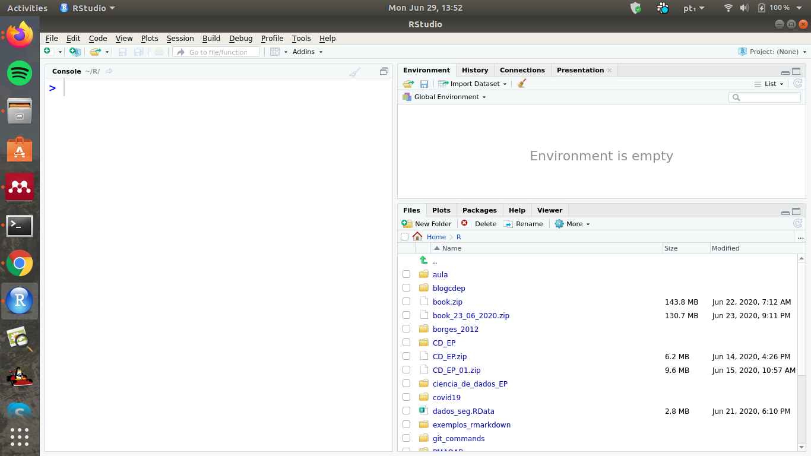
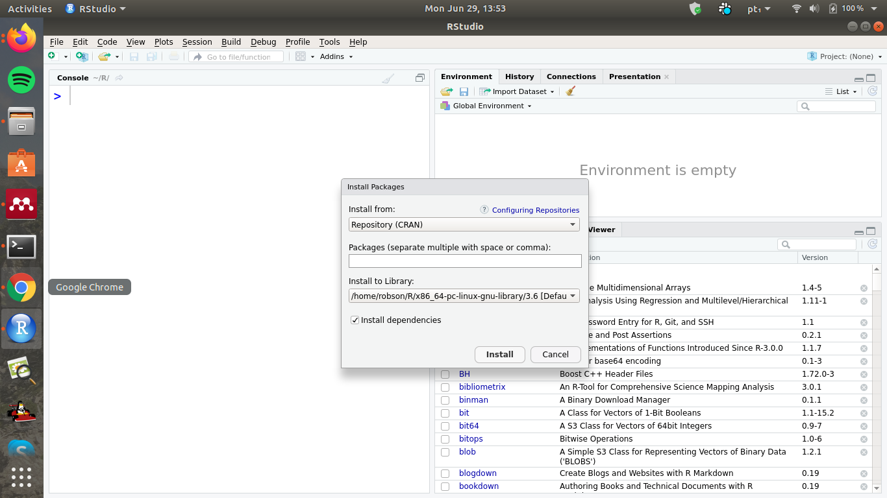
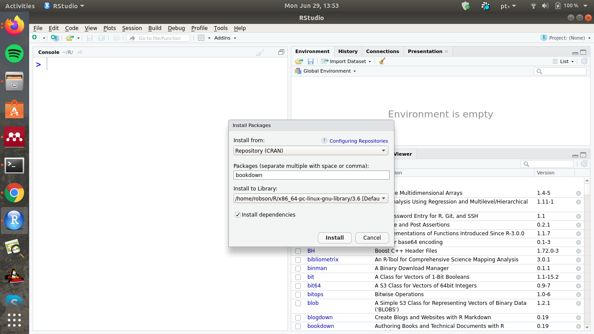
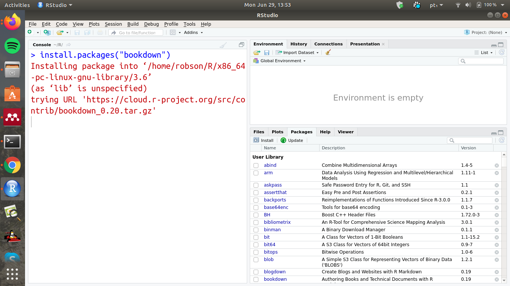

--- 
title: 'Treinamento Bookdown '
author: "Robson Wilson Silva Pessoa, Ícaro Bernardes e Daniela Almeida"
date: "`r Sys.Date()`"
output: pdf_document
description: Este documento faz parte de um treinamento introdutório de Rmardown,
  Bookdown e Tidyverse para o grupo Ciência de Dados na Escola Pública.
documentclass: book
link-citations: yes
bibliography:
- book.bib
- packages.bib
site: bookdown::bookdown_site
biblio-style: apalike
classoption: oneside
---

```{r, echo=TRUE}
knitr::opts_chunk$set(error = TRUE)
```

# Pré-requisitos

Este documento foi elaborado a partir da estrutura mínima 
obtida pelo *template* do *Bookdown* disponível no ambiente 
do *Rstudio*.  

Este é um _sample_ da escrita em **Markdown**. É 
possível utilizar qualquer recurso que suportado 
pelo *Markdown* do *Pandoc*, como  a
equação
$$f(x) = \frac{1}{\sigma\sqrt{2\pi}}\exp\left(-\frac{1}{2}\left(\frac{x-\mu}{\sigma}\right)^2\right)$$. 


A instalação do **bookdown** package pode instalado pelo CRAN ou Github. A seguir apresentamos uma sequência 
de passos de instalação pelo modo gráfico. Se 
você tem familiaridade pule a sequência de 
figuras e instale utilizando os comandos na aba 
*Console*, caso contrário siga os seguintes passos:

1. Primeiro é necessário abrir o Rstudio,



2. Selecoine a aba de instalação *Packages* e clique em **install**,



3. No ambiente de busca da interface instalação pesquise
por *bookdown*, selecione o pacote e clique em *install*,



4. Finalmente, o código será instalado,


5. Ainda é necessário carregá-lo na seção de uso, novamente na aba *Packages* pesquise por *bookdown*
e selecione o pacote, o que será suficiente para 
carregá-lo,


```{r eval=FALSE}
install.packages("bookdown")
# or the development version
# devtools::install_github("rstudio/bookdown")
library("bookdown")
```


Deve-se lembrar que para cada arquivo *.Rmd*
só pode ter um capítulo sendo definido pelo primeiro nível
por `#`.

Para compilar este exemplo para PDF, é necessário 
o pacote XeLaTeX. É recomendável 
instalar o TinyTeX (que inclui o XeLaTeX): <https://yihui.org/tinytex/>.

```{r include=FALSE}
# automatically create a bib database for R packages
knitr::write_bib(c(
  .packages(), 'bookdown', 'knitr', 'rmarkdown'
), 'packages.bib')
```

Nos próximos capítulos serão apresentados outros
detalhes sobre instalação e configuração.

